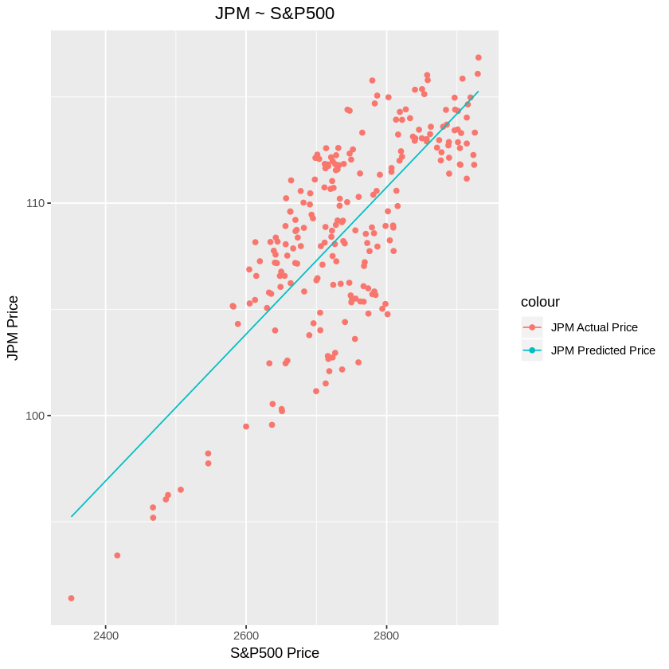

```R
library(quantmod)
library(ggplot2)

# Download JPM data from Yahoo Finance
getSymbols(c("JPM", "^GSPC"), src = "yahoo", from = '2018-02-01', to = '2018-12-30', getSymbols.yahoo.warning=FALSE)

# Show first few rows from the dataset
print("JPM - JP Morgan stock")
head(JPM)

print("^GSPC - S&P 500")
head(GSPC)
```


<ol class=list-inline>
	<li>'JPM'</li>
	<li>'GSPC'</li>
</ol>


    [1] "JPM - JP Morgan stock"


               JPM.Open JPM.High JPM.Low JPM.Close JPM.Volume JPM.Adjusted
    2018-02-01   115.77   116.99  115.48    116.87   13800600     113.9224
    2018-02-02   116.49   116.92  114.09    114.28   16477300     111.3978
    2018-02-05   113.00   114.59  103.98    108.80   30097600     106.0560
    2018-02-06   106.85   112.48  106.61    112.11   33114800     109.2825
    2018-02-07   111.55   114.45  111.15    112.87   21878300     110.0233
    2018-02-08   113.11   113.11  107.84    107.88   27425800     105.1592


    [1] "^GSPC - S&P 500"


               GSPC.Open GSPC.High GSPC.Low GSPC.Close GSPC.Volume GSPC.Adjusted
    2018-02-01   2816.45   2835.96  2812.70    2821.98  3938450000       2821.98
    2018-02-02   2808.92   2808.92  2759.97    2762.13  4301130000       2762.13
    2018-02-05   2741.06   2763.39  2638.17    2648.94  5283460000       2648.94
    2018-02-06   2614.78   2701.04  2593.07    2695.14  5891660000       2695.14
    2018-02-07   2690.95   2727.67  2681.33    2681.66  4626570000       2681.66
    2018-02-08   2685.01   2685.27  2580.56    2581.00  5305440000       2581.00


```R
ggplot(JPM, aes(Index)) + 
    geom_line(aes(y = JPM.Adjusted))+
    ggtitle("JPM - Closing Price") +
    labs(x = "Date", y = "Price") + 
    theme(plot.title = element_text(hjust = 0.5))
```


output_
output_
output_
output_
output_
```R
ggplot(GSPC, aes(Index)) + 
    geom_line(aes(y = GSPC.Adjusted))+
    ggtitle("S&P500 - Closing Price") +
    labs(x = "Date", y = "Price") + 
    theme(plot.title = element_text(hjust = 0.5))
```


```R
# Merge both dataset together and rename the columns
combined = merge(GSPC$"GSPC.Adjusted", JPM$"JPM.Adjusted")
colnames(combined) = c("GSPC", "JPM")

# Show first few rows of merged dataset
head(combined)
```


                  GSPC      JPM
    2018-02-01 2821.98 113.9224
    2018-02-02 2762.13 111.3978
    2018-02-05 2648.94 106.0560
    2018-02-06 2695.14 109.2825
    2018-02-07 2681.66 110.0233
    2018-02-08 2581.00 105.1592


```R
# Using a scatter plot to visualise the two dataset
# - Explanatory variable(GSPC) on the x-axis
# - Explained variable(JPM) on the y-axis
ggplot(combined, aes(GSPC)) + 
    geom_point(aes(y = JPM))+
    ggtitle("JPM ~ S&P500") +
    labs(x = "S&P500 Price", y = "JPM Price") + 
    theme(plot.title = element_text(hjust = 0.5))
```


```R
# Using linear regression to JPM against GSPC with intercept
fit = lm(combined$JPM ~ combined$GSPC)
summary(fit)
```


    
    Call:
    lm(formula = combined$JPM ~ combined$GSPC)
    
    Residuals:
        Min      1Q  Median      3Q     Max 
    -6.8550 -2.4328  0.4907  2.4191  5.7318 
    
    Coefficients:
                   Estimate Std. Error t value Pr(>|t|)    
    (Intercept)   13.954536   5.373016   2.597     0.01 *  
    combined$GSPC  0.034569   0.001957  17.662   <2e-16 ***
    ---
    Signif. codes:  0 ‘***’ 0.001 ‘**’ 0.01 ‘*’ 0.05 ‘.’ 0.1 ‘ ’ 1
    
    Residual standard error: 3.014 on 227 degrees of freedom
    Multiple R-squared:  0.5788,	Adjusted R-squared:  0.5769 
    F-statistic: 311.9 on 1 and 227 DF,  p-value: < 2.2e-16


```R
# predicted_df <- data.frame(mpg_pred = predict(lm_fit, df), hp=df$hp)
fit[1]
fit$coef[[1]]
fit$coef[[2]]
```


<strong>$coefficients</strong> = <dl class=dl-horizontal>
	<dt>(Intercept)</dt>
		<dd>13.9545358104153</dd>
	<dt>combined$GSPC</dt>
		<dd>0.0345690707436743</dd>
</dl>


13.9545358104153


0.0345690707436743


```R
# Generate predictions with model and data
predicted = predict(fit, combined)

# Create new dataframe with prediction
combinedWithPrediction = data.frame(date=index(combined), coredata(combined), JPM_Prediction = predicted)

# Show first few rows of data
head(combinedWithPrediction)
```


<table>
<thead><tr><th></th><th scope=col>date</th><th scope=col>GSPC</th><th scope=col>JPM</th><th scope=col>JPM_Prediction</th></tr></thead>
<tbody>
	<tr><th scope=row>2018-02-01</th><td>2018-02-01</td><td>2821.98   </td><td>113.9224  </td><td>111.5078  </td></tr>
	<tr><th scope=row>2018-02-02</th><td>2018-02-02</td><td>2762.13   </td><td>111.3978  </td><td>109.4388  </td></tr>
	<tr><th scope=row>2018-02-05</th><td>2018-02-05</td><td>2648.94   </td><td>106.0560  </td><td>105.5259  </td></tr>
	<tr><th scope=row>2018-02-06</th><td>2018-02-06</td><td>2695.14   </td><td>109.2825  </td><td>107.1230  </td></tr>
	<tr><th scope=row>2018-02-07</th><td>2018-02-07</td><td>2681.66   </td><td>110.0233  </td><td>106.6570  </td></tr>
	<tr><th scope=row>2018-02-08</th><td>2018-02-08</td><td>2581.00   </td><td>105.1592  </td><td>103.1773  </td></tr>
</tbody>
</table>


```R
# Plotting linear regression line on scatter plot
ggplot(combinedWithPrediction, aes(GSPC)) + 
    geom_point(aes(y = JPM, color = "JPM Actual Price"))+
    geom_line(aes(y = JPM_Prediction, color = "JPM Predicted Price"))+
    ggtitle("JPM ~ S&P500") +
    labs(x = "S&P500 Price", y = "JPM Price") + 
    theme(plot.title = element_text(hjust = 0.5))
```





```R
# Plot actual price and predicted price on the same graph
ggplot(combinedWithPrediction, aes(date)) + 
    geom_line(aes(y = combinedWithPrediction$JPM_Prediction, color = "Predicted"))+
    geom_line(aes(y = combinedWithPrediction$JPM, color = "Actual"))+
    ggtitle("Actual Price/Predicted Price vs Date") +
    labs(x = "Date", y = "Price") + 
    theme(plot.title = element_text(hjust = 0.5))
```


