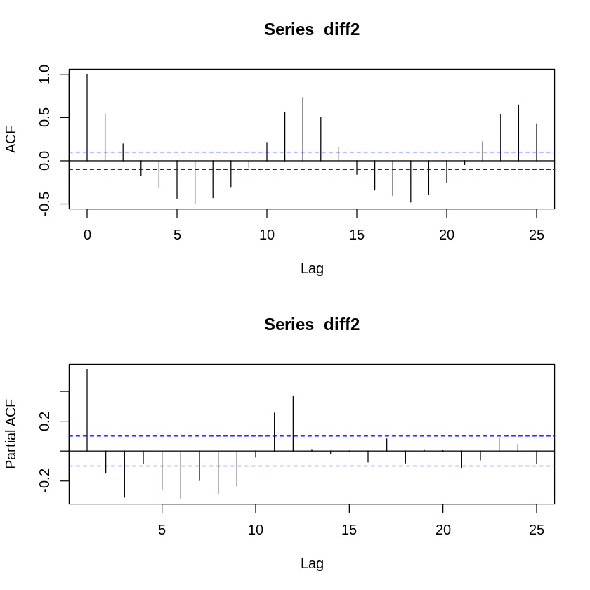
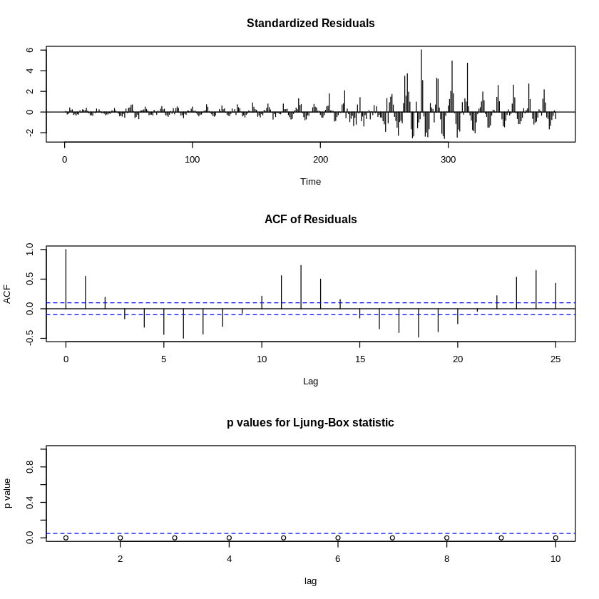
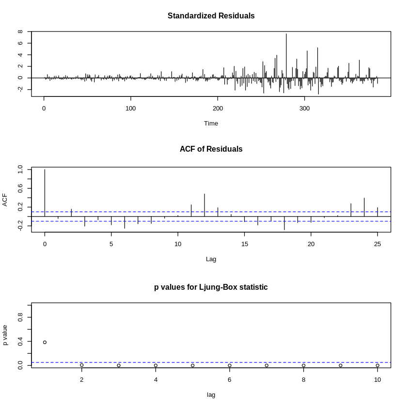
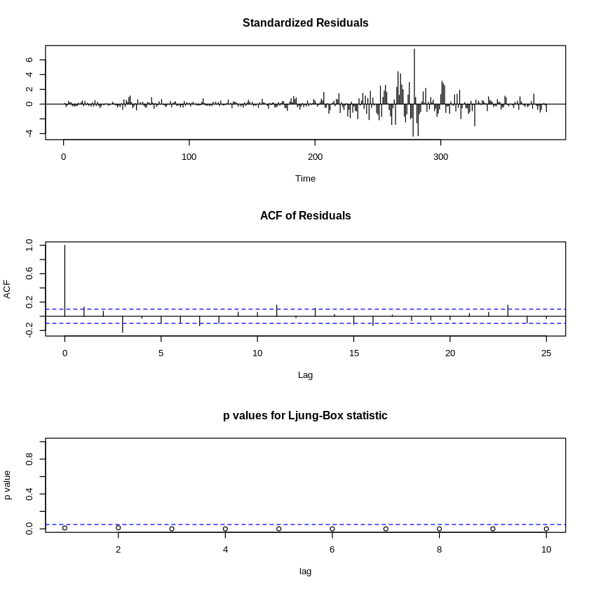
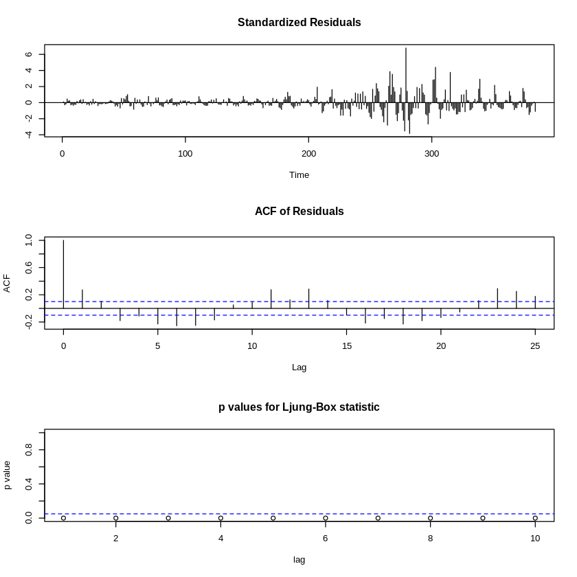
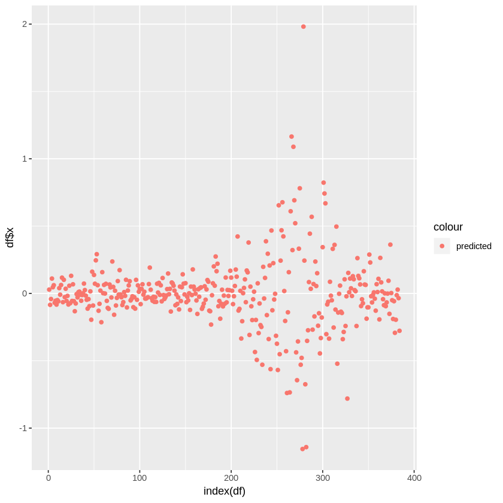
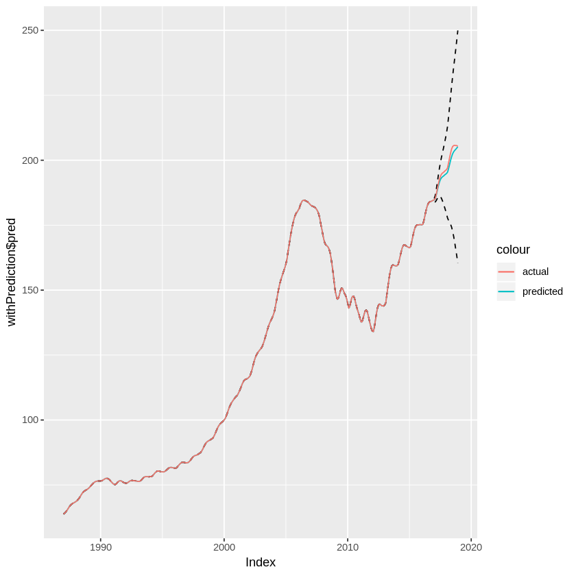

```R
library(quantmod)
library(ggplot2)
library(tseries)
library(gridExtra)
library(forecast)
library(lmtest)
```


```R
# Load the US National Home Price data from CSV
HomePrice = read.csv("./US_National_Home_price.csv")

# Format the data to xts
HomePrice = xts(HomePrice, order.by=as.Date(HomePrice$DATE, format="%Y-%m-%d")) 
storage.mode(HomePrice) = "numeric"
HomePrice$DATE = NULL
```

    Warning message in storage.mode(HomePrice) = "numeric":
    “NAs introduced by coercion”


```R
# Observe the first few rows of data
head(HomePrice)
```


               CSUSHPINSA
    1987-01-01     63.753
    1987-02-01     64.153
    1987-03-01     64.490
    1987-04-01     64.995
    1987-05-01     65.570
    1987-06-01     66.238


```R
# Plot the price index
ggplot(HomePrice, aes(Index)) + 
    geom_line(aes(y = HomePrice$CSUSHPINSA))+
    ggtitle("Case-Shiller U.S. National Home Price Index") +
    labs(x = "Date", y = "Index") + 
    theme(plot.title = element_text(hjust = 0.5))
```

    Don't know how to automatically pick scale for object of type xts/zoo. Defaulting to continuous.


## ADF Test

The adf test suggest that the model is non-statitionary. With the p-value at 0.4123, we cannot reject the null hypothesis that an unit root is present.

This suggest for the need to perform differencing


```R
# Perform adf test with time series of HomePrice
# See https://stackoverflow.com/questions/16447461/adf-test-returning-p-0-99-with-xts-but-returning-p-0-01-with-coredataxts

adf.test(as.ts(HomePrice))
```


    
    	Augmented Dickey-Fuller Test
    
    data:  as.ts(HomePrice)
    Dickey-Fuller = -2.3903, Lag order = 7, p-value = 0.4123
    alternative hypothesis: stationary


## ACF & PACF Chart

The ACF decays very slowly as the lag increases. This further confirms the need to difference the time series data.

The PACF displays a sharp cut-off at lag 1. This could be identified as an AR signature. 


```R
# Plot ACF & PACF for HomePrice

par(mfrow=c(2,1))
acf(HomePrice)
pacf(HomePrice)
```


## Differencing

### Diff 1

Applying diff 1 to the data, we obtained a p-value of 0.2558 on the ADF test. This suggest that the data is still not stationary at the 1% significance level.


```R
# Applying diff1
diff1 = diff(HomePrice, differences = 1)
diff1 = diff1[2:nrow(diff1)]
adf.test(as.ts(diff1))
```


    
    	Augmented Dickey-Fuller Test
    
    data:  as.ts(diff1)
    Dickey-Fuller = -2.7611, Lag order = 7, p-value = 0.2558
    alternative hypothesis: stationary


### Diff 2

Applying diff 2 to the data, we obtained a p-value of 0.01 on the ADF test, suggesting that we can reject the null hypothesis where a unit root is present. 


```R
# Applying diff2
diff2 = diff(HomePrice, differences = 2)
diff2 = diff2[3:nrow(diff2)]
adf.test(as.ts(diff2))
```

    Warning message in adf.test(as.ts(diff2)):
    “p-value smaller than printed p-value”


    
    	Augmented Dickey-Fuller Test
    
    data:  as.ts(diff2)
    Dickey-Fuller = -15.602, Lag order = 7, p-value = 0.01
    alternative hypothesis: stationary


## ACF & PACF of diff(2)

### ACF

The ACF chart for diff(2) shows that there are still significant correlation between the time series that are significantly different from 0 (as observed from the blue dotted lines). 

The sinusiodal graph may suggest the need for AR(2) graph.

However, we can also observe a negative correlation at lag 6 and a strong positive correlation at lag 12. This may suggest a seasonal AR with a period of 12.

### PACF

The PACF chart shows an AR(1) signature where PACF shows a sharp cut-off at the first lag.


```R
# Plot ACF & PACF for differenced model
# https://stats.stackexchange.com/questions/49571/understanding-the-blue-dotted-lines-in-an-acf-from-r

par(mfrow=c(2,1))
acf(diff2)
pacf(diff2)
```





## Model 1 - ARIMA(0, 2, 0)


Name | Value
--- | ---
Variance | 0.1703
Log likelihood | -203.9
AIC | 409.79
RMSE | 0.4115899

ACF chart still continues to diplay the sinusoidal wave, peaking at lag 6, 12, 18, 24. This suggest the need for AR(2). 

Ljung-Box-Pierce statistics shows that the model's accumulated residual autocorrelation is not significant up to lag 20. 


```R
model1 <- arima(window(HomePrice), order=c(0,2,0), method = "ML")

# Print summary of model1
summary(model1)

# Print diagnostics of model1
tsdiag(model1)
```

    
    Call:
    arima(x = window(HomePrice), order = c(0, 2, 0), method = "ML")
    
    
    sigma^2 estimated as 0.1703:  log likelihood = -203.9,  aic = 409.79
    
    Training set error measures:
                           ME      RMSE       MAE         MPE      MAPE      MASE
    Training set -0.001927416 0.4115899 0.2602374 0.002485472 0.1939264 0.3497458
                      ACF1
    Training set 0.5469119





## Model 2 - ARIMA(0, 2, 2)

Name | Value
--- | ---
Variance | 0.1101
Log likelihood | -120.87
AIC | 247.73
RMSE | 0.3309369

ACF chart shows smaller spikes compared to model1's. However, it can still be observed that the spiked at 6, 12, 18, 24 is still significant. This suggest that there are correlation that has yet to be accounted for.

Ljung-Box-Pierce statistics shows that the model's accumulated residual autocorrelation is significant at lag 1 to 4.

Both coefficient, ar1 & ar2, are tested to be significantly different from zero.


```R
model2 <- arima(window(HomePrice), order=c(0,2,2), method = "ML")

# Print summary of model2
summary(model2)

# Coefficient test of ar1 and ar2
coeftest(model2)

# Print diagnostics of model2
tsdiag(model2)
```

    
    Call:
    arima(x = window(HomePrice), order = c(0, 2, 2), method = "ML")
    
    Coefficients:
             ma1     ma2
          0.6201  0.4156
    s.e.  0.0458  0.0466
    
    sigma^2 estimated as 0.1101:  log likelihood = -120.87,  aic = 247.73
    
    Training set error measures:
                           ME      RMSE       MAE         MPE      MAPE      MASE
    Training set -0.001339956 0.3309369 0.2003839 0.001235961 0.1496965 0.2693058
                        ACF1
    Training set 0.001531978


    
    z test of coefficients:
    
        Estimate Std. Error z value  Pr(>|z|)    
    ma1 0.620150   0.045808 13.5379 < 2.2e-16 ***
    ma2 0.415642   0.046551  8.9288 < 2.2e-16 ***
    ---
    Signif. codes:  0 ‘***’ 0.001 ‘**’ 0.01 ‘*’ 0.05 ‘.’ 0.1 ‘ ’ 1


## Model 3 - ARIMA(2, 2, 0)

Name | Value
--- | ---
Variance | 0.1166
Log likelihood | -131.82
AIC | 269.64
RMSE | 0.3406494

ACF chart shows smaller spikes compared to model1's. However, it can still be observed that the spiked at 6, 12, 18, 24 is still significant. This suggest that there are correlation that has yet to be accounted for.

Ljung-Box-Pierce statistics shows that the model's accumulated residual autocorrelation is not significant up to lag 20, except for lag 1.

Both coefficient, ar1 & ar2, are tested to be significantly different from zero.

Overall, model3 outperforms model1 and model2 and should be chosen for non-seasonal arima model. 


```R
model3 <- arima(window(HomePrice), order=c(2,2,0), method = "ML")

# Print summary of model3
summary(model3)

# Coefficient test of ma1 and ma2
coeftest(model3)

# Print diagnostics of model3
tsdiag(model3)
```

    
    Call:
    arima(x = window(HomePrice), order = c(2, 2, 0), method = "ML")
    
    Coefficients:
             ar1      ar2
          0.6277  -0.1485
    s.e.  0.0506   0.0505
    
    sigma^2 estimated as 0.1166:  log likelihood = -131.82,  aic = 269.64
    
    Training set error measures:
                          ME      RMSE       MAE         MPE      MAPE      MASE
    Training set -0.00141818 0.3406494 0.2080001 0.001291073 0.1556069 0.2795416
                        ACF1
    Training set -0.04423696


    
    z test of coefficients:
    
         Estimate Std. Error z value  Pr(>|z|)    
    ar1  0.627713   0.050562 12.4146 < 2.2e-16 ***
    ar2 -0.148481   0.050537 -2.9381  0.003302 ** 
    ---
    Signif. codes:  0 ‘***’ 0.001 ‘**’ 0.01 ‘*’ 0.05 ‘.’ 0.1 ‘ ’ 1





## Seasonal ARIMA

As suggested by the high positive correlation at lag 12, it is highly possible that the model would be seasonal with period 12. This is further confirmed by the unexplained spiked of ACF for the non-seasonal model at lags of 6, 12, 18 and 24.

## Model 4 - ARIMA (0,2,0) (2,0,0) 12

Name | Value
--- | ---
Variance | 0.07037
Log likelihood | -40.53
AIC | 87.07
RMSE | 0.2646128

ACF chart shows smaller spikes compared to model3's. However, there are still significant spikes at lag 3, 7, 11, 16, 23.

Ljung-Box-Pierce statistics shows that the model's accumulated residual autocorrelation is not significant up to lag 20. 

Both coefficient, sar1 & sar2, are tested to be significantly different from zero.


```R
model4 <- arima(window(HomePrice), order=c(0,2,0), seasonal=list(order=c(2,0,0),period=12),  method = "ML")
# Print summary of model4
summary(model4)

# Coefficient test of sar1 and sar2
coeftest(model4)

# Print diagnostics of model4
tsdiag(model4)
```

    
    Call:
    arima(x = window(HomePrice), order = c(0, 2, 0), seasonal = list(order = c(2, 
        0, 0), period = 12), method = "ML")
    
    Coefficients:
            sar1    sar2
          0.5472  0.2536
    s.e.  0.0485  0.0491
    
    sigma^2 estimated as 0.07037:  log likelihood = -40.53,  aic = 87.07
    
    Training set error measures:
                           ME      RMSE       MAE          MPE      MAPE      MASE
    Training set -0.001702845 0.2646128 0.1577538 0.0009116675 0.1194314 0.2120131
                      ACF1
    Training set 0.1308832


    
    z test of coefficients:
    
         Estimate Std. Error z value  Pr(>|z|)    
    sar1 0.547214   0.048479 11.2877 < 2.2e-16 ***
    sar2 0.253567   0.049080  5.1665 2.386e-07 ***
    ---
    Signif. codes:  0 ‘***’ 0.001 ‘**’ 0.01 ‘*’ 0.05 ‘.’ 0.1 ‘ ’ 1





## Model 5 - ARIMA (0,2,0) (0,0,2) 12

Name | Value
--- | ---
Variance | 0.09245
Log likelihood | -90.1
AIC | 186.19
RMSE | 0.30329

ACF chart showed similar sinusoidal wave as the model1-3, with smaller ACF spikes on lag 12 and 24. The ACF spikes does not seemed to smoothened around those periods and the ACF spikes on lag 6 and 18 were not affected. This suggest that adding order to the SMA term does not futher explain the prices.

Ljung-Box-Pierce statistics shows that the model's accumulated residual autocorrelation is not significant up to lag 20. 

Both coefficient, sar1 & sar2, are tested to be significantly different from zero.


```R
model5 <- arima(window(HomePrice), order=c(0,2,0), seasonal=list(order=c(0,0,2),period=12),  method = "ML")
# Print summary of model5
summary(model5)

# Coefficient test of sma1 and sma2
coeftest(model5)

# Print diagnostics of model5
tsdiag(model5)
```

    
    Call:
    arima(x = window(HomePrice), order = c(0, 2, 0), seasonal = list(order = c(0, 
        0, 2), period = 12), method = "ML")
    
    Coefficients:
            sma1    sma2
          0.6074  0.3406
    s.e.  0.0505  0.0398
    
    sigma^2 estimated as 0.09245:  log likelihood = -90.1,  aic = 186.19
    
    Training set error measures:
                           ME      RMSE       MAE         MPE      MAPE      MASE
    Training set -0.001886846 0.3032905 0.1936652 0.001145485 0.1454877 0.2602762
                      ACF1
    Training set 0.2722617


    
    z test of coefficients:
    
         Estimate Std. Error z value  Pr(>|z|)    
    sma1 0.607432   0.050532 12.0208 < 2.2e-16 ***
    sma2 0.340587   0.039833  8.5504 < 2.2e-16 ***
    ---
    Signif. codes:  0 ‘***’ 0.001 ‘**’ 0.01 ‘*’ 0.05 ‘.’ 0.1 ‘ ’ 1





## Model Selection

Model | Variance | Log Likelihood | AIC | RMSE
--- | --- | --- | --- | ---
1 | 0.1703 | -203.9 | 409.79 | 0.4115899
2 | 0.1101 | -120.87 | 247.73 | 0.3309369
3 | 0.1166 | -131.82 | 269.64 | 0.3406494
4 | 0.07037 | -40.53 | 87.07 | 0.2646128
5 | 0.09245 | -90.1 | 186.19 | 0.30329

Comparing the different models, we can see that model4, ARIMA(0,2,0)(0,0,2)12, stands out as the best model for the forecast. 

## Forecasting with Model4

Using model4, we will attempt to forecast the last 24 periods of the timeseries.

First, we will split the data into training set and testing set. The testing set will have the actual price index of the last 24 period and the training set will have all the remaining data.

Then, we will train the ARIMA model with the training set and create a prediction with n.ahead = 24. We will plot out the predicted results compared to the actual results using ggplot, together with 2 * SE as the upper and lower bounds of the prediction.

Finally, we will assess the fit by calculating the RSME and MAE of the actual value vs predicted value. 


```R
# From the residual plot, we can see that the model starts to diverge at around period 200
# We will forecast ahead for 24 periods to ensure that we do not forecast too far into the future
df = as.data.frame(model4$residuals)
ggplot(df, aes(index(df))) + 
    geom_point(aes(y = df$x, color="predicted"))
```

    Don't know how to automatically pick scale for object of type ts. Defaulting to continuous.





```R
periodToForecast = 24
trainPeriod = nrow(HomePrice)-periodToForecast

# Split data into training set
train = HomePrice[1:trainPeriod]

# Create new model with training set
fit = arima(train, order=c(0,2,0), seasonal=list(order=c(2,0,0),period=12),  method = "ML")

# Create prediction
predictions = predict(fit,n.ahead=periodToForecast,se.fit=TRUE)
```


```R
# Create dataframe of HomePrice with prediction and 2 * SE bounds
pred = c()
upper = c()
lower = c()
for(i in 1:nrow(HomePrice)){
    if(i <= nrow(HomePrice) - periodToForecast){
        pred[i] = HomePrice$CSUSHPINSA[i]
        upper[i] = HomePrice$CSUSHPINSA[i]
        lower[i] = HomePrice$CSUSHPINSA[i]
    }else{
        p = i - trainPeriod
        pred[i] = predictions$pred[p]
        upper[i] = predictions$pred[p] + 2*predictions$se[p]
        lower[i] = predictions$pred[p] - 2*predictions$se[p]
    }
}
withPrediction = merge(HomePrice, pred, upper, lower)

ggplot(withPrediction, aes(Index)) + 
    geom_line(aes(y = withPrediction$pred, color="predicted")) +
    geom_line(aes(y = withPrediction$upper), linetype="dashed") +
    geom_line(aes(y = withPrediction$lower), , linetype="dashed") +
    geom_line(aes(y = withPrediction$CSUSHPINSA, color="actual"))
```

    Don't know how to automatically pick scale for object of type xts/zoo. Defaulting to continuous.





```R
library(DescTools)

rmseM4 = RMSE(withPrediction[-24]$pred, withPrediction[-24]$CSUSHPINSA)
maeM4 = MAE(withPrediction[-24]$pred, withPrediction[-24]$CSUSHPINSA)

sprintf("RSME: %s", rmseM4)
sprintf("MAE: %s", maeM4)
```


'RSME: 0.420224462539597'


'MAE: 0.0904105973244109'


##  Conclusion

From the graph above, we can see that the ARIMA (0,2,0)(2,0,0)12 model did a great job at forecasting the time series. 

This is further confirmed by the RSME of 0.42 on untrained data, which is very close to the RSME of model 4 at 0.2646128.

## Improving the forecasts

Prices are affected by supply and demand. Thus, supply-
side factors could include number of houses and interest rates (i.e. ease of getting a
mortgage). Demand-side factors could be population, wages, and inflation. GDP may be a
factor that influences both supply and demand.
