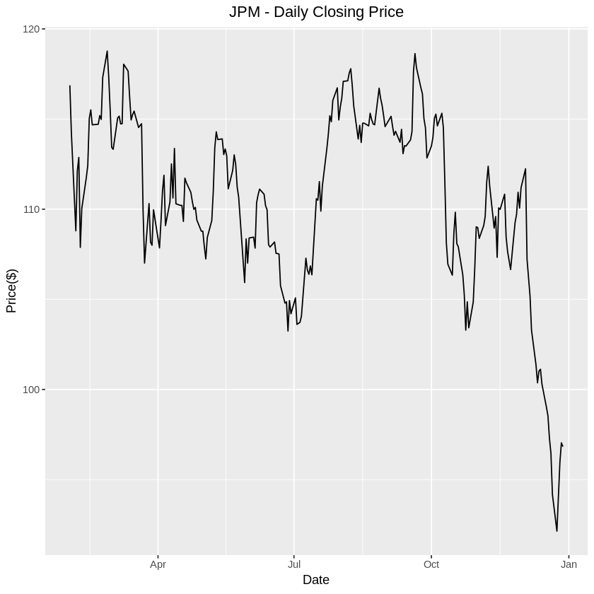
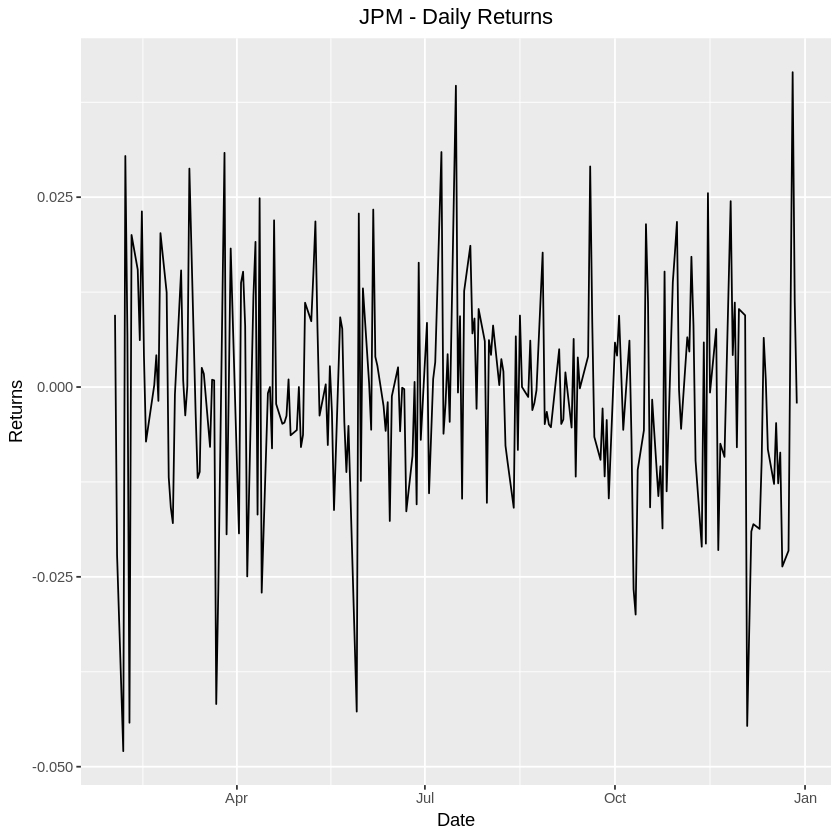
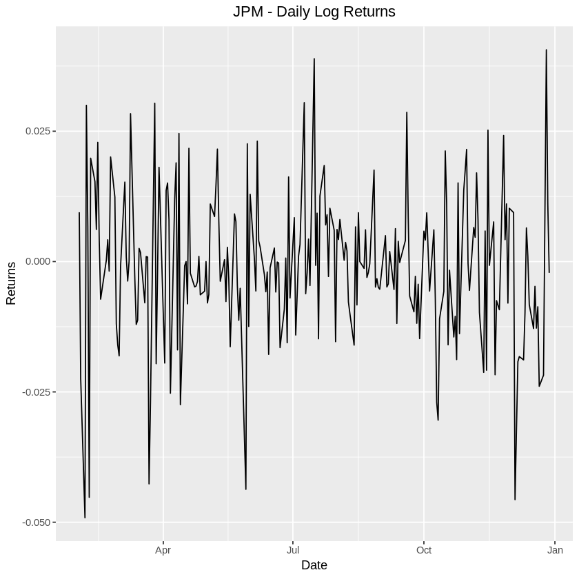

# Submission 1

## Basic Statistics

Download JP Morgan stock historical prices from Yahoo Finance

Period: February 1, 2018 – December 30, 2018

Frequency: Daily

Price considered in the analysis: Close price adjusted for dividends and splits

### Calculations in R

#### Overview of data

Prior to performing the calculations, we will first get an overview of the downloaded data by:

1. Printing the first few rows of the data to understand how the data is structured
2. Printing the summary statistics of the data set
3. Plotting the closing price  

```R
library(quantmod)
library(ggplot2)

# Download JPM data from Yahoo Finance
getSymbols("JPM", src = "yahoo", from = '2018-02-01', to = '2018-12-30', getSymbols.yahoo.warning=FALSE)

# Show first few rows from the dataset
head(JPM)
```
               JPM.Open JPM.High JPM.Low JPM.Close JPM.Volume JPM.Adjusted
    2018-02-01   115.77   116.99  115.48    116.87   13800600     113.9224
    2018-02-02   116.49   116.92  114.09    114.28   16477300     111.3978
    2018-02-05   113.00   114.59  103.98    108.80   30097600     106.0560
    2018-02-06   106.85   112.48  106.61    112.11   33114800     109.2825
    2018-02-07   111.55   114.45  111.15    112.87   21878300     110.0233
    2018-02-08   113.11   113.11  107.84    107.88   27425800     105.1592


```R
# Show summary statistics for the JPM dataset
summary(JPM)
```


         Index               JPM.Open         JPM.High         JPM.Low      
     Min.   :2018-02-01   Min.   : 92.69   Min.   : 94.22   Min.   : 91.11  
     1st Qu.:2018-04-25   1st Qu.:108.24   1st Qu.:109.29   1st Qu.:106.73  
     Median :2018-07-17   Median :111.17   Median :111.95   Median :109.89  
     Mean   :2018-07-15   Mean   :110.80   Mean   :111.80   Mean   :109.64  
     3rd Qu.:2018-10-05   3rd Qu.:114.59   3rd Qu.:115.24   3rd Qu.:113.67  
     Max.   :2018-12-28   Max.   :119.13   Max.   :119.33   Max.   :118.08  

       JPM.Close        JPM.Volume        JPM.Adjusted  
     Min.   : 92.14   Min.   : 6488400   Min.   : 91.4  
     1st Qu.:108.00   1st Qu.:11048700   1st Qu.:106.1  
     Median :110.99   Median :13948300   Median :109.0  
     Mean   :110.63   Mean   :15243736   Mean   :108.8  
     3rd Qu.:114.62   3rd Qu.:17963300   3rd Qu.:112.3  
     Max.   :118.77   Max.   :41313900   Max.   :116.9  


```R
# Plot the daily closing price of JPM
ggplot(JPM, aes(Index)) + 
    geom_line(aes(y = JPM.Close)) + 
    ggtitle("JPM - Daily Closing Price") +
    labs(x = "Date", y = "Price($)") + 
    theme(plot.title = element_text(hjust = 0.5))
```




#### 1.1 Average stock value

```R
# Calculate mean of closing price
jpmMeanAdj = mean(JPM[,"JPM.Adjusted"])
sprintf("1.1. Average stock value: %s", jpmMeanAdj)
```

'1.1. Average stock value: 108.786558755459'

#### 1.2 Stock volatility

```R
# Calculate standard deviation of closing price
jpmVol = sd(JPM[,"JPM.Adjusted"])
sprintf("1.2. Stock Volatility: %s", jpmVol)
```


'1.2. Stock Volatility: 4.63417113735034'

#### 1.3 Daily stock return

For the daily stock returns, we will print both the daily returns and daily logs returns:

```R
# Calculate arithmetic daily returns
jpmDailyRet = dailyReturn(JPM, type="arithmetic")
# Modify the from daily.returns to JPM.Returns
names(jpmDailyRet)[1] = "JPM.Returns"

# Calculate log daily returns
jpmLogRet = dailyReturn(JPM, type="log")
# Modify the from daily.returns to JPM.LogReturns
names(jpmLogRet)[1] = "JPM.LogReturns"

# Join both arithmatic and log returns with JPM xts
jpmWithReturns = merge(JPM, jpmDailyRet, join = "outer")
jpmWithReturns = merge(jpmWithReturns, jpmLogRet, join = "outer")

# Print first few rows of new dataset
head(jpmWithReturns)
```


               JPM.Open JPM.High JPM.Low JPM.Close JPM.Volume JPM.Adjusted
    2018-02-01   115.77   116.99  115.48    116.87   13800600     113.9224
    2018-02-02   116.49   116.92  114.09    114.28   16477300     111.3978
    2018-02-05   113.00   114.59  103.98    108.80   30097600     106.0560
    2018-02-06   106.85   112.48  106.61    112.11   33114800     109.2825
    2018-02-07   111.55   114.45  111.15    112.87   21878300     110.0233
    2018-02-08   113.11   113.11  107.84    107.88   27425800     105.1592
                JPM.Returns JPM.LogReturns
    2018-02-01  0.009501650    0.009456793
    2018-02-02 -0.022161410   -0.022410663
    2018-02-05 -0.047952363   -0.049140207
    2018-02-06  0.030422775    0.029969179
    2018-02-07  0.006779074    0.006756199
    2018-02-08 -0.044210205   -0.045217270

```R
ggplot(jpmWithReturns, aes(Index)) + 
    geom_line(aes(y = JPM.Returns))+
    ggtitle("JPM - Daily Returns") +
    labs(x = "Date", y = "Returns") + 
    theme(plot.title = element_text(hjust = 0.5))
```




```R
ggplot(jpmWithReturns, aes(Index)) + 
    geom_line(aes(y = JPM.LogReturns))+
    ggtitle("JPM - Daily Log Returns") +
    labs(x = "Date", y = "Returns") + 
    theme(plot.title = element_text(hjust = 0.5))
```




### Calculations in Excel

### 1.4 Average stock value

### 1.5 Stock volatility

### 1.6 Daily stock return

### 1.7 Show JP Morgan stock price evolution using a scatter plot

### 1.8 Add a trendline to the graph (trendline options – linear)

## Linear Regression

Explained variable: JP Morgan stock (adjusted close price)

Explanatory variable: S&P500

Period: February 1, 2018 – December 30, 2018

Frequency: Daily

### Implement a two-variable regression in R


### Implement a two-variable regression in Excel using LINEST function and Analysis ToolPak


## Univariate Time Series Analysis

Forecast S&P/Case-Shiller U.S. National Home Price Index using an ARMA model.

Data source: https://fred.stlouisfed.org/series/CSUSHPINSA

Period considered in the analysis: January 1978 – latest data

Frequency: monthly data

### Implemented the Augmented Dickey-Fuller Test for checking the existence of a unit root in Case-Shiller Index series

### Implement an ARIMA(p,d,q) model. Determine p, d, q using Information Criterion or Box-Jenkins methodology. Comment results

### Forecast the future evolution of Case-Shiller Index using the ARMA model. Test model using in-sample forecasts

### Suggest exogenous variables that can improve forecasts