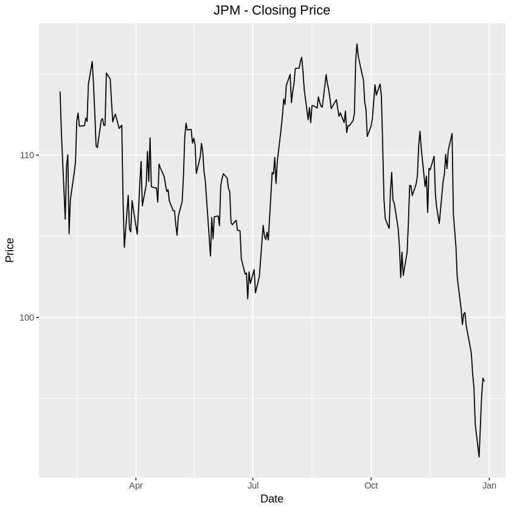
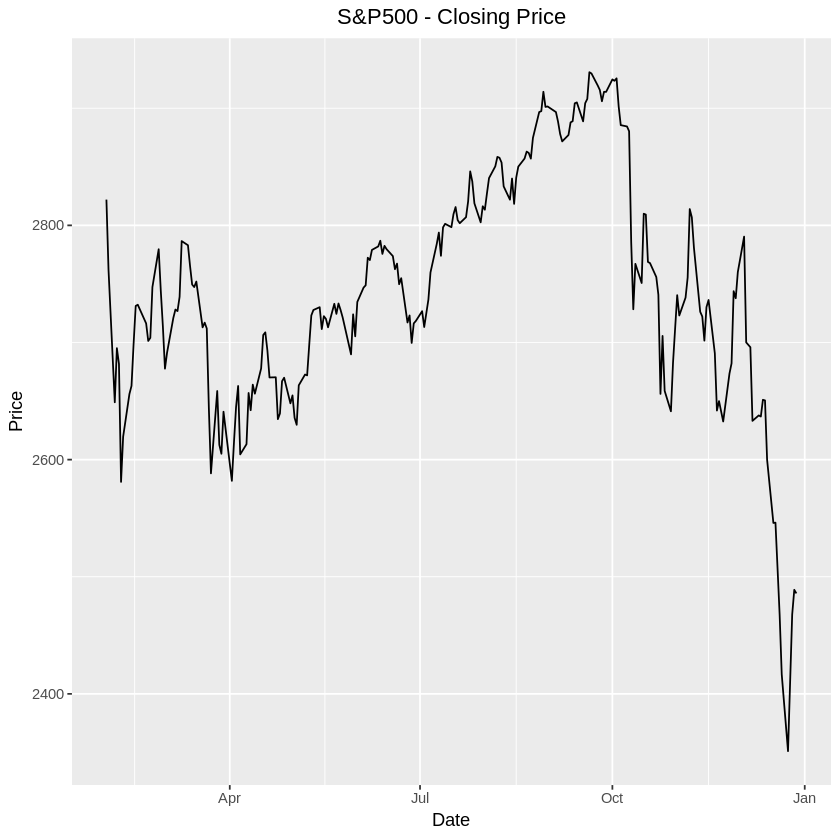
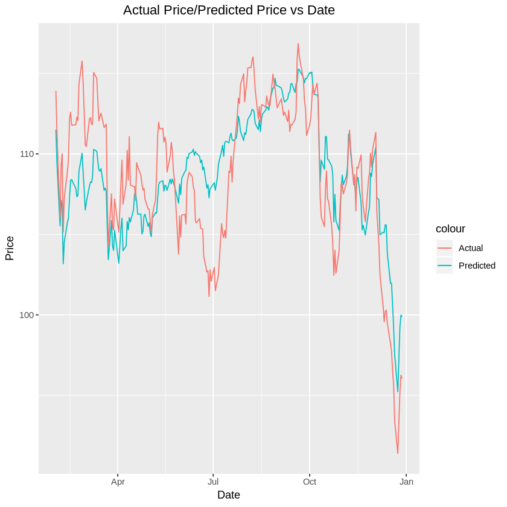

# Submission 1

## Basic Statistics

Download JP Morgan stock historical prices from Yahoo Finance

Period: February 1, 2018 – December 30, 2018

Frequency: Daily

Price considered in the analysis: Close price adjusted for dividends and splits

### Calculations in R

#### Overview of data

Prior to performing the calculations, we will first get an overview of the downloaded data by:

1. Printing the first few rows of the data to understand how the data is structured
2. Printing the summary statistics of the data set
3. Plotting the closing price  

```R
library(quantmod)
library(ggplot2)

# Download JPM data from Yahoo Finance
getSymbols("JPM", src = "yahoo", from = '2018-02-01', to = '2018-12-30', getSymbols.yahoo.warning=FALSE)

# Show first few rows from the dataset
head(JPM)
```
               JPM.Open JPM.High JPM.Low JPM.Close JPM.Volume JPM.Adjusted
    2018-02-01   115.77   116.99  115.48    116.87   13800600     113.9224
    2018-02-02   116.49   116.92  114.09    114.28   16477300     111.3978
    2018-02-05   113.00   114.59  103.98    108.80   30097600     106.0560
    2018-02-06   106.85   112.48  106.61    112.11   33114800     109.2825
    2018-02-07   111.55   114.45  111.15    112.87   21878300     110.0233
    2018-02-08   113.11   113.11  107.84    107.88   27425800     105.1592


```R
# Show summary statistics for the JPM dataset
summary(JPM)
```


         Index               JPM.Open         JPM.High         JPM.Low      
     Min.   :2018-02-01   Min.   : 92.69   Min.   : 94.22   Min.   : 91.11  
     1st Qu.:2018-04-25   1st Qu.:108.24   1st Qu.:109.29   1st Qu.:106.73  
     Median :2018-07-17   Median :111.17   Median :111.95   Median :109.89  
     Mean   :2018-07-15   Mean   :110.80   Mean   :111.80   Mean   :109.64  
     3rd Qu.:2018-10-05   3rd Qu.:114.59   3rd Qu.:115.24   3rd Qu.:113.67  
     Max.   :2018-12-28   Max.   :119.13   Max.   :119.33   Max.   :118.08  

       JPM.Close        JPM.Volume        JPM.Adjusted  
     Min.   : 92.14   Min.   : 6488400   Min.   : 91.4  
     1st Qu.:108.00   1st Qu.:11048700   1st Qu.:106.1  
     Median :110.99   Median :13948300   Median :109.0  
     Mean   :110.63   Mean   :15243736   Mean   :108.8  
     3rd Qu.:114.62   3rd Qu.:17963300   3rd Qu.:112.3  
     Max.   :118.77   Max.   :41313900   Max.   :116.9  


```R
# Plot the daily closing price of JPM
ggplot(JPM, aes(Index)) + 
    geom_line(aes(y = JPM.Close)) + 
    ggtitle("JPM - Daily Closing Price") +
    labs(x = "Date", y = "Price($)") + 
    theme(plot.title = element_text(hjust = 0.5))
```


#### 1.1 Average stock value

```R
# Calculate mean of closing price
jpmMeanAdj = mean(JPM[,"JPM.Adjusted"])
sprintf("1.1. Average stock value: %s", jpmMeanAdj)
```

'1.1. Average stock value: 108.786558755459'

#### 1.2 Stock volatility

```R
# Calculate standard deviation of closing price
jpmVol = sd(JPM[,"JPM.Adjusted"])
sprintf("1.2. Stock Volatility: %s", jpmVol)
```


'1.2. Stock Volatility: 4.63417113735034'

#### 1.3 Daily stock return

For the daily stock returns, we will print both the daily returns and daily logs returns:

```R
# Calculate arithmetic daily returns
jpmDailyRet = dailyReturn(JPM, type="arithmetic")
# Modify the from daily.returns to JPM.Returns
names(jpmDailyRet)[1] = "JPM.Returns"

# Calculate log daily returns
jpmLogRet = dailyReturn(JPM, type="log")
# Modify the from daily.returns to JPM.LogReturns
names(jpmLogRet)[1] = "JPM.LogReturns"

# Join both arithmatic and log returns with JPM xts
jpmWithReturns = merge(JPM, jpmDailyRet, join = "outer")
jpmWithReturns = merge(jpmWithReturns, jpmLogRet, join = "outer")

# Print first few rows of new dataset
head(jpmWithReturns)
```


               JPM.Open JPM.High JPM.Low JPM.Close JPM.Volume JPM.Adjusted
    2018-02-01   115.77   116.99  115.48    116.87   13800600     113.9224
    2018-02-02   116.49   116.92  114.09    114.28   16477300     111.3978
    2018-02-05   113.00   114.59  103.98    108.80   30097600     106.0560
    2018-02-06   106.85   112.48  106.61    112.11   33114800     109.2825
    2018-02-07   111.55   114.45  111.15    112.87   21878300     110.0233
    2018-02-08   113.11   113.11  107.84    107.88   27425800     105.1592
                JPM.Returns JPM.LogReturns
    2018-02-01  0.009501650    0.009456793
    2018-02-02 -0.022161410   -0.022410663
    2018-02-05 -0.047952363   -0.049140207
    2018-02-06  0.030422775    0.029969179
    2018-02-07  0.006779074    0.006756199
    2018-02-08 -0.044210205   -0.045217270

```R
ggplot(jpmWithReturns, aes(Index)) + 
    geom_line(aes(y = JPM.Returns))+
    ggtitle("JPM - Daily Returns") +
    labs(x = "Date", y = "Returns") + 
    theme(plot.title = element_text(hjust = 0.5))
```


```R
ggplot(jpmWithReturns, aes(Index)) + 
    geom_line(aes(y = JPM.LogReturns))+
    ggtitle("JPM - Daily Log Returns") +
    labs(x = "Date", y = "Returns") + 
    theme(plot.title = element_text(hjust = 0.5))
```


### Calculations in Excel

### 1.4 Average stock value

### 1.5 Stock volatility

### 1.6 Daily stock return

### 1.7 Show JP Morgan stock price evolution using a scatter plot

### 1.8 Add a trendline to the graph (trendline options – linear)

## Linear Regression

Explained variable: JP Morgan stock (adjusted close price)

Explanatory variable: S&P500

Period: February 1, 2018 – December 30, 2018

Frequency: Daily

### Implement a two-variable regression in R


```R
library(quantmod)
library(ggplot2)

# Download JPM data from Yahoo Finance
getSymbols(c("JPM", "^GSPC"), src = "yahoo", from = '2018-02-01', to = '2018-12-30', getSymbols.yahoo.warning=FALSE)

# Show first few rows from the dataset
print("JPM - JP Morgan stock")
head(JPM)

print("^GSPC - S&P 500")
head(GSPC)
```


<ol class=list-inline>
	<li>'JPM'</li>
	<li>'GSPC'</li>
</ol>


    [1] "JPM - JP Morgan stock"


               JPM.Open JPM.High JPM.Low JPM.Close JPM.Volume JPM.Adjusted
    2018-02-01   115.77   116.99  115.48    116.87   13800600     113.9224
    2018-02-02   116.49   116.92  114.09    114.28   16477300     111.3978
    2018-02-05   113.00   114.59  103.98    108.80   30097600     106.0560
    2018-02-06   106.85   112.48  106.61    112.11   33114800     109.2825
    2018-02-07   111.55   114.45  111.15    112.87   21878300     110.0233
    2018-02-08   113.11   113.11  107.84    107.88   27425800     105.1592


    [1] "^GSPC - S&P 500"


               GSPC.Open GSPC.High GSPC.Low GSPC.Close GSPC.Volume GSPC.Adjusted
    2018-02-01   2816.45   2835.96  2812.70    2821.98  3938450000       2821.98
    2018-02-02   2808.92   2808.92  2759.97    2762.13  4301130000       2762.13
    2018-02-05   2741.06   2763.39  2638.17    2648.94  5283460000       2648.94
    2018-02-06   2614.78   2701.04  2593.07    2695.14  5891660000       2695.14
    2018-02-07   2690.95   2727.67  2681.33    2681.66  4626570000       2681.66
    2018-02-08   2685.01   2685.27  2580.56    2581.00  5305440000       2581.00


```R
ggplot(JPM, aes(Index)) + 
    geom_line(aes(y = JPM.Adjusted))+
    ggtitle("JPM - Closing Price") +
    labs(x = "Date", y = "Price") + 
    theme(plot.title = element_text(hjust = 0.5))
```





output_
output_
output_
output_
output_
```R
ggplot(GSPC, aes(Index)) + 
    geom_line(aes(y = GSPC.Adjusted))+
    ggtitle("S&P500 - Closing Price") +
    labs(x = "Date", y = "Price") + 
    theme(plot.title = element_text(hjust = 0.5))
```





```R
# Merge both dataset together and rename the columns
combined = merge(GSPC$"GSPC.Adjusted", JPM$"JPM.Adjusted")
colnames(combined) = c("GSPC", "JPM")

# Show first few rows of merged dataset
head(combined)
```


                  GSPC      JPM
    2018-02-01 2821.98 113.9224
    2018-02-02 2762.13 111.3978
    2018-02-05 2648.94 106.0560
    2018-02-06 2695.14 109.2825
    2018-02-07 2681.66 110.0233
    2018-02-08 2581.00 105.1592


```R
# Using a scatter plot to visualise the two dataset
# - Explanatory variable(GSPC) on the x-axis
# - Explained variable(JPM) on the y-axis
ggplot(combined, aes(GSPC)) + 
    geom_point(aes(y = JPM))+
    ggtitle("JPM ~ S&P500") +
    labs(x = "S&P500 Price", y = "JPM Price") + 
    theme(plot.title = element_text(hjust = 0.5))
```


```R
# Using linear regression to JPM against GSPC with intercept
fit = lm(combined$JPM ~ combined$GSPC)
summary(fit)
```


    
    Call:
    lm(formula = combined$JPM ~ combined$GSPC)
    
    Residuals:
        Min      1Q  Median      3Q     Max 
    -6.8550 -2.4328  0.4907  2.4191  5.7318 
    
    Coefficients:
                   Estimate Std. Error t value Pr(>|t|)    
    (Intercept)   13.954536   5.373016   2.597     0.01 *  
    combined$GSPC  0.034569   0.001957  17.662   <2e-16 ***
    ---
    Signif. codes:  0 ‘***’ 0.001 ‘**’ 0.01 ‘*’ 0.05 ‘.’ 0.1 ‘ ’ 1
    
    Residual standard error: 3.014 on 227 degrees of freedom
    Multiple R-squared:  0.5788,	Adjusted R-squared:  0.5769 
    F-statistic: 311.9 on 1 and 227 DF,  p-value: < 2.2e-16


```R
# predicted_df <- data.frame(mpg_pred = predict(lm_fit, df), hp=df$hp)
fit[1]
fit$coef[[1]]
fit$coef[[2]]
```


	(Intercept)
		13.9545358104153
	combined$GSPC
		0.0345690707436743

    13.9545358104153

    0.0345690707436743


```R
# Generate predictions with model and data
predicted = predict(fit, combined)

# Create new dataframe with prediction
combinedWithPrediction = data.frame(date=index(combined), coredata(combined), JPM_Prediction = predicted)

# Show first few rows of data
head(combinedWithPrediction)
```


<table>
<thead><tr><th></th><th scope=col>date</th><th scope=col>GSPC</th><th scope=col>JPM</th><th scope=col>JPM_Prediction</th></tr></thead>
<tbody>
	<tr><th scope=row>2018-02-01</th><td>2018-02-01</td><td>2821.98   </td><td>113.9224  </td><td>111.5078  </td></tr>
	<tr><th scope=row>2018-02-02</th><td>2018-02-02</td><td>2762.13   </td><td>111.3978  </td><td>109.4388  </td></tr>
	<tr><th scope=row>2018-02-05</th><td>2018-02-05</td><td>2648.94   </td><td>106.0560  </td><td>105.5259  </td></tr>
	<tr><th scope=row>2018-02-06</th><td>2018-02-06</td><td>2695.14   </td><td>109.2825  </td><td>107.1230  </td></tr>
	<tr><th scope=row>2018-02-07</th><td>2018-02-07</td><td>2681.66   </td><td>110.0233  </td><td>106.6570  </td></tr>
	<tr><th scope=row>2018-02-08</th><td>2018-02-08</td><td>2581.00   </td><td>105.1592  </td><td>103.1773  </td></tr>
</tbody>
</table>


```R
# Plotting linear regression line on scatter plot
ggplot(combinedWithPrediction, aes(GSPC)) + 
    geom_point(aes(y = JPM, color = "JPM Actual Price"))+
    geom_line(aes(y = JPM_Prediction, color = "JPM Predicted Price"))+
    ggtitle("JPM ~ S&P500") +
    labs(x = "S&P500 Price", y = "JPM Price") + 
    theme(plot.title = element_text(hjust = 0.5))
```


```R
# Plot actual price and predicted price on the same graph
ggplot(combinedWithPrediction, aes(date)) + 
    geom_line(aes(y = combinedWithPrediction$JPM_Prediction, color = "Predicted"))+
    geom_line(aes(y = combinedWithPrediction$JPM, color = "Actual"))+
    ggtitle("Actual Price/Predicted Price vs Date") +
    labs(x = "Date", y = "Price") + 
    theme(plot.title = element_text(hjust = 0.5))
```




### Implement a two-variable regression in Excel using LINEST function and Analysis ToolPak


## Univariate Time Series Analysis

Forecast S&P/Case-Shiller U.S. National Home Price Index using an ARMA model.

Data source: https://fred.stlouisfed.org/series/CSUSHPINSA

Period considered in the analysis: January 1978 – latest data

Frequency: monthly data

### Implemented the Augmented Dickey-Fuller Test for checking the existence of a unit root in Case-Shiller Index series

### Implement an ARIMA(p,d,q) model. Determine p, d, q using Information Criterion or Box-Jenkins methodology. Comment results

### Forecast the future evolution of Case-Shiller Index using the ARMA model. Test model using in-sample forecasts

### Suggest exogenous variables that can improve forecasts