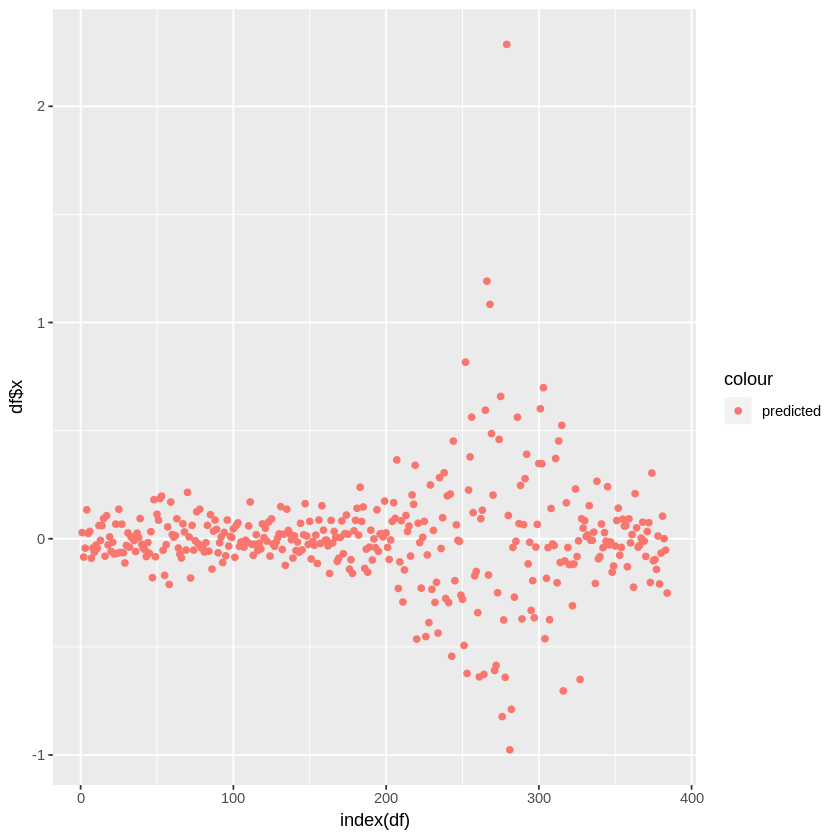

# Submission

## Code & Excel File
The code of the submission is available at https://github.com/yehjxraymond/wqu_econometrics_group_proj

The R code and Excel files for this submission is located in the ./code as: 
- 1\. Basic Statistics.ipynb
- 2\. Linear Regression.ipynb
- 3\. Univariate Time Series.ipynb
- Regression Analysis.xlsx

The R code are written in Jupyter Notebook with R Kernel. Installation istructions can be found [here]([google.com](https://docs.anaconda.com/anaconda/navigator/tutorials/r-lang/)).

# Basic Statistics

Download JP Morgan stock historical prices from Yahoo Finance

Period: February 1, 2018 – December 30, 2018

Frequency: Daily

Price considered in the analysis: Close price adjusted for dividends and splits

## Calculations in R

### Overview of data

Prior to performing the calculations, we will first get an overview of the downloaded data by:

1. Printing the first few rows of the data to understand how the data is structured
2. Printing the summary statistics of the data set
3. Plotting the closing price  

```R
library(quantmod)
library(ggplot2)

# Download JPM data from Yahoo Finance
getSymbols("JPM", src = "yahoo", from = '2018-02-01', to = '2018-12-30', getSymbols.yahoo.warning=FALSE)

# Show first few rows from the dataset
head(JPM)
```
               JPM.Open JPM.High JPM.Low JPM.Close JPM.Volume JPM.Adjusted
    2018-02-01   115.77   116.99  115.48    116.87   13800600     113.9224
    2018-02-02   116.49   116.92  114.09    114.28   16477300     111.3978
    2018-02-05   113.00   114.59  103.98    108.80   30097600     106.0560
    2018-02-06   106.85   112.48  106.61    112.11   33114800     109.2825
    2018-02-07   111.55   114.45  111.15    112.87   21878300     110.0233
    2018-02-08   113.11   113.11  107.84    107.88   27425800     105.1592


```R
# Show summary statistics for the JPM dataset
summary(JPM)
```


         Index               JPM.Open         JPM.High         JPM.Low      
     Min.   :2018-02-01   Min.   : 92.69   Min.   : 94.22   Min.   : 91.11  
     1st Qu.:2018-04-25   1st Qu.:108.24   1st Qu.:109.29   1st Qu.:106.73  
     Median :2018-07-17   Median :111.17   Median :111.95   Median :109.89  
     Mean   :2018-07-15   Mean   :110.80   Mean   :111.80   Mean   :109.64  
     3rd Qu.:2018-10-05   3rd Qu.:114.59   3rd Qu.:115.24   3rd Qu.:113.67  
     Max.   :2018-12-28   Max.   :119.13   Max.   :119.33   Max.   :118.08  

       JPM.Close        JPM.Volume        JPM.Adjusted  
     Min.   : 92.14   Min.   : 6488400   Min.   : 91.4  
     1st Qu.:108.00   1st Qu.:11048700   1st Qu.:106.1  
     Median :110.99   Median :13948300   Median :109.0  
     Mean   :110.63   Mean   :15243736   Mean   :108.8  
     3rd Qu.:114.62   3rd Qu.:17963300   3rd Qu.:112.3  
     Max.   :118.77   Max.   :41313900   Max.   :116.9  


```R
# Plot the daily closing price of JPM
ggplot(JPM, aes(Index)) + 
    geom_line(aes(y = JPM.Close)) + 
    ggtitle("JPM - Daily Closing Price") +
    labs(x = "Date", y = "Price($)") + 
    theme(plot.title = element_text(hjust = 0.5))
```


### 1.1 Average stock value

```R
# Calculate mean of closing price
jpmMeanAdj = mean(JPM[,"JPM.Adjusted"])
sprintf("1.1. Average stock value: %s", jpmMeanAdj)
```

'1.1. Average stock value: 108.786558755459'

### 1.2 Stock volatility

```R
# Calculate standard deviation of closing price
jpmVol = sd(JPM[,"JPM.Adjusted"])
sprintf("1.2. Stock Volatility: %s", jpmVol)
```


'1.2. Stock Volatility: 4.63417113735034'

### 1.3 Daily stock return

For the daily stock returns, we will print both the daily returns and daily logs returns:

```R
# Calculate arithmetic daily returns
jpmDailyRet = dailyReturn(JPM, type="arithmetic")
# Modify the from daily.returns to JPM.Returns
names(jpmDailyRet)[1] = "JPM.Returns"

# Calculate log daily returns
jpmLogRet = dailyReturn(JPM, type="log")
# Modify the from daily.returns to JPM.LogReturns
names(jpmLogRet)[1] = "JPM.LogReturns"

# Join both arithmatic and log returns with JPM xts
jpmWithReturns = merge(JPM, jpmDailyRet, join = "outer")
jpmWithReturns = merge(jpmWithReturns, jpmLogRet, join = "outer")

# Print first few rows of new dataset
head(jpmWithReturns)
```


               JPM.Open JPM.High JPM.Low JPM.Close JPM.Volume JPM.Adjusted
    2018-02-01   115.77   116.99  115.48    116.87   13800600     113.9224
    2018-02-02   116.49   116.92  114.09    114.28   16477300     111.3978
    2018-02-05   113.00   114.59  103.98    108.80   30097600     106.0560
    2018-02-06   106.85   112.48  106.61    112.11   33114800     109.2825
    2018-02-07   111.55   114.45  111.15    112.87   21878300     110.0233
    2018-02-08   113.11   113.11  107.84    107.88   27425800     105.1592
                JPM.Returns JPM.LogReturns
    2018-02-01  0.009501650    0.009456793
    2018-02-02 -0.022161410   -0.022410663
    2018-02-05 -0.047952363   -0.049140207
    2018-02-06  0.030422775    0.029969179
    2018-02-07  0.006779074    0.006756199
    2018-02-08 -0.044210205   -0.045217270

```R
ggplot(jpmWithReturns, aes(Index)) + 
    geom_line(aes(y = JPM.Returns))+
    ggtitle("JPM - Daily Returns") +
    labs(x = "Date", y = "Returns") + 
    theme(plot.title = element_text(hjust = 0.5))
```


```R
ggplot(jpmWithReturns, aes(Index)) + 
    geom_line(aes(y = JPM.LogReturns))+
    ggtitle("JPM - Daily Log Returns") +
    labs(x = "Date", y = "Returns") + 
    theme(plot.title = element_text(hjust = 0.5))
```


## Calculations in Excel


### 1.4 Average stock value


### 1.5 Stock volatility


### 1.6 Daily stock return


### 1.7 Show JP Morgan stock price evolution using a scatter plot


### 1.8 Add a trendline to the graph (trendline options – linear)


# Linear Regression

Explained variable: JP Morgan stock (adjusted close price)

Explanatory variable: S&P500

Period: February 1, 2018 – December 30, 2018

Frequency: Daily

## Implement a two-variable regression in R

```R
library(quantmod)
library(ggplot2)

# Download JPM data from Yahoo Finance
getSymbols(c("JPM", "^GSPC"), src = "yahoo", from = '2018-02-01', to = '2018-12-30', getSymbols.yahoo.warning=FALSE)

# Show first few rows from the dataset
print("JPM - JP Morgan stock")
head(JPM)

print("^GSPC - S&P 500")
head(GSPC)
```


<ol class=list-inline>
	<li>'JPM'</li>
	<li>'GSPC'</li>
</ol>


    [1] "JPM - JP Morgan stock"


               JPM.Open JPM.High JPM.Low JPM.Close JPM.Volume JPM.Adjusted
    2018-02-01   115.77   116.99  115.48    116.87   13800600     113.9224
    2018-02-02   116.49   116.92  114.09    114.28   16477300     111.3978
    2018-02-05   113.00   114.59  103.98    108.80   30097600     106.0560
    2018-02-06   106.85   112.48  106.61    112.11   33114800     109.2825
    2018-02-07   111.55   114.45  111.15    112.87   21878300     110.0233
    2018-02-08   113.11   113.11  107.84    107.88   27425800     105.1592


    [1] "^GSPC - S&P 500"


               GSPC.Open GSPC.High GSPC.Low GSPC.Close GSPC.Volume GSPC.Adjusted
    2018-02-01   2816.45   2835.96  2812.70    2821.98  3938450000       2821.98
    2018-02-02   2808.92   2808.92  2759.97    2762.13  4301130000       2762.13
    2018-02-05   2741.06   2763.39  2638.17    2648.94  5283460000       2648.94
    2018-02-06   2614.78   2701.04  2593.07    2695.14  5891660000       2695.14
    2018-02-07   2690.95   2727.67  2681.33    2681.66  4626570000       2681.66
    2018-02-08   2685.01   2685.27  2580.56    2581.00  5305440000       2581.00


```R
ggplot(JPM, aes(Index)) + 
    geom_line(aes(y = JPM.Adjusted))+
    ggtitle("JPM - Closing Price") +
    labs(x = "Date", y = "Price") + 
    theme(plot.title = element_text(hjust = 0.5))
```


output_
output_
output_
output_
output_
```R
ggplot(GSPC, aes(Index)) + 
    geom_line(aes(y = GSPC.Adjusted))+
    ggtitle("S&P500 - Closing Price") +
    labs(x = "Date", y = "Price") + 
    theme(plot.title = element_text(hjust = 0.5))
```


```R
# Merge both dataset together and rename the columns
combined = merge(GSPC$"GSPC.Adjusted", JPM$"JPM.Adjusted")
colnames(combined) = c("GSPC", "JPM")

# Show first few rows of merged dataset
head(combined)
```


                  GSPC      JPM
    2018-02-01 2821.98 113.9224
    2018-02-02 2762.13 111.3978
    2018-02-05 2648.94 106.0560
    2018-02-06 2695.14 109.2825
    2018-02-07 2681.66 110.0233
    2018-02-08 2581.00 105.1592


```R
# Using a scatter plot to visualise the two dataset
# - Explanatory variable(GSPC) on the x-axis
# - Explained variable(JPM) on the y-axis
ggplot(combined, aes(GSPC)) + 
    geom_point(aes(y = JPM))+
    ggtitle("JPM ~ S&P500") +
    labs(x = "S&P500 Price", y = "JPM Price") + 
    theme(plot.title = element_text(hjust = 0.5))
```


```R
# Using linear regression to JPM against GSPC with intercept
fit = lm(combined$JPM ~ combined$GSPC)
summary(fit)
```


    
    Call:
    lm(formula = combined$JPM ~ combined$GSPC)
    
    Residuals:
        Min      1Q  Median      3Q     Max 
    -6.8550 -2.4328  0.4907  2.4191  5.7318 
    
    Coefficients:
                   Estimate Std. Error t value Pr(>|t|)    
    (Intercept)   13.954536   5.373016   2.597     0.01 *  
    combined$GSPC  0.034569   0.001957  17.662   <2e-16 ***
    ---
    Signif. codes:  0 ‘***’ 0.001 ‘**’ 0.01 ‘*’ 0.05 ‘.’ 0.1 ‘ ’ 1
    
    Residual standard error: 3.014 on 227 degrees of freedom
    Multiple R-squared:  0.5788,	Adjusted R-squared:  0.5769 
    F-statistic: 311.9 on 1 and 227 DF,  p-value: < 2.2e-16


```R
# predicted_df <- data.frame(mpg_pred = predict(lm_fit, df), hp=df$hp)
fit[1]
fit$coef[[1]]
fit$coef[[2]]
```


	(Intercept)
		13.9545358104153
	combined$GSPC
		0.0345690707436743

    13.9545358104153

    0.0345690707436743


```R
# Generate predictions with model and data
predicted = predict(fit, combined)

# Create new dataframe with prediction
combinedWithPrediction = data.frame(date=index(combined), coredata(combined), JPM_Prediction = predicted)

# Show first few rows of data
head(combinedWithPrediction)
```


<table>
<thead><tr><th></th><th scope=col>date</th><th scope=col>GSPC</th><th scope=col>JPM</th><th scope=col>JPM_Prediction</th></tr></thead>
<tbody>
	<tr><th scope=row>2018-02-01</th><td>2018-02-01</td><td>2821.98   </td><td>113.9224  </td><td>111.5078  </td></tr>
	<tr><th scope=row>2018-02-02</th><td>2018-02-02</td><td>2762.13   </td><td>111.3978  </td><td>109.4388  </td></tr>
	<tr><th scope=row>2018-02-05</th><td>2018-02-05</td><td>2648.94   </td><td>106.0560  </td><td>105.5259  </td></tr>
	<tr><th scope=row>2018-02-06</th><td>2018-02-06</td><td>2695.14   </td><td>109.2825  </td><td>107.1230  </td></tr>
	<tr><th scope=row>2018-02-07</th><td>2018-02-07</td><td>2681.66   </td><td>110.0233  </td><td>106.6570  </td></tr>
	<tr><th scope=row>2018-02-08</th><td>2018-02-08</td><td>2581.00   </td><td>105.1592  </td><td>103.1773  </td></tr>
</tbody>
</table>


```R
# Plotting linear regression line on scatter plot
ggplot(combinedWithPrediction, aes(GSPC)) + 
    geom_point(aes(y = JPM, color = "JPM Actual Price"))+
    geom_line(aes(y = JPM_Prediction, color = "JPM Predicted Price"))+
    ggtitle("JPM ~ S&P500") +
    labs(x = "S&P500 Price", y = "JPM Price") + 
    theme(plot.title = element_text(hjust = 0.5))
```


```R
# Plot actual price and predicted price on the same graph
ggplot(combinedWithPrediction, aes(date)) + 
    geom_line(aes(y = combinedWithPrediction$JPM_Prediction, color = "Predicted"))+
    geom_line(aes(y = combinedWithPrediction$JPM, color = "Actual"))+
    ggtitle("Actual Price/Predicted Price vs Date") +
    labs(x = "Date", y = "Price") + 
    theme(plot.title = element_text(hjust = 0.5))
```


### Implement a two-variable regression in Excel using LINEST function and Analysis ToolPak


From the calculation in excel, the average stock price of JPM is approximately 108.79 based on the mean value. The daily return of JPW ranges from -5.04% to 3.98% and the standard deviation of JPM stock is 0.0145. From the liner regression estimation, the coefficient between JPM stock and S&P 500 index is 16.47. R square is 57.9%, meaning 57.9% of the variation in JPM stock that is accounted for S&P 500 index. 

The Sum of Squares Regression (SSR) is the sum of the squared differences between the prediction for each observation and the population mean. The residual sum of squares is used to help decide if a statistical model is a good fit. The proportion of total variation (SST) that is explained by the regression (SSR) is known as the Coefficient of Determination, and is often referred to as R square. In our case, the regression square of 1,372,666 divide the sum of square regression of 2,371,560 is R square, which is 57.9%. 

The "F value'' tests the overall significance of the regression model.  Specifically, they test the null hypothesis that all of the regression coefficients are equal to zero.  The F value of 311.94 indicates the coefficient between JPM stock and S&P 500 index is non zero.

According to the JPM scatterplot, we can see the stock price evolution going up and down with daily return fluctuation around 0. Based on the S&P 500 vs JPM - Regression Scatter Plot, there is obvious upward trend between S&P 500 index and JPM stock.


# Univariate Time Series Analysis

Forecast S&P/Case-Shiller U.S. National Home Price Index using an ARMA model.

Data source: https://fred.stlouisfed.org/series/CSUSHPINSA

Period considered in the analysis: January 1978 – latest data

Frequency: monthly data

## Overview of the data


```R
library(quantmod)
library(ggplot2)
library(tseries)
library(gridExtra)
library(forecast)
library(lmtest)
```


```R
# Load the US National Home Price data from CSV
HomePrice = read.csv("./US_National_Home_price.csv")

# Format the data to xts
HomePrice = xts(HomePrice, order.by=as.Date(HomePrice$DATE, format="%Y-%m-%d")) 
storage.mode(HomePrice) = "numeric"
HomePrice$DATE = NULL
```

```R
# Observe the first few rows of data
head(HomePrice)
```


               CSUSHPINSA
    1987-01-01     63.753
    1987-02-01     64.153
    1987-03-01     64.490
    1987-04-01     64.995
    1987-05-01     65.570
    1987-06-01     66.238


```R
# Plot the price index
ggplot(HomePrice, aes(Index)) + 
    geom_line(aes(y = HomePrice$CSUSHPINSA))+
    ggtitle("Case-Shiller U.S. National Home Price Index") +
    labs(x = "Date", y = "Index") + 
    theme(plot.title = element_text(hjust = 0.5))
```


## Implemented the Augmented Dickey-Fuller Test for checking the existence of a unit root in Case-Shiller Index series


The adf test suggest that the model is non-statitionary. With the p-value at 0.4123, we cannot reject the null hypothesis that an unit root is present.

This suggest for the need to perform differencing


```R
# Perform adf test with time series of HomePrice
# See https://stackoverflow.com/questions/16447461/adf-test-returning-p-0-99-with-xts-but-returning-p-0-01-with-coredataxts

adf.test(as.ts(HomePrice))
```
    
    	Augmented Dickey-Fuller Test
    
    data:  as.ts(HomePrice)
    Dickey-Fuller = -2.3903, Lag order = 7, p-value = 0.4123
    alternative hypothesis: stationary


### ACF & PACF Chart

The ACF decays very slowly as the lag increases. This further confirms the need to difference the time series data.

The PACF displays a sharp cut-off at lag 1. This could be identified as an AR signature. 


```R
# Plot ACF & PACF for HomePrice

par(mfrow=c(2,1))
acf(HomePrice)
pacf(HomePrice)
```


### Differencing

#### Diff 1

Applying diff 1 to the data, we obtained a p-value of 0.2558 on the ADF test. This suggest that the data is still not stationary at the 1% significance level.


```R
# Applying diff1
diff1 = diff(HomePrice, differences = 1)
diff1 = diff1[2:nrow(diff1)]
adf.test(as.ts(diff1))
```


    
    	Augmented Dickey-Fuller Test
    
    data:  as.ts(diff1)
    Dickey-Fuller = -2.7611, Lag order = 7, p-value = 0.2558
    alternative hypothesis: stationary


#### Diff 2

Applying diff 2 to the data, we obtained a p-value of 0.01 on the ADF test, suggesting that we can reject the null hypothesis where a unit root is present. 


```R
# Applying diff2
diff2 = diff(HomePrice, differences = 2)
diff2 = diff2[3:nrow(diff2)]
adf.test(as.ts(diff2))
```

    Warning message in adf.test(as.ts(diff2)):
    “p-value smaller than printed p-value”


    
    	Augmented Dickey-Fuller Test
    
    data:  as.ts(diff2)
    Dickey-Fuller = -15.602, Lag order = 7, p-value = 0.01
    alternative hypothesis: stationary

## Implement an ARIMA(p,d,q) model. Determine p, d, q using Information Criterion or Box-Jenkins methodology. Comment results

### ACF & PACF of diff(2)

#### ACF

The ACF chart for diff(2) shows that there are still significant correlation between the time series that are significantly different from 0 (as observed from the blue dotted lines). 

The sinusiodal graph may suggest the need for AR(2) graph.

However, we can also observe a negative correlation at lag 6 and a strong positive correlation at lag 12. This may suggest a seasonal AR with a period of 12.

#### PACF

The PACF chart shows an AR(1) signature where PACF shows a sharp cut-off at the first lag.


```R
# Plot ACF & PACF for differenced model
# https://stats.stackexchange.com/questions/49571/understanding-the-blue-dotted-lines-in-an-acf-from-r

par(mfrow=c(2,1))
acf(diff2)
pacf(diff2)
```


### Model 1 - ARIMA(0, 2, 0)


Name | Value
--- | ---
Variance | 0.1703
Log likelihood | -203.9
AIC | 409.79
RMSE | 0.4115899

ACF chart still continues to diplay the sinusoidal wave, peaking at lag 6, 12, 18, 24. This suggest the need for AR(2). 

Ljung-Box-Pierce statistics shows that the model's accumulated residual autocorrelation is not significant up to lag 20. 


```R
model1 <- arima(window(HomePrice), order=c(0,2,0), method = "ML")

# Print summary of model1
summary(model1)

# Print diagnostics of model1
tsdiag(model1)
```
    Call:
    arima(x = window(HomePrice), order = c(0, 2, 0), method = "ML")
    
    
    sigma^2 estimated as 0.1703:  log likelihood = -203.9,  aic = 409.79
    
    Training set error measures:
                           ME      RMSE       MAE         MPE      MAPE      MASE
    Training set -0.001927416 0.4115899 0.2602374 0.002485472 0.1939264 0.3497458
                      ACF1
    Training set 0.5469119


### Model 2 - ARIMA(0, 2, 2)

Name | Value
--- | ---
Variance | 0.1101
Log likelihood | -120.87
AIC | 247.73
RMSE | 0.3309369

ACF chart shows smaller spikes compared to model1's. However, it can still be observed that the spiked at 6, 12, 18, 24 is still significant. This suggest that there are correlation that has yet to be accounted for.

Ljung-Box-Pierce statistics shows that the model's accumulated residual autocorrelation is significant at lag 1 to 4.

Both coefficient, ar1 & ar2, are tested to be significantly different from zero.


```R
model2 <- arima(window(HomePrice), order=c(0,2,2), method = "ML")

# Print summary of model2
summary(model2)

# Coefficient test of ar1 and ar2
coeftest(model2)

# Print diagnostics of model2
tsdiag(model2)
```
    Call:
    arima(x = window(HomePrice), order = c(0, 2, 2), method = "ML")
    
    Coefficients:
             ma1     ma2
          0.6201  0.4156
    s.e.  0.0458  0.0466
    
    sigma^2 estimated as 0.1101:  log likelihood = -120.87,  aic = 247.73
    
    Training set error measures:
                           ME      RMSE       MAE         MPE      MAPE      MASE
    Training set -0.001339956 0.3309369 0.2003839 0.001235961 0.1496965 0.2693058
                        ACF1
    Training set 0.001531978
    
    z test of coefficients:
    
        Estimate Std. Error z value  Pr(>|z|)    
    ma1 0.620150   0.045808 13.5379 < 2.2e-16 ***
    ma2 0.415642   0.046551  8.9288 < 2.2e-16 ***
    ---
    Signif. codes:  0 ‘***’ 0.001 ‘**’ 0.01 ‘*’ 0.05 ‘.’ 0.1 ‘ ’ 1


### Model 3 - ARIMA(2, 2, 0)

Name | Value
--- | ---
Variance | 0.1166
Log likelihood | -131.82
AIC | 269.64
RMSE | 0.3406494

ACF chart shows smaller spikes compared to model1's. However, it can still be observed that the spiked at 6, 12, 18, 24 is still significant. This suggest that there are correlation that has yet to be accounted for.

Ljung-Box-Pierce statistics shows that the model's accumulated residual autocorrelation is not significant up to lag 20, except for lag 1.

Both coefficient, ar1 & ar2, are tested to be significantly different from zero.

Overall, model3 outperforms model1 and model2 and should be chosen for non-seasonal arima model. 


```R
model3 <- arima(window(HomePrice), order=c(2,2,0), method = "ML")

# Print summary of model3
summary(model3)

# Coefficient test of ma1 and ma2
coeftest(model3)

# Print diagnostics of model3
tsdiag(model3)
```
    Call:
    arima(x = window(HomePrice), order = c(2, 2, 0), method = "ML")
    
    Coefficients:
             ar1      ar2
          0.6277  -0.1485
    s.e.  0.0506   0.0505
    
    sigma^2 estimated as 0.1166:  log likelihood = -131.82,  aic = 269.64
    
    Training set error measures:
                          ME      RMSE       MAE         MPE      MAPE      MASE
    Training set -0.00141818 0.3406494 0.2080001 0.001291073 0.1556069 0.2795416
                        ACF1
    Training set -0.04423696

    
    z test of coefficients:
    
         Estimate Std. Error z value  Pr(>|z|)    
    ar1  0.627713   0.050562 12.4146 < 2.2e-16 ***
    ar2 -0.148481   0.050537 -2.9381  0.003302 ** 
    ---
    Signif. codes:  0 ‘***’ 0.001 ‘**’ 0.01 ‘*’ 0.05 ‘.’ 0.1 ‘ ’ 1


### Seasonal ARIMA

As suggested by the high positive correlation at lag 12, it is highly possible that the model would be seasonal with period 12. This is further confirmed by the unexplained spiked of ACF for the non-seasonal model at lags of 6, 12, 18 and 24.

### Model 4 - ARIMA (0,2,0) (2,0,0) 12

Name | Value
--- | ---
Variance | 0.07037
Log likelihood | -40.53
AIC | 87.07
RMSE | 0.2646128

ACF chart shows smaller spikes compared to model3's. However, there are still significant spikes at lag 3, 7, 11, 16, 23.

Ljung-Box-Pierce statistics shows that the model's accumulated residual autocorrelation is not significant up to lag 20. 

Both coefficient, sar1 & sar2, are tested to be significantly different from zero.


```R
model4 <- arima(window(HomePrice), order=c(0,2,0), seasonal=list(order=c(2,0,0),period=12),  method = "ML")
# Print summary of model4
summary(model4)

# Coefficient test of sar1 and sar2
coeftest(model4)

# Print diagnostics of model4
tsdiag(model4)
```
    
    Call:
    arima(x = window(HomePrice), order = c(0, 2, 0), seasonal = list(order = c(2, 
        0, 0), period = 12), method = "ML")
    
    Coefficients:
            sar1    sar2
          0.5472  0.2536
    s.e.  0.0485  0.0491
    
    sigma^2 estimated as 0.07037:  log likelihood = -40.53,  aic = 87.07
    
    Training set error measures:
                           ME      RMSE       MAE          MPE      MAPE      MASE
    Training set -0.001702845 0.2646128 0.1577538 0.0009116675 0.1194314 0.2120131
                      ACF1
    Training set 0.1308832

    
    z test of coefficients:
    
         Estimate Std. Error z value  Pr(>|z|)    
    sar1 0.547214   0.048479 11.2877 < 2.2e-16 ***
    sar2 0.253567   0.049080  5.1665 2.386e-07 ***
    ---
    Signif. codes:  0 ‘***’ 0.001 ‘**’ 0.01 ‘*’ 0.05 ‘.’ 0.1 ‘ ’ 1


### Model 5 - ARIMA (0,2,0) (0,0,2) 12

Name | Value
--- | ---
Variance | 0.09245
Log likelihood | -90.1
AIC | 186.19
RMSE | 0.30329

ACF chart showed similar sinusoidal wave as the model1-3, with smaller ACF spikes on lag 12 and 24. The ACF spikes does not seemed to smoothened around those periods and the ACF spikes on lag 6 and 18 were not affected. This suggest that adding order to the SMA term does not futher explain the prices.

Ljung-Box-Pierce statistics shows that the model's accumulated residual autocorrelation is not significant up to lag 20. 

Both coefficient, sar1 & sar2, are tested to be significantly different from zero.


```R
model5 <- arima(window(HomePrice), order=c(0,2,0), seasonal=list(order=c(0,0,2),period=12),  method = "ML")
# Print summary of model5
summary(model5)

# Coefficient test of sma1 and sma2
coeftest(model5)

# Print diagnostics of model5
tsdiag(model5)
```
    Call:
    arima(x = window(HomePrice), order = c(0, 2, 0), seasonal = list(order = c(0, 
        0, 2), period = 12), method = "ML")
    
    Coefficients:
            sma1    sma2
          0.6074  0.3406
    s.e.  0.0505  0.0398
    
    sigma^2 estimated as 0.09245:  log likelihood = -90.1,  aic = 186.19
    
    Training set error measures:
                           ME      RMSE       MAE         MPE      MAPE      MASE
    Training set -0.001886846 0.3032905 0.1936652 0.001145485 0.1454877 0.2602762
                      ACF1
    Training set 0.2722617

    
    z test of coefficients:
    
         Estimate Std. Error z value  Pr(>|z|)    
    sma1 0.607432   0.050532 12.0208 < 2.2e-16 ***
    sma2 0.340587   0.039833  8.5504 < 2.2e-16 ***
    ---
    Signif. codes:  0 ‘***’ 0.001 ‘**’ 0.01 ‘*’ 0.05 ‘.’ 0.1 ‘ ’ 1


### Model Selection

Model | Variance | Log Likelihood | AIC | RMSE
--- | --- | --- | --- | ---
1 | 0.1703 | -203.9 | 409.79 | 0.4115899
2 | 0.1101 | -120.87 | 247.73 | 0.3309369
3 | 0.1166 | -131.82 | 269.64 | 0.3406494
4 | 0.07037 | -40.53 | 87.07 | 0.2646128
5 | 0.09245 | -90.1 | 186.19 | 0.30329

Comparing the non-seasonal models, we can see that model2, ARIMA(0,2,2) is the best model. 

However, if we take seasonality into account, we can see that model4, ARIMA(0,2,0)(0,0,2)12, stands out as the best model for the forecast. 

## Forecast the future evolution of Case-Shiller Index using the ARMA model. Test model using in-sample forecasts

### Forecasting with Model4

Using model4, we will attempt to forecast the last 24 periods of the timeseries.

First, we will split the data into training set and testing set. The testing set will have the actual price index of the last 24 period and the training set will have all the remaining data.

Then, we will train the ARIMA model with the training set and create a prediction with n.ahead = 24. We will plot out the predicted results compared to the actual results using ggplot, together with 2 * SE as the upper and lower bounds of the prediction.

Finally, we will assess the fit by calculating the RSME and MAE of the actual value vs predicted value. 


```R
# From the residual plot, we can see that the model starts to diverge at around period 200
# We will forecast ahead for 24 periods to ensure that we do not forecast too far into the future
df = as.data.frame(model4$residuals)
ggplot(df, aes(index(df))) + 
    geom_point(aes(y = df$x, color="predicted"))
```


```R
periodToForecast = 24
trainPeriod = nrow(HomePrice)-periodToForecast

# Split data into training set
train = HomePrice[1:trainPeriod]

# Create new model with training set
fit = arima(train, order=c(0,2,0), seasonal=list(order=c(2,0,0),period=12),  method = "ML")

# Create prediction
predictions = predict(fit,n.ahead=periodToForecast,se.fit=TRUE)
```


```R
# Create dataframe of HomePrice with prediction and 2 * SE bounds
pred = c()
upper = c()
lower = c()
for(i in 1:nrow(HomePrice)){
    if(i <= nrow(HomePrice) - periodToForecast){
        pred[i] = HomePrice$CSUSHPINSA[i]
        upper[i] = HomePrice$CSUSHPINSA[i]
        lower[i] = HomePrice$CSUSHPINSA[i]
    }else{
        p = i - trainPeriod
        pred[i] = predictions$pred[p]
        upper[i] = predictions$pred[p] + 2*predictions$se[p]
        lower[i] = predictions$pred[p] - 2*predictions$se[p]
    }
}
withPrediction = merge(HomePrice, pred, upper, lower)

ggplot(withPrediction, aes(Index)) + 
    geom_line(aes(y = withPrediction$pred, color="predicted")) +
    geom_line(aes(y = withPrediction$upper), linetype="dashed") +
    geom_line(aes(y = withPrediction$lower), , linetype="dashed") +
    geom_line(aes(y = withPrediction$CSUSHPINSA, color="actual"))
```




```R
library(DescTools)

rmseM4 = RMSE(withPrediction[-24]$pred, withPrediction[-24]$CSUSHPINSA)
maeM4 = MAE(withPrediction[-24]$pred, withPrediction[-24]$CSUSHPINSA)

sprintf("RSME: %s", rmseM4)
sprintf("MAE: %s", maeM4)
```

'RSME: 0.420224462539597'

'MAE: 0.0904105973244109'

### Conclusion

From the graph above, we can see that the ARIMA (0,2,0)(2,0,0)12 model did a great job at forecasting the time series. 

This is further confirmed by the RSME of 0.42 on untrained data, which is very close to the RSME of model 4 at 0.2646128.

## Suggest exogenous variables that can improve forecasts

Prices are affected by supply and demand. Thus, supply-
side factors could include number of houses and interest rates (i.e. ease of getting a
mortgage). Demand-side factors could be population, wages, and inflation. GDP may be a
factor that influences both supply and demand.
