# Submission No. 2: Volatility And Multivariate Analysis
Author	: Raymond Yeh, Vincent Louie Delfin, Lu Liu, Nazri Nawi

Date	: April 8, 2019

## Part 1 - Volatility Modelling Analysis

### 1.0 Volatility Analysis.

In this assignment, we will do a forecasting of Apple (AAPL) daily stock return by applying volatility analysis using a GARCH Model.
We will analyse each GARCH model i.e; ARCH, GARCH-M, IGARCH, EGARCH, TARCH, multivariate GARCH, then we will compare and select the best fit.

Daily OCHL data source of Apple is obtained from Yahoo Finance. 

```R
# Load necessary libraries

library(quantmod)
library(ggplot2)
library(tseries)
library(rugarch)
library(lmtest)
library(moments)
```


```R
# Download Apple data from Yahoo Finance
getSymbols("AAPL", src = "yahoo", from = '2000-01-01', to = '2019-04-01', getSymbols.yahoo.warning=FALSE)

# Show first few rows from the dataset
head(AAPL)
```


'AAPL'


               AAPL.Open AAPL.High AAPL.Low AAPL.Close AAPL.Volume AAPL.Adjusted
    2000-01-03  3.745536  4.017857 3.631696   3.997768   133949200      2.665724
    2000-01-04  3.866071  3.950893 3.613839   3.660714   128094400      2.440975
    2000-01-05  3.705357  3.948661 3.678571   3.714286   194580400      2.476697
    2000-01-06  3.790179  3.821429 3.392857   3.392857   191993200      2.262367
    2000-01-07  3.446429  3.607143 3.410714   3.553571   115183600      2.369532
    2000-01-10  3.642857  3.651786 3.383929   3.491071   126266000      2.327857


```R
# Plotting returns
Price = as.xts(AAPL$AAPL.Adjusted)
names(Price) = c("price")
Returns = dailyReturn(Price)
plot(Returns)
```


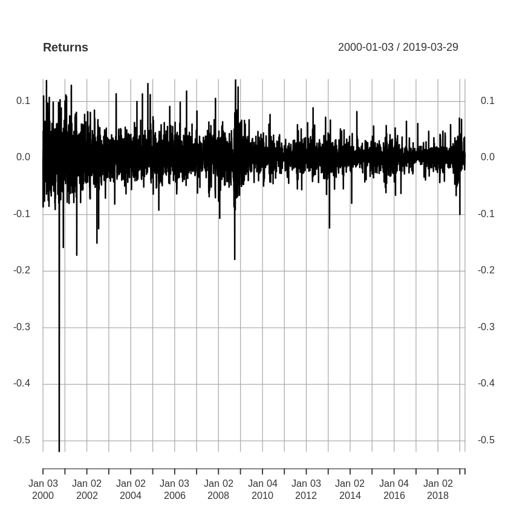


```R
# Basic normality test on the returns
returnsDf = as.data.frame(Returns)$daily.returns
shapiro.test(returnsDf)
skewness(returnsDf)
kurtosis(returnsDf)
```


    
    	Shapiro-Wilk normality test
    
    data:  returnsDf
    W = 0.89249, p-value < 2.2e-16


-1.62812865907981

40.7237359235109


```R
# Stationary test on returns
adf.test(Returns)
```

    Warning message in adf.test(Returns):
    “p-value smaller than printed p-value”


    
    	Augmented Dickey-Fuller Test
    
    data:  Returns
    Dickey-Fuller = -15.572, Lag order = 16, p-value = 0.01
    alternative hypothesis: stationary


```R
# Examining the ACF & PACF of returns
acf(Returns)
pacf(Returns)
```


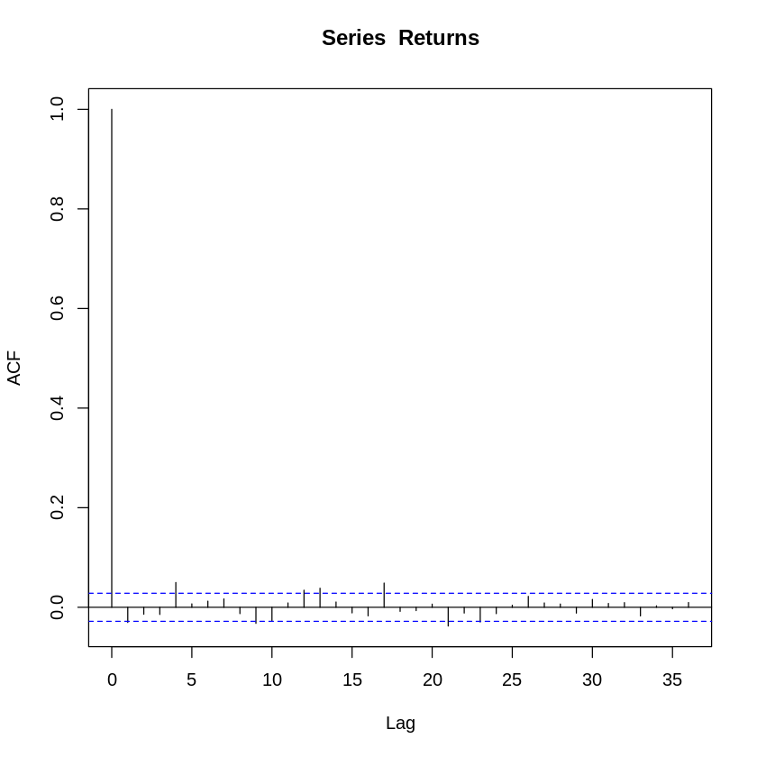


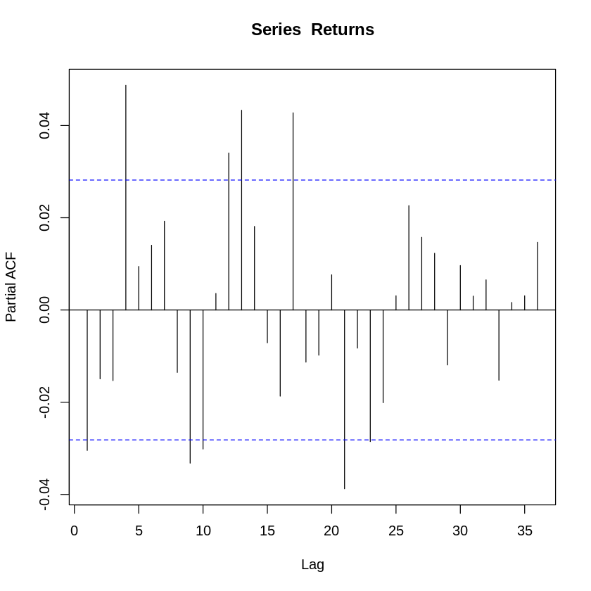


```R
# Examining the ACF & PACF of returns^2
acf(Returns^2)
pacf(Returns^2)
```


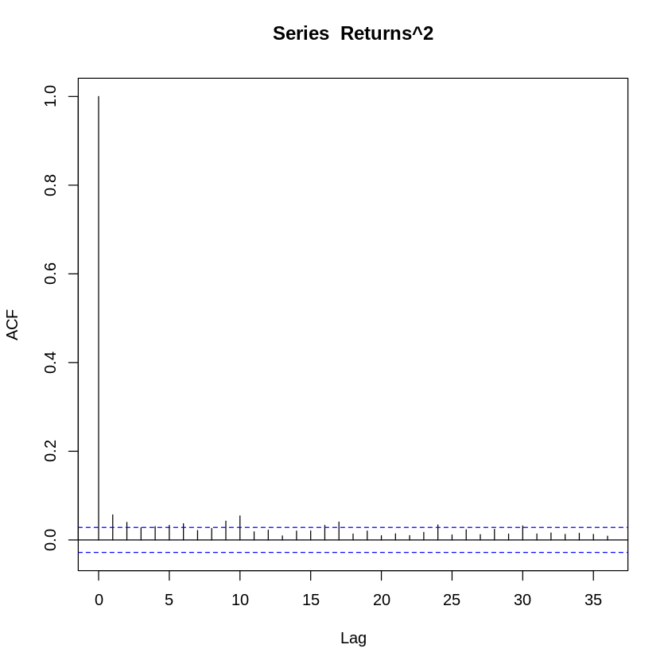


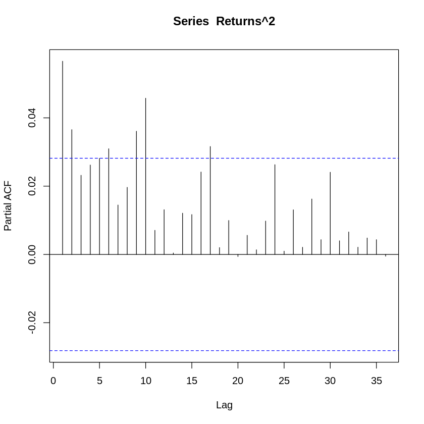


## Intuitions

Looking at the ADF test we can see that the daily return is stationary. 

The normality test shows skews and kurtosis. The negative skew of the returns may suggest that negative news impact the innovation of the series more than positive news. This may suggest the need for asymmetric GARCH models. 

The ACF & PACF of the series suggests possibility of AR model. We will investigate the impact of AR terms on the GARCH model.

The ACF & PACF of the series suggests possibility of MA terms for the GARCH model. We will investigate further the impact of additional MA terms on the GARCH model.

## 1.1 GARCH Model

Since the returns is stationary, we will model the volatility with the simplest GARCH(1,1) model first to compare against other models. 


```R
spec_garch_11 = ugarchspec(mean.model = list(armaOrder = c(0,0)))
show(spec_garch_11)
```

    
    *---------------------------------*
    *       GARCH Model Spec          *
    *---------------------------------*
    
    Conditional Variance Dynamics 	
    ------------------------------------
    GARCH Model		: sGARCH(1,1)
    Variance Targeting	: FALSE 
    
    Conditional Mean Dynamics
    ------------------------------------
    Mean Model		: ARFIMA(0,0,0)
    Include Mean		: TRUE 
    GARCH-in-Mean		: FALSE 
    
    Conditional Distribution
    ------------------------------------
    Distribution	:  norm 
    Includes Skew	:  FALSE 
    Includes Shape	:  FALSE 
    Includes Lambda	:  FALSE 
    


```R
fit_garch_11 = ugarchfit(spec_garch_11, Returns, solver='hybrid', out.sample = 30)
```


```R
show(fit_garch_11)
```

    
    *---------------------------------*
    *          GARCH Model Fit        *
    *---------------------------------*
    
    Conditional Variance Dynamics 	
    -----------------------------------
    GARCH Model	: sGARCH(1,1)
    Mean Model	: ARFIMA(0,0,0)
    Distribution	: norm 
    
    Optimal Parameters
    ------------------------------------
            Estimate  Std. Error  t value Pr(>|t|)
    mu      0.001957    0.000275   7.1239 0.000000
    omega   0.000006    0.000002   2.8611 0.004221
    alpha1  0.070646    0.009108   7.7565 0.000000
    beta1   0.923010    0.010445  88.3689 0.000000
    
    Robust Standard Errors:
            Estimate  Std. Error  t value Pr(>|t|)
    mu      0.001957    0.000291  6.71943 0.000000
    omega   0.000006    0.000007  0.79615 0.425947
    alpha1  0.070646    0.032051  2.20413 0.027515
    beta1   0.923010    0.035988 25.64783 0.000000
    
    LogLikelihood : 11538.93 
    
    Information Criteria
    ------------------------------------
                        
    Akaike       -4.7962
    Bayes        -4.7908
    Shibata      -4.7962
    Hannan-Quinn -4.7943
    
    Weighted Ljung-Box Test on Standardized Residuals
    ------------------------------------
                            statistic p-value
    Lag[1]                   0.003614  0.9521
    Lag[2*(p+q)+(p+q)-1][2]  0.231636  0.8350
    Lag[4*(p+q)+(p+q)-1][5]  3.451694  0.3307
    d.o.f=0
    H0 : No serial correlation
    
    Weighted Ljung-Box Test on Standardized Squared Residuals
    ------------------------------------
                            statistic p-value
    Lag[1]                     0.5901  0.4424
    Lag[2*(p+q)+(p+q)-1][5]    1.3949  0.7657
    Lag[4*(p+q)+(p+q)-1][9]    2.0510  0.8988
    d.o.f=2
    
    Weighted ARCH LM Tests
    ------------------------------------
                Statistic Shape Scale P-Value
    ARCH Lag[3]    0.4915 0.500 2.000  0.4832
    ARCH Lag[5]    1.4486 1.440 1.667  0.6059
    ARCH Lag[7]    1.8084 2.315 1.543  0.7578
    
    Nyblom stability test
    ------------------------------------
    Joint Statistic:  1.75
    Individual Statistics:             
    mu     0.3266
    omega  0.2720
    alpha1 0.9633
    beta1  1.1454
    
    Asymptotic Critical Values (10% 5% 1%)
    Joint Statistic:     	 1.07 1.24 1.6
    Individual Statistic:	 0.35 0.47 0.75
    
    Sign Bias Test
    ------------------------------------
                       t-value     prob sig
    Sign Bias           2.2301 0.025784  **
    Negative Sign Bias  0.4115 0.680716    
    Positive Sign Bias  3.1981 0.001392 ***
    Joint Effect       11.4520 0.009517 ***
    
    
    Adjusted Pearson Goodness-of-Fit Test:
    ------------------------------------
      group statistic p-value(g-1)
    1    20     193.1    8.068e-31
    2    30     207.2    8.243e-29
    3    40     210.7    2.002e-25
    4    50     231.4    1.747e-25
    
    
    Elapsed time : 0.2939816 
    


## 1.2 Asymmetric GARCH

Noted earlier, we will want to explore the impact of asymmetry on the GARCH model due to the difference in the impact of positive and negative news to the returns process. We will start with the TGARCH model.

### TGARCH


```R
spec_tgarch_11 = ugarchspec(
    variance.model = list( model = "fGARCH", submodel = "TGARCH", garchOrder = c(1,1)),
    mean.model = list(armaOrder = c(0,0))
)
spec_tgarch_11
```


    
    *---------------------------------*
    *       GARCH Model Spec          *
    *---------------------------------*
    
    Conditional Variance Dynamics 	
    ------------------------------------
    GARCH Model		: fGARCH(1,1)
    fGARCH Sub-Model	: TGARCH
    Variance Targeting	: FALSE 
    
    Conditional Mean Dynamics
    ------------------------------------
    Mean Model		: ARFIMA(0,0,0)
    Include Mean		: TRUE 
    GARCH-in-Mean		: FALSE 
    
    Conditional Distribution
    ------------------------------------
    Distribution	:  norm 
    Includes Skew	:  FALSE 
    Includes Shape	:  FALSE 
    Includes Lambda	:  FALSE 


```R
fit_tgarch_11 = ugarchfit(spec_tgarch_11, Returns, solver='hybrid', out.sample = 30)
fit_tgarch_11
```


    
    *---------------------------------*
    *          GARCH Model Fit        *
    *---------------------------------*
    
    Conditional Variance Dynamics 	
    -----------------------------------
    GARCH Model	: fGARCH(1,1)
    fGARCH Sub-Model	: TGARCH
    Mean Model	: ARFIMA(0,0,0)
    Distribution	: norm 
    
    Optimal Parameters
    ------------------------------------
            Estimate  Std. Error  t value Pr(>|t|)
    mu      0.001607    0.000260   6.1896        0
    omega   0.000420    0.000076   5.5067        0
    alpha1  0.095212    0.009311  10.2257        0
    beta1   0.911350    0.009377  97.1886        0
    eta11   0.372888    0.048901   7.6254        0
    
    Robust Standard Errors:
            Estimate  Std. Error  t value Pr(>|t|)
    mu      0.001607    0.000313   5.1312 0.000000
    omega   0.000420    0.000164   2.5588 0.010503
    alpha1  0.095212    0.027032   3.5222 0.000428
    beta1   0.911350    0.024959  36.5139 0.000000
    eta11   0.372888    0.075080   4.9665 0.000001
    
    LogLikelihood : 11589.88 
    
    Information Criteria
    ------------------------------------
                        
    Akaike       -4.8170
    Bayes        -4.8103
    Shibata      -4.8170
    Hannan-Quinn -4.8146
    
    Weighted Ljung-Box Test on Standardized Residuals
    ------------------------------------
                            statistic p-value
    Lag[1]                     0.4992  0.4798
    Lag[2*(p+q)+(p+q)-1][2]    0.5714  0.6610
    Lag[4*(p+q)+(p+q)-1][5]    3.6733  0.2977
    d.o.f=0
    H0 : No serial correlation
    
    Weighted Ljung-Box Test on Standardized Squared Residuals
    ------------------------------------
                            statistic p-value
    Lag[1]                     0.4158  0.5191
    Lag[2*(p+q)+(p+q)-1][5]    1.5754  0.7214
    Lag[4*(p+q)+(p+q)-1][9]    1.9817  0.9072
    d.o.f=2
    
    Weighted ARCH LM Tests
    ------------------------------------
                Statistic Shape Scale P-Value
    ARCH Lag[3]    0.8617 0.500 2.000  0.3533
    ARCH Lag[5]    0.9786 1.440 1.667  0.7393
    ARCH Lag[7]    1.1110 2.315 1.543  0.8948
    
    Nyblom stability test
    ------------------------------------
    Joint Statistic:  2.722
    Individual Statistics:             
    mu     0.7083
    omega  1.4864
    alpha1 1.6176
    beta1  1.8628
    eta11  0.7872
    
    Asymptotic Critical Values (10% 5% 1%)
    Joint Statistic:     	 1.28 1.47 1.88
    Individual Statistic:	 0.35 0.47 0.75
    
    Sign Bias Test
    ------------------------------------
                       t-value      prob sig
    Sign Bias           2.4287 0.0151890  **
    Negative Sign Bias  0.9311 0.3518294    
    Positive Sign Bias  3.3517 0.0008093 ***
    Joint Effect       12.2649 0.0065288 ***
    
    
    Adjusted Pearson Goodness-of-Fit Test:
    ------------------------------------
      group statistic p-value(g-1)
    1    20     160.9    1.725e-24
    2    30     180.1    9.558e-24
    3    40     190.0    9.609e-22
    4    50     207.4    2.173e-21
    
    
    Elapsed time : 0.7492216 


```R
plot(fit_tgarch_11, which = "all")
```

    
    please wait...calculating quantiles...


We can observe that providing asymmetry to the model improves the model's performance. With that, we can explore if the asymmetry is a result of conditional variance with the EGARCH model.

### EGARCH


```R
spec_egarch_11 = ugarchspec(mean.model = list(armaOrder = c(0,0)), variance.model= list(garchOrder = c(1,1), model="eGARCH"))
show(spec_egarch_11)
```

    
    *---------------------------------*
    *       GARCH Model Spec          *
    *---------------------------------*
    
    Conditional Variance Dynamics 	
    ------------------------------------
    GARCH Model		: eGARCH(1,1)
    Variance Targeting	: FALSE 
    
    Conditional Mean Dynamics
    ------------------------------------
    Mean Model		: ARFIMA(0,0,0)
    Include Mean		: TRUE 
    GARCH-in-Mean		: FALSE 
    
    Conditional Distribution
    ------------------------------------
    Distribution	:  norm 
    Includes Skew	:  FALSE 
    Includes Shape	:  FALSE 
    Includes Lambda	:  FALSE 
    


```R
fit_egarch_11 = ugarchfit(spec_egarch_11, Returns, solver='hybrid', out.sample = 30)
fit_egarch_11
```


    
    *---------------------------------*
    *          GARCH Model Fit        *
    *---------------------------------*
    
    Conditional Variance Dynamics 	
    -----------------------------------
    GARCH Model	: eGARCH(1,1)
    Mean Model	: ARFIMA(0,0,0)
    Distribution	: norm 
    
    Optimal Parameters
    ------------------------------------
            Estimate  Std. Error  t value Pr(>|t|)
    mu      0.001671    0.000320   5.2216        0
    omega  -0.117904    0.010479 -11.2514        0
    alpha1 -0.056031    0.007641  -7.3326        0
    beta1   0.983375    0.001327 740.8497        0
    gamma1  0.157625    0.013045  12.0832        0
    
    Robust Standard Errors:
            Estimate  Std. Error  t value Pr(>|t|)
    mu      0.001671    0.000542   3.0844 0.002040
    omega  -0.117904    0.029518  -3.9944 0.000065
    alpha1 -0.056031    0.013044  -4.2954 0.000017
    beta1   0.983375    0.003409 288.4905 0.000000
    gamma1  0.157625    0.048721   3.2353 0.001215
    
    LogLikelihood : 11591.07 
    
    Information Criteria
    ------------------------------------
                        
    Akaike       -4.8175
    Bayes        -4.8108
    Shibata      -4.8175
    Hannan-Quinn -4.8151
    
    Weighted Ljung-Box Test on Standardized Residuals
    ------------------------------------
                            statistic p-value
    Lag[1]                     0.2875  0.5918
    Lag[2*(p+q)+(p+q)-1][2]    0.4484  0.7183
    Lag[4*(p+q)+(p+q)-1][5]    3.4212  0.3355
    d.o.f=0
    H0 : No serial correlation
    
    Weighted Ljung-Box Test on Standardized Squared Residuals
    ------------------------------------
                            statistic p-value
    Lag[1]                     0.6966  0.4039
    Lag[2*(p+q)+(p+q)-1][5]    1.3126  0.7858
    Lag[4*(p+q)+(p+q)-1][9]    1.7437  0.9333
    d.o.f=2
    
    Weighted ARCH LM Tests
    ------------------------------------
                Statistic Shape Scale P-Value
    ARCH Lag[3]    0.7434 0.500 2.000  0.3886
    ARCH Lag[5]    0.9123 1.440 1.667  0.7591
    ARCH Lag[7]    1.1462 2.315 1.543  0.8887
    
    Nyblom stability test
    ------------------------------------
    Joint Statistic:  2.3992
    Individual Statistics:              
    mu     0.39248
    omega  1.42038
    alpha1 0.43223
    beta1  1.30444
    gamma1 0.06334
    
    Asymptotic Critical Values (10% 5% 1%)
    Joint Statistic:     	 1.28 1.47 1.88
    Individual Statistic:	 0.35 0.47 0.75
    
    Sign Bias Test
    ------------------------------------
                       t-value      prob sig
    Sign Bias           2.5725 0.0101269  **
    Negative Sign Bias  0.5439 0.5865569    
    Positive Sign Bias  3.8790 0.0001063 ***
    Joint Effect       15.5530 0.0014002 ***
    
    
    Adjusted Pearson Goodness-of-Fit Test:
    ------------------------------------
      group statistic p-value(g-1)
    1    20     165.7    1.952e-25
    2    30     179.7    1.121e-23
    3    40     187.1    3.024e-21
    4    50     200.7    2.954e-20
    
    
    Elapsed time : 0.5421457 


We can see the EGARCH(1,1) model performed better than the other models but it is still failing at Ljung-box test for the square residuals. We will attempt to increase the MA term for the EGARCH model to account for the serial correlation of the square of residuals.

### EGARCH(1,2)


```R
spec_egarch_12 = ugarchspec(mean.model = list(armaOrder = c(0,0)), variance.model= list(garchOrder = c(1,2), model="eGARCH"))
show(spec_egarch_12)
```

    
    *---------------------------------*
    *       GARCH Model Spec          *
    *---------------------------------*
    
    Conditional Variance Dynamics 	
    ------------------------------------
    GARCH Model		: eGARCH(1,2)
    Variance Targeting	: FALSE 
    
    Conditional Mean Dynamics
    ------------------------------------
    Mean Model		: ARFIMA(0,0,0)
    Include Mean		: TRUE 
    GARCH-in-Mean		: FALSE 
    
    Conditional Distribution
    ------------------------------------
    Distribution	:  norm 
    Includes Skew	:  FALSE 
    Includes Shape	:  FALSE 
    Includes Lambda	:  FALSE 
    


```R
fit_egarch_12 = ugarchfit(spec_egarch_12, Returns, solver='hybrid', out.sample = 30)
fit_egarch_12
```


    
    *---------------------------------*
    *          GARCH Model Fit        *
    *---------------------------------*
    
    Conditional Variance Dynamics 	
    -----------------------------------
    GARCH Model	: eGARCH(1,2)
    Mean Model	: ARFIMA(0,0,0)
    Distribution	: norm 
    
    Optimal Parameters
    ------------------------------------
            Estimate  Std. Error  t value Pr(>|t|)
    mu      0.001672    0.000292   5.7192        0
    omega  -0.127462    0.021907  -5.8182        0
    alpha1 -0.061576    0.006700  -9.1906        0
    beta1   0.776043    0.001656 468.6130        0
    beta2   0.205902    0.001889 109.0295        0
    gamma1  0.181361    0.015097  12.0127        0
    
    Robust Standard Errors:
            Estimate  Std. Error  t value Pr(>|t|)
    mu      0.001672    0.000407   4.1102 0.000040
    omega  -0.127462    0.074786  -1.7044 0.088314
    alpha1 -0.061576    0.016251  -3.7891 0.000151
    beta1   0.776043    0.005435 142.7765 0.000000
    beta2   0.205902    0.004964  41.4828 0.000000
    gamma1  0.181361    0.035165   5.1574 0.000000
    
    LogLikelihood : 11593.1 
    
    Information Criteria
    ------------------------------------
                        
    Akaike       -4.8179
    Bayes        -4.8098
    Shibata      -4.8179
    Hannan-Quinn -4.8151
    
    Weighted Ljung-Box Test on Standardized Residuals
    ------------------------------------
                            statistic p-value
    Lag[1]                     0.2425  0.6224
    Lag[2*(p+q)+(p+q)-1][2]    0.3871  0.7491
    Lag[4*(p+q)+(p+q)-1][5]    3.3711  0.3435
    d.o.f=0
    H0 : No serial correlation
    
    Weighted Ljung-Box Test on Standardized Squared Residuals
    ------------------------------------
                             statistic p-value
    Lag[1]                      0.3273  0.5672
    Lag[2*(p+q)+(p+q)-1][8]     1.3018  0.9487
    Lag[4*(p+q)+(p+q)-1][14]    2.1694  0.9876
    d.o.f=3
    
    Weighted ARCH LM Tests
    ------------------------------------
                Statistic Shape Scale P-Value
    ARCH Lag[4]    0.1496 0.500 2.000  0.6989
    ARCH Lag[6]    0.3603 1.461 1.711  0.9299
    ARCH Lag[8]    0.5810 2.368 1.583  0.9750
    
    Nyblom stability test
    ------------------------------------
    Joint Statistic:  2.5969
    Individual Statistics:             
    mu     0.3389
    omega  1.2813
    alpha1 0.6046
    beta1  1.1792
    beta2  1.1811
    gamma1 0.0644
    
    Asymptotic Critical Values (10% 5% 1%)
    Joint Statistic:     	 1.49 1.68 2.12
    Individual Statistic:	 0.35 0.47 0.75
    
    Sign Bias Test
    ------------------------------------
                       t-value      prob sig
    Sign Bias           2.4838 0.0130337  **
    Negative Sign Bias  0.7355 0.4620856    
    Positive Sign Bias  3.7090 0.0002104 ***
    Joint Effect       14.4159 0.0023904 ***
    
    
    Adjusted Pearson Goodness-of-Fit Test:
    ------------------------------------
      group statistic p-value(g-1)
    1    20     165.0    2.682e-25
    2    30     174.2    1.203e-22
    3    40     191.3    5.612e-22
    4    50     200.2    3.550e-20
    
    
    Elapsed time : 0.6495256 


```R
plot(fit_egarch_12, which="all")
```

    
    please wait...calculating quantiles...


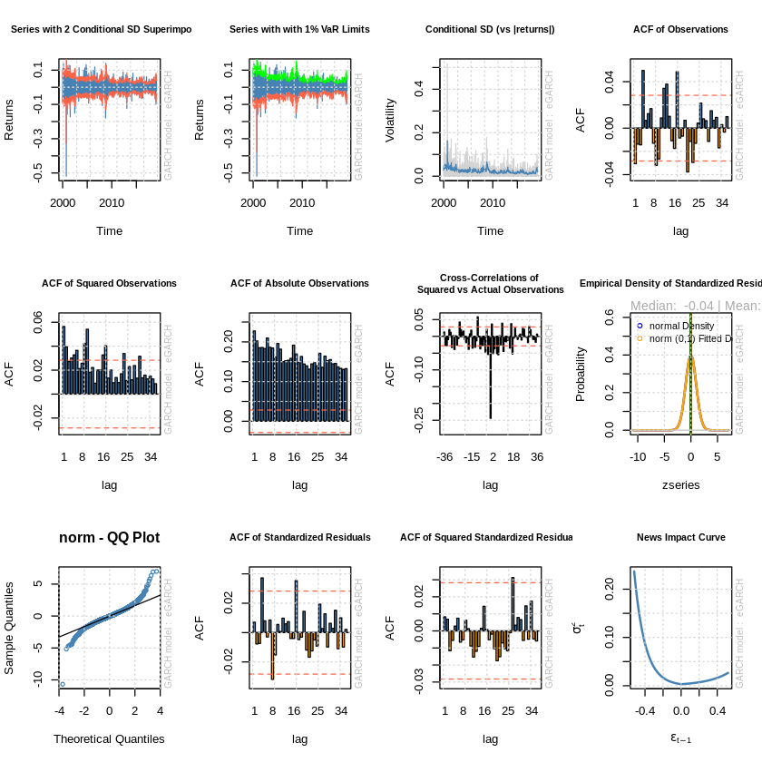


## 1.3 Other Models

### ARCH


```R
spec_garch_10 = ugarchspec(mean.model = list(armaOrder = c(0,0)), variance.model= list(garchOrder = c(1,0)))
show(spec_garch_10)
```

    
    *---------------------------------*
    *       GARCH Model Spec          *
    *---------------------------------*
    
    Conditional Variance Dynamics 	
    ------------------------------------
    GARCH Model		: sGARCH(1,0)
    Variance Targeting	: FALSE 
    
    Conditional Mean Dynamics
    ------------------------------------
    Mean Model		: ARFIMA(0,0,0)
    Include Mean		: TRUE 
    GARCH-in-Mean		: FALSE 
    
    Conditional Distribution
    ------------------------------------
    Distribution	:  norm 
    Includes Skew	:  FALSE 
    Includes Shape	:  FALSE 
    Includes Lambda	:  FALSE 
    


```R
fit_garch_10 = ugarchfit(spec_garch_10, Returns, solver='hybrid', out.sample = 30)
fit_garch_10
```


    
    *---------------------------------*
    *          GARCH Model Fit        *
    *---------------------------------*
    
    Conditional Variance Dynamics 	
    -----------------------------------
    GARCH Model	: sGARCH(1,0)
    Mean Model	: ARFIMA(0,0,0)
    Distribution	: norm 
    
    Optimal Parameters
    ------------------------------------
            Estimate  Std. Error  t value Pr(>|t|)
    mu      0.119601    0.000040 2974.594        0
    omega   0.000007    0.000001   10.727        0
    alpha1  0.999000    0.000451 2213.723        0
    
    Robust Standard Errors:
            Estimate  Std. Error  t value Pr(>|t|)
    mu      0.119601    0.000438 272.7793  0.00000
    omega   0.000007    0.000006   1.1816  0.23736
    alpha1  0.999000    0.004535 220.2867  0.00000
    
    LogLikelihood : 1575.533 
    
    Information Criteria
    ------------------------------------
                         
    Akaike       -0.65386
    Bayes        -0.64982
    Shibata      -0.65386
    Hannan-Quinn -0.65244
    
    Weighted Ljung-Box Test on Standardized Residuals
    ------------------------------------
                            statistic  p-value
    Lag[1]                      68.26 1.11e-16
    Lag[2*(p+q)+(p+q)-1][2]     68.36 0.00e+00
    Lag[4*(p+q)+(p+q)-1][5]     69.88 0.00e+00
    d.o.f=0
    H0 : No serial correlation
    
    Weighted Ljung-Box Test on Standardized Squared Residuals
    ------------------------------------
                            statistic p-value
    Lag[1]                    0.05502  0.8145
    Lag[2*(p+q)+(p+q)-1][2]   0.05974  0.9489
    Lag[4*(p+q)+(p+q)-1][5]   0.07356  0.9990
    d.o.f=1
    
    Weighted ARCH LM Tests
    ------------------------------------
                Statistic Shape Scale P-Value
    ARCH Lag[2]   0.00943 0.500 2.000  0.9226
    ARCH Lag[4]   0.01949 1.397 1.611  0.9983
    ARCH Lag[6]   0.02926 2.222 1.500  0.9999
    
    Nyblom stability test
    ------------------------------------
    Joint Statistic:  13.5592
    Individual Statistics:               
    mu      0.65768
    omega   0.05674
    alpha1 11.55546
    
    Asymptotic Critical Values (10% 5% 1%)
    Joint Statistic:     	 0.846 1.01 1.35
    Individual Statistic:	 0.35 0.47 0.75
    
    Sign Bias Test
    ------------------------------------
                       t-value       prob sig
    Sign Bias            16.79  1.473e-61 ***
    Negative Sign Bias   10.39  5.201e-25 ***
    Positive Sign Bias   11.56  1.603e-30 ***
    Joint Effect        568.26 7.667e-123 ***
    
    
    Adjusted Pearson Goodness-of-Fit Test:
    ------------------------------------
      group statistic p-value(g-1)
    1    20     17703            0
    2    30     18560            0
    3    40     18944            0
    4    50     18963            0
    
    
    Elapsed time : 0.759702 


### GARCH-M


```R
spec_garchm_11 = ugarchspec(mean.model = list(armaOrder = c(0,0), archm = TRUE, archpow = 1))
show(spec_garchm_11)
```

    
    *---------------------------------*
    *       GARCH Model Spec          *
    *---------------------------------*
    
    Conditional Variance Dynamics 	
    ------------------------------------
    GARCH Model		: sGARCH(1,1)
    Variance Targeting	: FALSE 
    
    Conditional Mean Dynamics
    ------------------------------------
    Mean Model		: ARFIMA(0,0,0)
    Include Mean		: TRUE 
    GARCH-in-Mean		: TRUE 
    
    Conditional Distribution
    ------------------------------------
    Distribution	:  norm 
    Includes Skew	:  FALSE 
    Includes Shape	:  FALSE 
    Includes Lambda	:  FALSE 
    


```R
fitt = ugarchfit(spec_garchm_11, Returns, solver='hybrid', out.sample = 30)
fitt
```


    
    *---------------------------------*
    *          GARCH Model Fit        *
    *---------------------------------*
    
    Conditional Variance Dynamics 	
    -----------------------------------
    GARCH Model	: sGARCH(1,1)
    Mean Model	: ARFIMA(0,0,0)
    Distribution	: norm 
    
    Optimal Parameters
    ------------------------------------
            Estimate  Std. Error  t value Pr(>|t|)
    mu      0.002073    0.000881  2.35274 0.018636
    archm  -0.006323    0.045476 -0.13903 0.889422
    omega   0.000006    0.000002  2.75707 0.005832
    alpha1  0.070454    0.009256  7.61133 0.000000
    beta1   0.923156    0.010748 85.89406 0.000000
    
    Robust Standard Errors:
            Estimate  Std. Error  t value Pr(>|t|)
    mu      0.002073    0.001043  1.98751 0.046866
    archm  -0.006323    0.053571 -0.11803 0.906046
    omega   0.000006    0.000008  0.76041 0.447012
    alpha1  0.070454    0.032656  2.15746 0.030970
    beta1   0.923156    0.037283 24.76053 0.000000
    
    LogLikelihood : 11538.94 
    
    Information Criteria
    ------------------------------------
                        
    Akaike       -4.7958
    Bayes        -4.7891
    Shibata      -4.7958
    Hannan-Quinn -4.7935
    
    Weighted Ljung-Box Test on Standardized Residuals
    ------------------------------------
                            statistic p-value
    Lag[1]                    0.00345  0.9532
    Lag[2*(p+q)+(p+q)-1][2]   0.23168  0.8350
    Lag[4*(p+q)+(p+q)-1][5]   3.44977  0.3310
    d.o.f=0
    H0 : No serial correlation
    
    Weighted Ljung-Box Test on Standardized Squared Residuals
    ------------------------------------
                            statistic p-value
    Lag[1]                     0.6103  0.4347
    Lag[2*(p+q)+(p+q)-1][5]    1.4107  0.7618
    Lag[4*(p+q)+(p+q)-1][9]    2.0649  0.8971
    d.o.f=2
    
    Weighted ARCH LM Tests
    ------------------------------------
                Statistic Shape Scale P-Value
    ARCH Lag[3]    0.4863 0.500 2.000  0.4856
    ARCH Lag[5]    1.4415 1.440 1.667  0.6078
    ARCH Lag[7]    1.8001 2.315 1.543  0.7595
    
    Nyblom stability test
    ------------------------------------
    Joint Statistic:  2.0444
    Individual Statistics:             
    mu     0.3510
    archm  0.2294
    omega  0.2730
    alpha1 0.9679
    beta1  1.1500
    
    Asymptotic Critical Values (10% 5% 1%)
    Joint Statistic:     	 1.28 1.47 1.88
    Individual Statistic:	 0.35 0.47 0.75
    
    Sign Bias Test
    ------------------------------------
                       t-value     prob sig
    Sign Bias           2.2132 0.026928  **
    Negative Sign Bias  0.4345 0.663942    
    Positive Sign Bias  3.1969 0.001398 ***
    Joint Effect       11.4463 0.009542 ***
    
    
    Adjusted Pearson Goodness-of-Fit Test:
    ------------------------------------
      group statistic p-value(g-1)
    1    20     193.6    6.256e-31
    2    30     208.5    4.684e-29
    3    40     210.0    2.672e-25
    4    50     227.0    9.874e-25
    
    
    Elapsed time : 0.8942223 


### IGARCH

The IGARCH model will be unsuitable for forecasting the returns process as the process is already stationary and does not benefit from futher integration.

### ARMA(1,0)-GARCH(1,1)


```R
spec_arma_10_garch_11 = ugarchspec(mean.model = list(armaOrder = c(1,0)))
show(spec_arma_10_garch_11)
```

    
    *---------------------------------*
    *       GARCH Model Spec          *
    *---------------------------------*
    
    Conditional Variance Dynamics 	
    ------------------------------------
    GARCH Model		: sGARCH(1,1)
    Variance Targeting	: FALSE 
    
    Conditional Mean Dynamics
    ------------------------------------
    Mean Model		: ARFIMA(1,0,0)
    Include Mean		: TRUE 
    GARCH-in-Mean		: FALSE 
    
    Conditional Distribution
    ------------------------------------
    Distribution	:  norm 
    Includes Skew	:  FALSE 
    Includes Shape	:  FALSE 
    Includes Lambda	:  FALSE 
    


```R
fit_arma_10_garch_11 = ugarchfit(spec_arma_10_garch_11, Returns, solver='hybrid', out.sample = 30)
show(fit_arma_10_garch_11)
```

    
    *---------------------------------*
    *          GARCH Model Fit        *
    *---------------------------------*
    
    Conditional Variance Dynamics 	
    -----------------------------------
    GARCH Model	: sGARCH(1,1)
    Mean Model	: ARFIMA(1,0,0)
    Distribution	: norm 
    
    Optimal Parameters
    ------------------------------------
            Estimate  Std. Error   t value Pr(>|t|)
    mu      0.001958    0.000275  7.125310 0.000000
    ar1    -0.000214    0.015543 -0.013791 0.988997
    omega   0.000006    0.000002  2.821438 0.004781
    alpha1  0.070379    0.009165  7.678730 0.000000
    beta1   0.923267    0.010546 87.547567 0.000000
    
    Robust Standard Errors:
            Estimate  Std. Error   t value Pr(>|t|)
    mu      0.001958    0.000291  6.717125 0.000000
    ar1    -0.000214    0.014478 -0.014805 0.988188
    omega   0.000006    0.000007  0.774343 0.438728
    alpha1  0.070379    0.032616  2.157831 0.030941
    beta1   0.923267    0.036875 25.037722 0.000000
    
    LogLikelihood : 11538.93 
    
    Information Criteria
    ------------------------------------
                        
    Akaike       -4.7958
    Bayes        -4.7891
    Shibata      -4.7958
    Hannan-Quinn -4.7934
    
    Weighted Ljung-Box Test on Standardized Residuals
    ------------------------------------
                            statistic p-value
    Lag[1]                   0.005214  0.9424
    Lag[2*(p+q)+(p+q)-1][2]  0.233655  0.9978
    Lag[4*(p+q)+(p+q)-1][5]  3.455068  0.3259
    d.o.f=1
    H0 : No serial correlation
    
    Weighted Ljung-Box Test on Standardized Squared Residuals
    ------------------------------------
                            statistic p-value
    Lag[1]                     0.6017  0.4379
    Lag[2*(p+q)+(p+q)-1][5]    1.3992  0.7647
    Lag[4*(p+q)+(p+q)-1][9]    2.0534  0.8985
    d.o.f=2
    
    Weighted ARCH LM Tests
    ------------------------------------
                Statistic Shape Scale P-Value
    ARCH Lag[3]    0.4862 0.500 2.000  0.4856
    ARCH Lag[5]    1.4380 1.440 1.667  0.6088
    ARCH Lag[7]    1.7986 2.315 1.543  0.7599
    
    Nyblom stability test
    ------------------------------------
    Joint Statistic:  2.0208
    Individual Statistics:             
    mu     0.3242
    ar1    0.2934
    omega  0.2696
    alpha1 0.9688
    beta1  1.1491
    
    Asymptotic Critical Values (10% 5% 1%)
    Joint Statistic:     	 1.28 1.47 1.88
    Individual Statistic:	 0.35 0.47 0.75
    
    Sign Bias Test
    ------------------------------------
                       t-value     prob sig
    Sign Bias           2.2304 0.025765  **
    Negative Sign Bias  0.4165 0.677049    
    Positive Sign Bias  3.2050 0.001360 ***
    Joint Effect       11.4975 0.009318 ***
    
    
    Adjusted Pearson Goodness-of-Fit Test:
    ------------------------------------
      group statistic p-value(g-1)
    1    20     193.2    7.564e-31
    2    30     207.2    8.199e-29
    3    40     210.8    1.962e-25
    4    50     232.5    1.106e-25
    
    
    Elapsed time : 0.8379197 
    


## 1.4 Summary (Volatility Analysis)

### Comparison of Viable Models


Model | Log Likelihood | AIC
--- | --- | ---
ARCH(1) | 1575.533 | -0.65386
GARCH(1,1) | 11538.93 | -4.7962
ARMA(1,0)-GARCH(1,1) | 11538.93 | -4.7962
TGARCH(1,1) | 11589.88 | -4.8170
EGARCH(1,1) | 11591.07 | -4.8175
EGARCH(1,2) | 11593.1 | -4.8179
GARCH-M(1,1) | 11538.94 | -4.7958


Comparing the different models, we can see that the asymmetric GARCH model, EGARCH(1,2), appears to be the best model for AAPL daily returns, matching our initial intuition that negative news impact the returns more significantly than positive news. 

The EGARCH(1,2) model's coefficients, mu, omega, alpha1, beta1, beta2 & gamma1 are all significant.

We can also observe that adding AR terms to the model does not improve the model. This can be seen from the ARMA(1,0)-GARCH(1,1) model where the coefficient of the ar1 term is tested to be insignificant. 

## 1.5 Forecasting with EGARCH(1,2)

Now that we can be reasonably sure that our risk model works properly, we can produce VaR forecasts as well. We will use the rolling forecast method of the package to generate the next (15) period returns.


```R
forecast_egarch_12 = ugarchforecast(fit_egarch_12, n.ahead=15, n.roll=5)
forecast_egarch_12
```


    
    *------------------------------------*
    *       GARCH Model Forecast         *
    *------------------------------------*
    Model: eGARCH
    Horizon: 15
    Roll Steps: 5
    Out of Sample: 15
    
    0-roll forecast [T0=2019-02-14]:
           Series   Sigma
    T+1  0.001672 0.01880
    T+2  0.001672 0.01917
    T+3  0.001672 0.01924
    T+4  0.001672 0.01937
    T+5  0.001672 0.01949
    T+6  0.001672 0.01961
    T+7  0.001672 0.01972
    T+8  0.001672 0.01984
    T+9  0.001672 0.01996
    T+10 0.001672 0.02007
    T+11 0.001672 0.02019
    T+12 0.001672 0.02030
    T+13 0.001672 0.02041
    T+14 0.001672 0.02052
    T+15 0.001672 0.02063
    
## 1.6 Conclusion

Using EGARCH(1,2) to forecast we get the next period daily return to be 0.001672. The one-period ahead forecast for the volatility (sigma) is 0.01880. Since we assume a normal distribution, the 99% VaR can be calculated using the 99% quantile (type in qnorm(0.99)) of the standard normal distribution. The one-month 99% VaR estimatefor the next period is hence qnorm(0.99)*0.01880 = 0.04373. Hence, with 99% probability the monthly return is above -4.4%.


The chart of the forecast is as followed:


```R
plot(forecast_egarch_12, which="all")
```


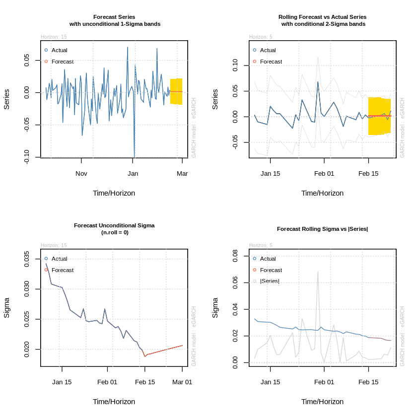


# Part 2 - Calculating Equilibrium FX (Multivariate Analysis)

### 2.1 Economic theories and models for calculating equilibrium FX.

The equilibirum foreign exchange (FX) rate is determined by the demand and supply of one currency given another. This value can be determined by the intersection between the demand curve and the supply curve of the currency pair.

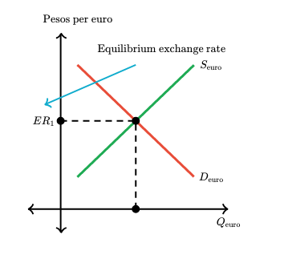

In the example given by Khan Academy[1], we can see that the exchange rate between Peso and Euro is defined by:

- Different amount of Euros supplied at different rate of Peso per Euro, forming the supply curve
- Different amount of Euros demanded at different rate of Peso per Euro, forming the demand curve

The intersection of these two curves determine the equilibrium FX rate between Peso and Euro:

- A rate higher than the equilibrium will result in the supply of Euros to exceed the demand, applying a downward pressure in the rate, towards short-term equilibrium.
- A rate lower than the equilibirum will result in the demand of Eruos to exceed the supply, applying a upward pressure in the rate, towards short-term equilibirum.

## 2.2 Macroeconomic variables used for calculating equilibrium FX.

Macroeconomic variables which affects the demand or supply curve of the one currency, expressed in another will affect the equilibrium FX rate.

### Interest Rates

One such example is the interest rate of a country. When interest rates increases, savers from other countries will be encouraged to buy financial assets in that country[1]. That will require foreign savers to first buy the country's currency to buy the financial assets. This results in higher demand for the country's currency, resulting in increased exhange rate. 

Factors increasing interest rate can include the country's budget deficit. 

### Money Supply

The money supply of the country affects the supply of the currency directly. An increase in money supply results in a decrease in equilibrium FX[2].

One metrics that is available is M1 which directly measures physical currency and coin, demand deposits, travelers checks, other checkable deposits and negotiable order of withdrawal (NOW) accounts[3]. Basically, the most liquid form of money in a country.

### Inflation

Typically, a country with a consistently lower inflation rate exhibits a rising currency value, as its purchasing power increases relative to other currencies. [4]

### Industrial Production Index 

The Index of Industrial Production (IIP) has shown to be dependent on the exchange rate[5].

### Political Stability

Political stability of a country also affects the exchange rate positively. Investors are encouraged to invest in countries with higher political stability, resulting in higher demand for the currency[4].

## 2.3 The connection between linear regression and Vector Error Correction (VEC).

The Vector Auto-Regressive(VAR) model extends the linear regression model by allowing different processes to be grenerated from their mutual histories. 

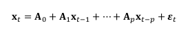

The VAR equation is produce the generating process based on previous period values, producing a short term forecasting result.  

The Vector Error Correction (VEC) model, also known as cointegration model, extends the VAR model. It introduces the long-term relationships between variables, through their cointegration.[6] 

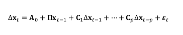

The VECM integrates information of the cointegration of the variables to allow them to return to long-run equilibirum. This can be seen from the PI term in the equation above. We can see that the VECM is a linear model, forming a linear relationship between the first difference of the result and the difference(s) of the previous results of the process, with it's constant and error terms.

## 2.4 Calculate equilibrium FX using VEC. The Behavioural Equilibrium Exchange Rate (BEER) approach will be applied to the analysis.

## USD/SGD is used for this analysis

### Models

The VECM model will be used with the macroeconomic data below.

### Data Used

- USD/SGD (https://fred.stlouisfed.org/series/EXSIUS)
- US M1 (https://fred.stlouisfed.org/series/M1NS)
- SG M1 (https://secure.mas.gov.sg/msb-xml/Report.aspx?tableSetID=I...I..)
- US Inflation (https://fred.stlouisfed.org/series/FPCPITOTLZGUSA)
- SG Inflation (https://fred.stlouisfed.org/series/FPCPITOTLZGSGP)
- US Interest rate (https://fred.stlouisfed.org/series/FEDFUNDS)
- SG Interest rate (https://secure.mas.gov.sg/msb/InterestRatesOfBanksAndFinanceCompanies.aspx)

### Variables Used

- USD/SGD
- US M1 Increase (log)
- SG M1 Increase (log)
- Inflation differential (US-SG)
- Interest rate differential (US-SG)


```R
library(quantmod)
library(readxl)
library(vars)
library(timeSeries)
library(urca)
library(tsDyn)
```

We will first download the data from the FRED sources. From the data source, we can observe that the maximum date range that has data for all the dataset is from Jan 1992 to Jan 2017. We will make use of the monthly data. 

For the dataset of M1_US and M1_SG, the dataset is of annual frequency. We will resample these data using linear interpolation to yield the monthly data. 


```R
# Read data from CSV
USDSGD = read.table("data/USDSGD.csv", header=TRUE, sep = ",", colClasses = c("Date", "numeric"))
INTEREST_SG = read.table("data/INTEREST-SG.csv", header=TRUE, sep = ",", colClasses = c("Date", "numeric"))
INTEREST_US = read.table("data/INTEREST-US.csv", header=TRUE, sep = ",", colClasses = c("Date", "numeric"))
M1_SG = read.table("data/M1-SG.csv", header=TRUE, sep = ",", colClasses = c("Date", "numeric"))
M1_US = read.table("data/M1-US.csv", header=TRUE, sep = ",", colClasses = c("Date", "numeric"))
INF_US = read.table("data/INFLATION-US.csv", header=TRUE, sep = ",", colClasses = c("Date", "numeric"))
INF_SG = read.table("data/INFLATION-SG.csv", header=TRUE, sep = ",", colClasses = c("Date", "numeric"))
```


```R
# Date Range: Jan 1991 - Jan 2017
DATE_RANGE = "199101/201701"

# Convert to xts
usdsgd = xts(USDSGD, order.by = USDSGD$DATE, x=USDSGD$EXSIUS)
interest_us = xts(INTEREST_US, order.by = INTEREST_US$DATE, x=INTEREST_US$FEDFUNDS)
interest_sg = xts(INTEREST_SG,  order.by = INTEREST_SG$Month, x = INTEREST_SG$Prime.Lending.Rate)
m1_us = xts(M1_US, order.by = M1_US$DATE, x=M1_US$M1)
m1_sg = xts(M1_SG, order.by = M1_SG$Month, x=M1_SG$S..MILLION)
inf_us = xts(INF_US, order.by = INF_US$DATE, x=INF_US$FPCPITOTLZGUSA)
inf_sg = xts(INF_SG, order.by = INF_SG$DATE, x=INF_SG$FPCPITOTLZGSGP)

# Resampling m1 to daily before converting to monthly data
seq_daily = seq(as.Date("1991-01-01"), as.Date(end(data), frac = 1), by = "day")
m1_us_daily = na.approx(m1_us, x = as.Date, xout = seq_daily)
m1_sg_daily = na.approx(m1_sg, x = as.Date, xout = seq_daily)
m1_us_monthly = merge(data, m1_us_daily, join = "left")
m1_us_monthly_pct = monthlyReturn(m1_us_monthly$m1_us_daily, type = "log")
m1_sg_monthly = merge(data, m1_sg_daily, join = "left")
m1_sg_monthly_pct = monthlyReturn(m1_sg_monthly$m1_sg_daily, type = "log")
data = merge(usdsgd[DATE_RANGE], m1_us_monthly_pct[DATE_RANGE], join = "left")
data = merge(data, m1_sg_monthly_pct[DATE_RANGE], join = "left")

# Interpolating inflation to monthly range
seq_monthly = seq(as.Date(start(data)), as.Date(end(data), frac = 1), by = "month")
inf_us_monthly = na.approx(inf_us, x = as.Date, xout = seq_monthly)
inf_sg_monthly = na.approx(inf_sg, x = as.Date, xout = seq_monthly)
# data = merge(data, inf_us_monthly[DATE_RANGE], join = "left")
# data = merge(data, inf_sg_monthly[DATE_RANGE], join = "left")

# Fill in any missing values in case we miss them
data = na.approx(data)

# Calculate interest rate & inflation rate differential
INT_DIFF = interest_us[DATE_RANGE] - interest_sg[DATE_RANGE]
INF_DIFF = inf_us_monthly[DATE_RANGE] - inf_sg_monthly[DATE_RANGE]
data = merge(data, INT_DIFF[DATE_RANGE], join = "left")
data = merge(data, INF_DIFF[DATE_RANGE], join = "left")

# Renaming columns
names(data) = c("USDSGD", "M1_INC_US", "M1_INC_SG", "INT_DIFF", "INF_DIFF")

# Show data after transformation
head(data)
nrow(data)
```


               USDSGD    M1_INC_US    M1_INC_SG INT_DIFF  INF_DIFF
    1991-01-01 1.7455  0.000000000  0.000000000    -0.54 0.8092622
    1991-02-01 1.7180  0.001516092  0.008959708    -1.18 0.8055665
    1991-03-01 1.7589  0.004397424 -0.002767862    -1.31 0.8022285
    1991-04-01 1.7688  0.014311606 -0.018541698    -1.52 0.7985328
    1991-05-01 1.7688 -0.003334098  0.003669354    -1.65 0.7949563
    1991-06-01 1.7782  0.006943358 -0.005656008    -1.81 0.7912607

Once the data has been transformed to the xts series, we can now plot the all the different dataset. 


```R
# Plot the data
plot(data, legend.loc = "right")
```


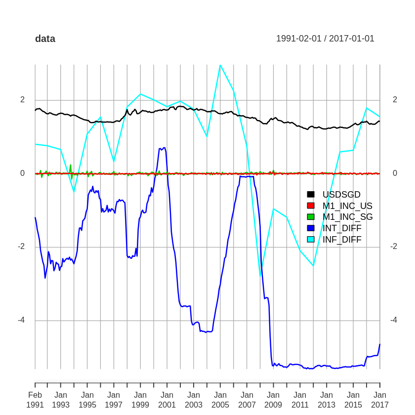


```R
# Print correlation of the data
cor(data)
```


<table>
<thead><tr><th></th><th scope=col>USDSGD</th><th scope=col>M1_INC_US</th><th scope=col>M1_INC_SG</th><th scope=col>INT_DIFF</th><th scope=col>INF_DIFF</th></tr></thead>
<tbody>
	<tr><th scope=row>USDSGD</th><td> 1.0000000  </td><td>-0.12923933 </td><td>-0.041475697</td><td> 0.497684576</td><td> 0.6454498  </td></tr>
	<tr><th scope=row>M1_INC_US</th><td>-0.1292393  </td><td> 1.00000000 </td><td> 0.072252470</td><td>-0.308143046</td><td>-0.2167271  </td></tr>
	<tr><th scope=row>M1_INC_SG</th><td>-0.0414757  </td><td> 0.07225247 </td><td> 1.000000000</td><td>-0.003533487</td><td>-0.1081419  </td></tr>
	<tr><th scope=row>INT_DIFF</th><td> 0.4976846  </td><td>-0.30814305 </td><td>-0.003533487</td><td> 1.000000000</td><td> 0.4237391  </td></tr>
	<tr><th scope=row>INF_DIFF</th><td> 0.6454498  </td><td>-0.21672710 </td><td>-0.108141863</td><td> 0.423739134</td><td> 1.0000000  </td></tr>
</tbody>
</table>


From the correlation table, we can see that the exchange rate (USDSGD) is most highly correlated to the inflation differential followed by the interest rate differential. It also has the least correlation to the M1 money supply of Singapore. 


```R
# VAR 
VAR_model = VAR(data, lag.max=12, type = "none", ic = "AIC")
summary(VAR_model)
```


    
    VAR Estimation Results:
    ========================= 
    Endogenous variables: USDSGD, M1_INC_US, M1_INC_SG, INT_DIFF, INF_DIFF 
    Deterministic variables: none 
    Sample size: 310 
    Log Likelihood: 3198.1 
    Roots of the characteristic polynomial:
    0.9989 0.9816 0.9511 0.9511 0.5136 0.3817 0.3817 0.114 0.114 0.03086
    Call:
    VAR(y = data, type = "none", lag.max = 12, ic = "AIC")
    
    
    Estimation results for equation USDSGD: 
    ======================================= 
    USDSGD = USDSGD.l1 + M1_INC_US.l1 + M1_INC_SG.l1 + INT_DIFF.l1 + INF_DIFF.l1 + USDSGD.l2 + M1_INC_US.l2 + M1_INC_SG.l2 + INT_DIFF.l2 + INF_DIFF.l2 
    
                  Estimate Std. Error t value Pr(>|t|)    
    USDSGD.l1     1.251514   0.056469  22.163  < 2e-16 ***
    M1_INC_US.l1  0.157608   0.113593   1.387   0.1663    
    M1_INC_SG.l1  0.061030   0.043307   1.409   0.1598    
    INT_DIFF.l1   0.003049   0.006924   0.440   0.6600    
    INF_DIFF.l1   0.025011   0.012052   2.075   0.0388 *  
    USDSGD.l2    -0.252847   0.056332  -4.489 1.02e-05 ***
    M1_INC_US.l2  0.117548   0.112881   1.041   0.2986    
    M1_INC_SG.l2 -0.007003   0.043435  -0.161   0.8720    
    INT_DIFF.l2  -0.002524   0.006815  -0.370   0.7114    
    INF_DIFF.l2  -0.023824   0.012230  -1.948   0.0523 .  
    ---
    Signif. codes:  0 ‘***’ 0.001 ‘**’ 0.01 ‘*’ 0.05 ‘.’ 0.1 ‘ ’ 1
    
    
    Residual standard error: 0.01978 on 300 degrees of freedom
    Multiple R-Squared: 0.9998,	Adjusted R-squared: 0.9998 
    F-statistic: 1.865e+05 on 10 and 300 DF,  p-value: < 2.2e-16 
    
    
    Estimation results for equation M1_INC_US: 
    ========================================== 
    M1_INC_US = USDSGD.l1 + M1_INC_US.l1 + M1_INC_SG.l1 + INT_DIFF.l1 + INF_DIFF.l1 + USDSGD.l2 + M1_INC_US.l2 + M1_INC_SG.l2 + INT_DIFF.l2 + INF_DIFF.l2 
    
                   Estimate Std. Error t value Pr(>|t|)    
    USDSGD.l1    -0.0621156  0.0287234  -2.163  0.03137 *  
    M1_INC_US.l1 -0.2784374  0.0577803  -4.819  2.3e-06 ***
    M1_INC_SG.l1  0.0236080  0.0220285   1.072  0.28472    
    INT_DIFF.l1  -0.0108804  0.0035218  -3.089  0.00219 ** 
    INF_DIFF.l1   0.0037977  0.0061301   0.620  0.53605    
    USDSGD.l2     0.0627929  0.0286537   2.191  0.02919 *  
    M1_INC_US.l2 -0.0488249  0.0574178  -0.850  0.39581    
    M1_INC_SG.l2 -0.0002042  0.0220936  -0.009  0.99263    
    INT_DIFF.l2   0.0090680  0.0034665   2.616  0.00935 ** 
    INF_DIFF.l2  -0.0047408  0.0062207  -0.762  0.44661    
    ---
    Signif. codes:  0 ‘***’ 0.001 ‘**’ 0.01 ‘*’ 0.05 ‘.’ 0.1 ‘ ’ 1
    
    
    Residual standard error: 0.01006 on 300 degrees of freedom
    Multiple R-Squared: 0.3098,	Adjusted R-squared: 0.2868 
    F-statistic: 13.47 on 10 and 300 DF,  p-value: < 2.2e-16 
    
    
    Estimation results for equation M1_INC_SG: 
    ========================================== 
    M1_INC_SG = USDSGD.l1 + M1_INC_US.l1 + M1_INC_SG.l1 + INT_DIFF.l1 + INF_DIFF.l1 + USDSGD.l2 + M1_INC_US.l2 + M1_INC_SG.l2 + INT_DIFF.l2 + INF_DIFF.l2 
    
                  Estimate Std. Error t value Pr(>|t|)    
    USDSGD.l1    -0.137542   0.073980  -1.859   0.0640 .  
    M1_INC_US.l1  0.251549   0.148819   1.690   0.0920 .  
    M1_INC_SG.l1 -0.364381   0.056737  -6.422 5.25e-10 ***
    INT_DIFF.l1   0.016057   0.009071   1.770   0.0777 .  
    INF_DIFF.l1  -0.030390   0.015789  -1.925   0.0552 .  
    USDSGD.l2     0.147407   0.073801   1.997   0.0467 *  
    M1_INC_US.l2  0.189969   0.147886   1.285   0.1999    
    M1_INC_SG.l2 -0.110045   0.056905  -1.934   0.0541 .  
    INT_DIFF.l2  -0.015028   0.008928  -1.683   0.0934 .  
    INF_DIFF.l2   0.026653   0.016022   1.664   0.0973 .  
    ---
    Signif. codes:  0 ‘***’ 0.001 ‘**’ 0.01 ‘*’ 0.05 ‘.’ 0.1 ‘ ’ 1
    
    
    Residual standard error: 0.02591 on 300 degrees of freedom
    Multiple R-Squared: 0.2232,	Adjusted R-squared: 0.1973 
    F-statistic:  8.62 on 10 and 300 DF,  p-value: 2.159e-12 
    
    
    Estimation results for equation INT_DIFF: 
    ========================================= 
    INT_DIFF = USDSGD.l1 + M1_INC_US.l1 + M1_INC_SG.l1 + INT_DIFF.l1 + INF_DIFF.l1 + USDSGD.l2 + M1_INC_US.l2 + M1_INC_SG.l2 + INT_DIFF.l2 + INF_DIFF.l2 
    
                 Estimate Std. Error t value Pr(>|t|)    
    USDSGD.l1    -1.29657    0.40647  -3.190  0.00157 ** 
    M1_INC_US.l1  0.48631    0.81765   0.595  0.55245    
    M1_INC_SG.l1  0.25171    0.31173   0.807  0.42004    
    INT_DIFF.l1   1.47154    0.04984  29.527  < 2e-16 ***
    INF_DIFF.l1   0.12081    0.08675   1.393  0.16475    
    USDSGD.l2     1.25519    0.40548   3.096  0.00215 ** 
    M1_INC_US.l2 -0.58025    0.81252  -0.714  0.47570    
    M1_INC_SG.l2  0.55703    0.31265   1.782  0.07582 .  
    INT_DIFF.l2  -0.48305    0.04906  -9.847  < 2e-16 ***
    INF_DIFF.l2  -0.09353    0.08803  -1.062  0.28890    
    ---
    Signif. codes:  0 ‘***’ 0.001 ‘**’ 0.01 ‘*’ 0.05 ‘.’ 0.1 ‘ ’ 1
    
    
    Residual standard error: 0.1424 on 300 degrees of freedom
    Multiple R-Squared: 0.9984,	Adjusted R-squared: 0.9983 
    F-statistic: 1.854e+04 on 10 and 300 DF,  p-value: < 2.2e-16 
    
    
    Estimation results for equation INF_DIFF: 
    ========================================= 
    INF_DIFF = USDSGD.l1 + M1_INC_US.l1 + M1_INC_SG.l1 + INT_DIFF.l1 + INF_DIFF.l1 + USDSGD.l2 + M1_INC_US.l2 + M1_INC_SG.l2 + INT_DIFF.l2 + INF_DIFF.l2 
    
                 Estimate Std. Error t value Pr(>|t|)    
    USDSGD.l1    -0.04190    0.12283  -0.341   0.7333    
    M1_INC_US.l1 -0.45111    0.24709  -1.826   0.0689 .  
    M1_INC_SG.l1 -0.04827    0.09420  -0.512   0.6088    
    INT_DIFF.l1  -0.01597    0.01506  -1.060   0.2900    
    INF_DIFF.l1   1.90523    0.02621  72.677   <2e-16 ***
    USDSGD.l2     0.04537    0.12253   0.370   0.7114    
    M1_INC_US.l2 -0.46398    0.24554  -1.890   0.0598 .  
    M1_INC_SG.l2 -0.06234    0.09448  -0.660   0.5099    
    INT_DIFF.l2   0.01482    0.01482   1.000   0.3183    
    INF_DIFF.l2  -0.91089    0.02660 -34.241   <2e-16 ***
    ---
    Signif. codes:  0 ‘***’ 0.001 ‘**’ 0.01 ‘*’ 0.05 ‘.’ 0.1 ‘ ’ 1
    
    
    Residual standard error: 0.04303 on 300 degrees of freedom
    Multiple R-Squared: 0.9993,	Adjusted R-squared: 0.9992 
    F-statistic: 4.119e+04 on 10 and 300 DF,  p-value: < 2.2e-16 
    
    
    
    Covariance matrix of residuals:
                  USDSGD  M1_INC_US  M1_INC_SG   INT_DIFF   INF_DIFF
    USDSGD     3.912e-04  3.292e-05  1.660e-05 -0.0004693  4.540e-05
    M1_INC_US  3.292e-05  1.012e-04  2.824e-05 -0.0001411  2.560e-05
    M1_INC_SG  1.660e-05  2.824e-05  6.716e-04 -0.0004112  8.841e-06
    INT_DIFF  -4.693e-04 -1.411e-04 -4.112e-04  0.0202727 -1.091e-03
    INF_DIFF   4.540e-05  2.560e-05  8.841e-06 -0.0010910  1.851e-03
    
    Correlation matrix of residuals:
                USDSGD M1_INC_US M1_INC_SG INT_DIFF  INF_DIFF
    USDSGD     1.00000   0.16543  0.032390 -0.16663  0.053347
    M1_INC_US  0.16543   1.00000  0.108315 -0.09847  0.059127
    M1_INC_SG  0.03239   0.10831  1.000000 -0.11143  0.007929
    INT_DIFF  -0.16663  -0.09847 -0.111430  1.00000 -0.178083
    INF_DIFF   0.05335   0.05913  0.007929 -0.17808  1.000000
    


Using a basic VAR model, we can see that the significant coefficients for the equation is:

- Interest rate differential
- M1 of US

We can also note that there is a total of 300 degree of freedom. This number is way too high as there are only 313 rows on the dataset. We will need to estimate with fewer variables later.


```R
plot(VAR_model)
```


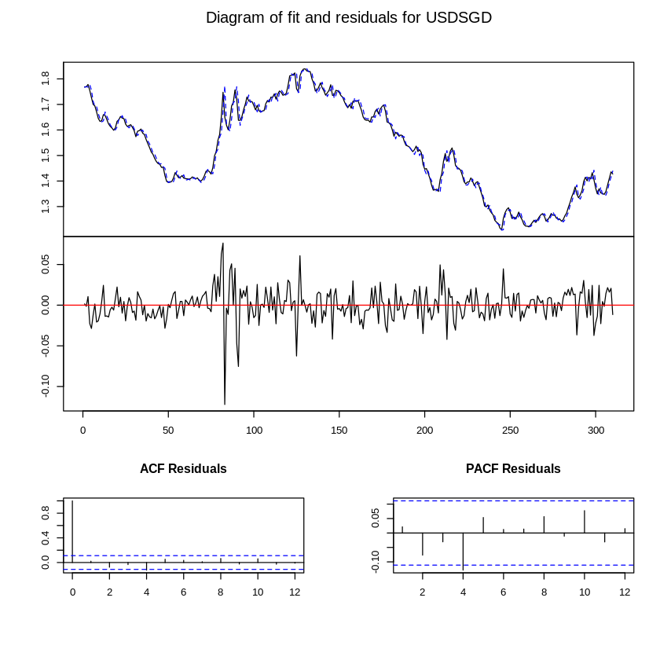


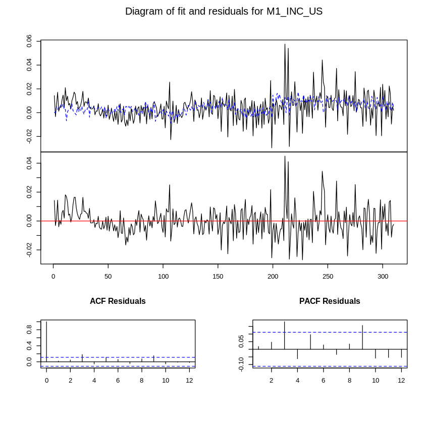


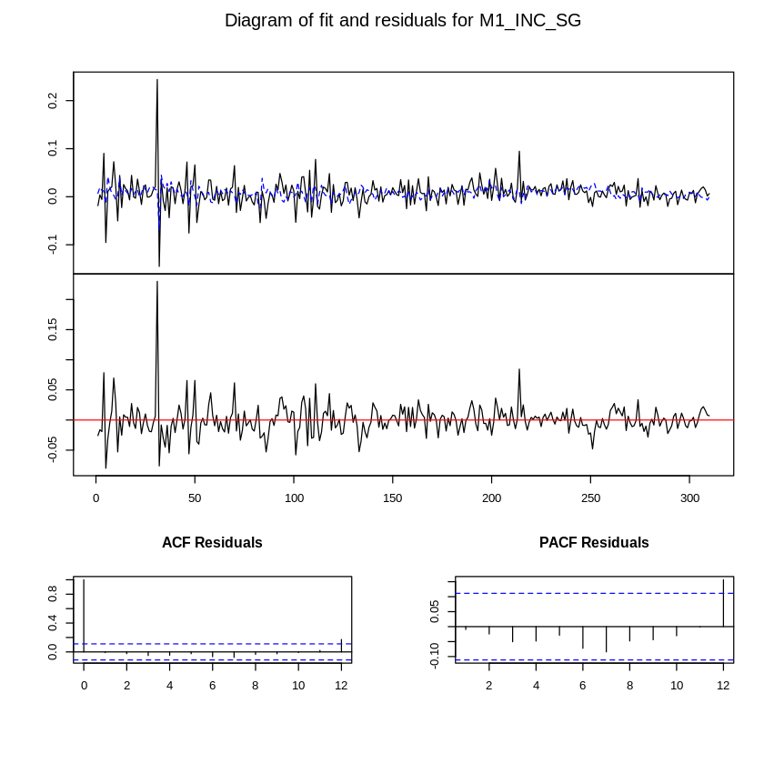


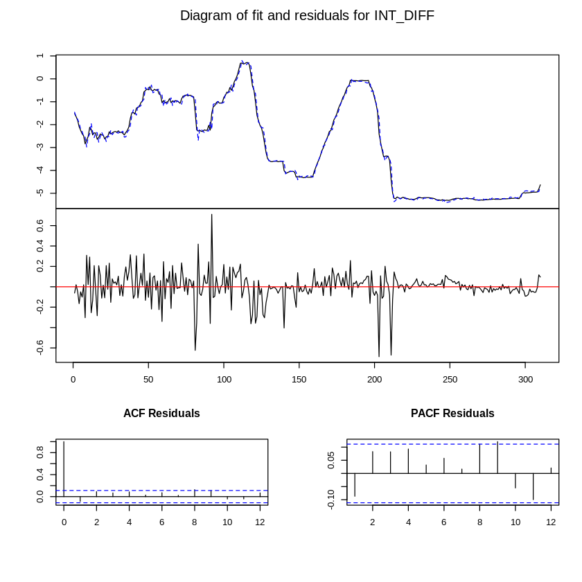


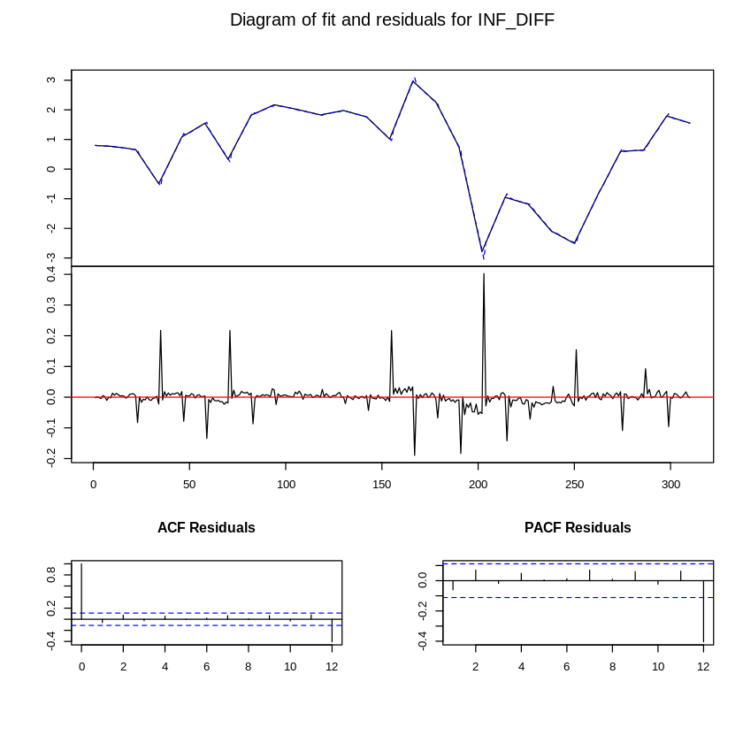


The ACF and PACF of the USDSGD dataset seemed to be stationary and are made up of white noises.


```R
# compute and plot the impulse response functions
VAR_irf = irf(VAR_model, n.ahead = 13,boot = TRUE, ci = 0.95)
plot(VAR_irf)
```


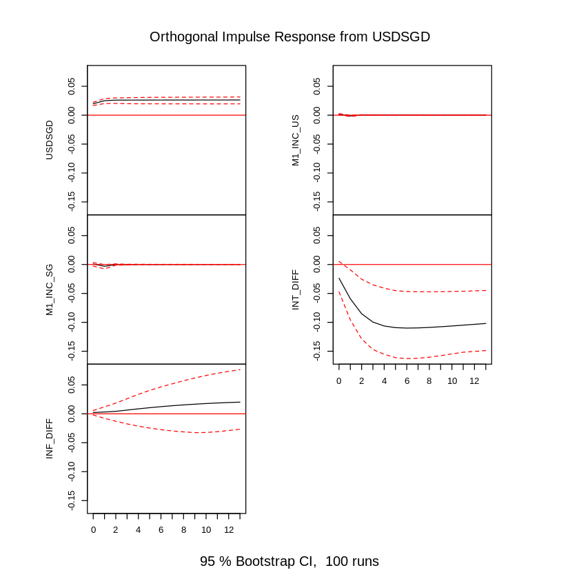


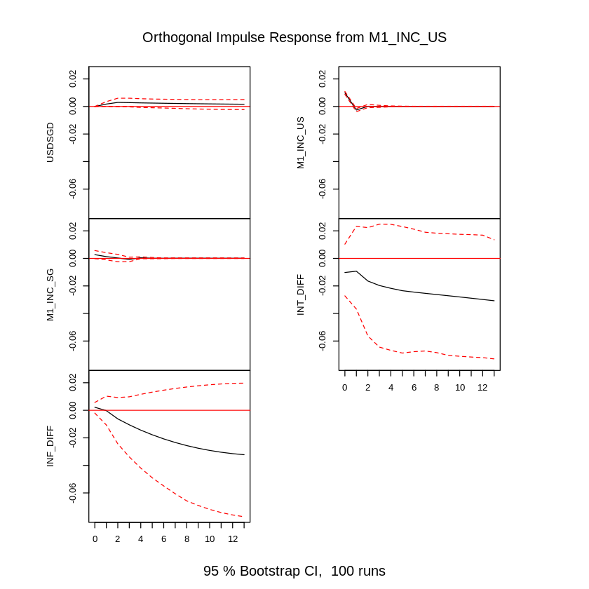


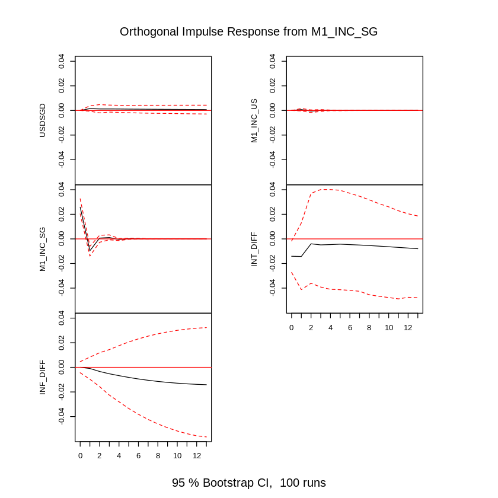


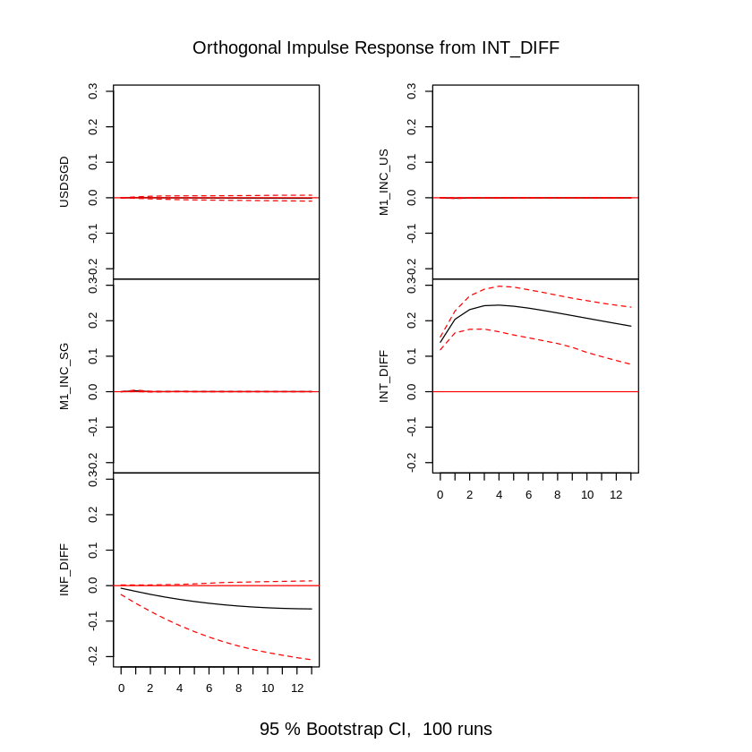


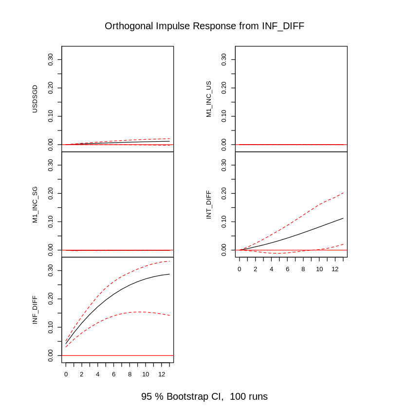


From the impulse function of USDSGD, we can see that both M1_US and M1_SG quickly return to the mean, interest rate differential also seemed to be returning to the mean, but very slowly. 


```R
# compute and plot the forecast error variance decomposition
VAR_fevd <- fevd(VAR_model,n.ahead = 13)
plot(VAR_fevd)
```


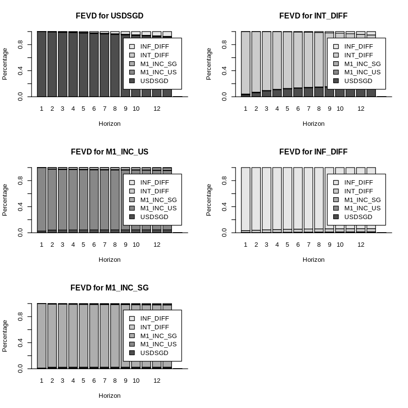


Looking at the forecast error variance decomposition, we can see that the USDSGD does not have components of other variables in the short term but seemed to be explained by the interest rate differential in the long term. We can make use of this information to generate a more parsimonious model.


```R
jotest1=ca.jo(data, type="eigen", K=9, ecdet="none", spec="longrun")
summary(jotest1)
```


    
    ###################### 
    # Johansen-Procedure # 
    ###################### 
    
    Test type: maximal eigenvalue statistic (lambda max) , with linear trend 
    
    Eigenvalues (lambda):
    [1] 0.183749082 0.083705728 0.061071661 0.034668610 0.009592389
    
    Values of teststatistic and critical values of test:
    
              test 10pct  5pct  1pct
    r <= 4 |  2.92  6.50  8.18 11.65
    r <= 3 | 10.69 12.91 14.90 19.19
    r <= 2 | 19.09 18.90 21.07 25.75
    r <= 1 | 26.49 24.78 27.14 32.14
    r = 0  | 61.52 30.84 33.32 38.78
    
    Eigenvectors, normalised to first column:
    (These are the cointegration relations)
    
                     USDSGD.l9 M1_INC_US.l9 M1_INC_SG.l9 INT_DIFF.l9  INF_DIFF.l9
    USDSGD.l9      1.000000000   1.00000000   1.00000000     1.00000  1.000000000
    M1_INC_US.l9   5.569691818 -72.99149460  -0.30710287  2396.09226  5.538829262
    M1_INC_SG.l9 -67.074770837   3.75049801   1.08636131  -515.22389  0.707298625
    INT_DIFF.l9    0.009467883  -0.07750398  -0.05346909    13.33348  0.045939215
    INF_DIFF.l9   -0.223331885  -0.20596255  -0.10581722   -13.84998 -0.001714244
    
    Weights W:
    (This is the loading matrix)
    
                   USDSGD.l9 M1_INC_US.l9 M1_INC_SG.l9   INT_DIFF.l9   INF_DIFF.l9
    USDSGD.d    -0.003047337 -0.007320024 -0.031007321  1.833804e-05 -0.0026701940
    M1_INC_US.d  0.001376064  0.010111033 -0.008308665 -4.064152e-05 -0.0001376793
    M1_INC_SG.d  0.031589665 -0.004039068 -0.007448002  6.855564e-06  0.0006929855
    INT_DIFF.d  -0.021474798 -0.084573816  0.058440536 -1.145220e-03  0.0071447850
    INF_DIFF.d   0.005782302  0.010124143  0.015801041  2.744807e-05 -0.0183578898


```R
jotest2=ca.jo(data, type="trace", K=9, ecdet="none", spec="longrun")
summary(jotest2)
```


    
    ###################### 
    # Johansen-Procedure # 
    ###################### 
    
    Test type: trace statistic , with linear trend 
    
    Eigenvalues (lambda):
    [1] 0.182334987 0.084197049 0.059799870 0.034633135 0.009283369
    
    Values of teststatistic and critical values of test:
    
               test 10pct  5pct  1pct
    r <= 4 |   2.84  6.50  8.18 11.65
    r <= 3 |  13.55 15.66 17.95 23.52
    r <= 2 |  32.30 28.71 31.52 37.22
    r <= 1 |  59.03 45.23 48.28 55.43
    r = 0  | 120.23 66.49 70.60 78.87
    
    Eigenvectors, normalised to first column:
    (These are the cointegration relations)
    
                     USDSGD.l9 M1_INC_US.l9 M1_INC_SG.l9 INT_DIFF.l9  INF_DIFF.l9
    USDSGD.l9      1.000000000   1.00000000   1.00000000     1.00000  1.000000000
    M1_INC_US.l9   7.052974270 -70.91007192   1.03908196  7819.06677  4.506471954
    M1_INC_SG.l9 -67.122919617   3.11734181   1.24902002 -1726.33262  0.660890598
    INT_DIFF.l9    0.008493893  -0.07830929  -0.05113518    44.34699  0.047017679
    INF_DIFF.l9   -0.221603913  -0.20428627  -0.10330311   -46.12759 -0.002472603
    
    Weights W:
    (This is the loading matrix)
    
                   USDSGD.l9 M1_INC_US.l9 M1_INC_SG.l9   INT_DIFF.l9   INF_DIFF.l9
    USDSGD.d    -0.003161389 -0.008010878 -0.030354994  5.816952e-06 -2.505915e-03
    M1_INC_US.d  0.001096862  0.010434602 -0.008490675 -1.202138e-05 -9.601853e-05
    M1_INC_SG.d  0.031349973 -0.003467716 -0.007935882  2.266422e-06  7.728191e-04
    INT_DIFF.d  -0.018842301 -0.086719776  0.058823572 -3.457795e-04  6.390796e-03
    INF_DIFF.d   0.006027834  0.010978225  0.014329304  8.647183e-06 -1.783039e-02


Both Johansen-Procedure test shows that we can use r = 2.


```R
fit = VECM(data, 3, r = 2, include = "const",estim = "ML", LRinclude = "none")
summary(fit)
```


    #############
    ###Model VECM 
    #############
    Full sample size: 313 	End sample size: 309
    Number of variables: 5 	Number of estimated slope parameters 90
    AIC -10631.59 	BIC -10273.19 	SSR 6.834194
    Cointegrating vector (estimated by ML):
              USDSGD    M1_INC_US  M1_INC_SG    INT_DIFF     INF_DIFF
    r1  1.000000e+00 3.552714e-15 -77.429157 0.018740912 -0.281552410
    r2 -5.269906e-19 1.000000e+00  -1.016069 0.001882071 -0.001415143
    
    
                       ECT1               ECT2               Intercept          
    Equation USDSGD    -0.0086(0.0037)*   0.5421(0.2829).    0.0102(0.0053).    
    Equation M1_INC_US 0.0140(0.0019)***  -1.0870(0.1426)*** -0.0204(0.0027)*** 
    Equation M1_INC_SG 0.0133(0.0049)**   0.5746(0.3731)     -0.0035(0.0070)    
    Equation INT_DIFF  -0.0500(0.0270).   3.0332(2.0597)     0.0600(0.0387)     
    Equation INF_DIFF  0.0290(0.0080)***  -2.0541(0.6090)*** -0.0400(0.0114)*** 
                       USDSGD -1           M1_INC_US -1        M1_INC_SG -1       
    Equation USDSGD    0.2623(0.0598)***   -0.3017(0.2522)     -0.0750(0.1001)    
    Equation M1_INC_US -0.0812(0.0301)**   -0.1540(0.1271)     -0.0047(0.0505)    
    Equation M1_INC_SG -0.1268(0.0788)     -0.3435(0.3327)     0.2423(0.1320).    
    Equation INT_DIFF  -1.3804(0.4351)**   -2.2698(1.8366)     -0.6315(0.7289)    
    Equation INF_DIFF  -0.0957(0.1286)     1.7216(0.5430)**    0.1077(0.2155)     
                       INT_DIFF -1         INF_DIFF -1         USDSGD -2          
    Equation USDSGD    -0.0065(0.0084)     0.0303(0.0270)      -0.0751(0.0622)    
    Equation M1_INC_US -0.0100(0.0042)*    0.0027(0.0136)      0.0049(0.0314)     
    Equation M1_INC_SG 0.0179(0.0110)      -0.0362(0.0355)     -0.0863(0.0821)    
    Equation INT_DIFF  0.3961(0.0609)***   0.1979(0.1962)      -0.1496(0.4530)    
    Equation INF_DIFF  -0.0142(0.0180)     0.8746(0.0580)***   0.1100(0.1339)     
                       M1_INC_US -2        M1_INC_SG -2        INT_DIFF -2       
    Equation USDSGD    -0.0691(0.1964)     -0.0707(0.0752)     0.0199(0.0089)*   
    Equation M1_INC_US -0.1304(0.0990)     -0.0124(0.0379)     0.0048(0.0045)    
    Equation M1_INC_SG -0.1123(0.2590)     0.0928(0.0992)      -0.0197(0.0117).  
    Equation INT_DIFF  -1.8675(1.4298)     -0.0612(0.5474)     0.1467(0.0648)*   
    Equation INF_DIFF  1.1445(0.4227)**    -0.0039(0.1618)     0.0017(0.0192)    
                       INF_DIFF -2         USDSGD -3           M1_INC_US -3       
    Equation USDSGD    -0.0163(0.0357)     -0.0225(0.0596)     0.0011(0.1185)     
    Equation M1_INC_US -0.0084(0.0180)     -0.0199(0.0300)     0.0529(0.0597)     
    Equation M1_INC_SG -0.0205(0.0471)     -0.0732(0.0786)     0.0516(0.1563)     
    Equation INT_DIFF  0.0272(0.2599)      0.4621(0.4339)      -0.7459(0.8631)    
    Equation INF_DIFF  0.1121(0.0769)      -0.0099(0.1283)     0.7835(0.2552)**   
                       M1_INC_SG -3        INT_DIFF -3         INF_DIFF -3        
    Equation USDSGD    -0.0280(0.0443)     -0.0096(0.0079)     0.0109(0.0272)     
    Equation M1_INC_US -0.0207(0.0223)     0.0035(0.0040)      0.0177(0.0137)     
    Equation M1_INC_SG 0.0420(0.0585)      0.0117(0.0104)      0.0363(0.0358)     
    Equation INT_DIFF  0.1714(0.3228)      0.0950(0.0577)      -0.0438(0.1979)    
    Equation INF_DIFF  -0.1676(0.0955).    0.0034(0.0170)      -0.0758(0.0585)    


```R
predict(fit, n.ahead=3)
```


<table>
<thead><tr><th></th><th scope=col>USDSGD</th><th scope=col>M1_INC_US</th><th scope=col>M1_INC_SG</th><th scope=col>INT_DIFF</th><th scope=col>INF_DIFF</th></tr></thead>
<tbody>
	<tr><th scope=row>314</th><td>1.422764    </td><td>0.000365743 </td><td>-0.004518124</td><td>-4.534573   </td><td>1.532782    </td></tr>
	<tr><th scope=row>315</th><td>1.420645    </td><td>0.005404270 </td><td> 0.003997137</td><td>-4.459303   </td><td>1.526594    </td></tr>
	<tr><th scope=row>316</th><td>1.418958    </td><td>0.003037646 </td><td> 0.005517923</td><td>-4.407052   </td><td>1.520535    </td></tr>
</tbody>
</table>


## VECM with fewer variables

Using the information above, we can create a more parsimonious model. It can be seen that the significant coefficients of the previous model is the interest rate differential and the M1 money supply of US.


```R
data_simp = data$USDSGD
data_simp = merge(data_simp, data$INT_DIFF)
data_simp = merge(data_simp, data$M1_INC_US)
```


```R
jotest3=ca.jo(data_simp, type="eigen", K=9, ecdet="none", spec="longrun")
summary(jotest3)
```


    
    ###################### 
    # Johansen-Procedure # 
    ###################### 
    
    Test type: maximal eigenvalue statistic (lambda max) , with linear trend 
    
    Eigenvalues (lambda):
    [1] 0.067385652 0.041820252 0.004837982
    
    Values of teststatistic and critical values of test:
    
              test 10pct  5pct  1pct
    r <= 2 |  1.47  6.50  8.18 11.65
    r <= 1 | 12.99 12.91 14.90 19.19
    r = 0  | 21.21 18.90 21.07 25.75
    
    Eigenvectors, normalised to first column:
    (These are the cointegration relations)
    
                   USDSGD.l9 INT_DIFF.l9 M1_INC_US.l9
    USDSGD.l9      1.0000000    1.000000   1.00000000
    INT_DIFF.l9    0.1800576   -0.159094   0.04458363
    M1_INC_US.l9 193.9029368  -26.387258   2.29898383
    
    Weights W:
    (This is the loading matrix)
    
                   USDSGD.l9  INT_DIFF.l9  M1_INC_US.l9
    USDSGD.d    -0.001852385 -0.010897085 -0.0046122959
    INT_DIFF.d   0.015492788  0.118265325 -0.0210486186
    M1_INC_US.d -0.003589055  0.001925471 -0.0001587515


```R
The Johansen-Procedure suggest to use r = 1
```


```R
fit2 = VECM(data_simp, 2, r = 1, include = "const",estim = "ML", LRinclude = "none")
summary(fit2)
```


    #############
    ###Model VECM 
    #############
    Full sample size: 313 	End sample size: 310
    Number of variables: 3 	Number of estimated slope parameters 24
    AIC -6488.479 	BIC -6391.328 	SSR 6.448042
    Cointegrating vector (estimated by ML):
       USDSGD   INT_DIFF M1_INC_US
    r1      1 -0.6478023 -356.7588
    
    
                       ECT                 Intercept           USDSGD -1         
    Equation USDSGD    -0.0009(0.0007)     0.0009(0.0016)      0.2859(0.0573)*** 
    Equation INT_DIFF  -0.0002(0.0048)     -0.0036(0.0119)     -1.0529(0.4187)*  
    Equation M1_INC_US 0.0028(0.0003)***   -0.0052(0.0008)***  -0.0754(0.0286)** 
                       INT_DIFF -1         M1_INC_US -1        USDSGD -2          
    Equation USDSGD    -0.0063(0.0078)     -0.1650(0.1817)     -0.0748(0.0582)    
    Equation INT_DIFF  0.4365(0.0572)***   0.4367(1.3283)      0.1152(0.4258)     
    Equation M1_INC_US -0.0126(0.0039)**   -0.2476(0.0908)**   -0.0200(0.0291)    
                       INT_DIFF -2        M1_INC_US -2       
    Equation USDSGD    0.0169(0.0076)*    -0.0105(0.1122)    
    Equation INT_DIFF  0.1687(0.0556)**   -0.0987(0.8205)    
    Equation M1_INC_US 0.0037(0.0038)     -0.2121(0.0561)*** 


## Conclusion

Using VECM we tend to face the curse of dimensionality as shown in the first example with 5 variables. Using the combinations of correlation & forecast error variance decompisition we may deduce a simpler model. The SSR for the first model improved from 6.834194 to 6.448042 and the number of coefficients to estimate reduced from 300 to 24 by using only three variables and lower r. 

We can also observe that the second model has great proportion of coefficients that are significant compared to the first model. 

While the AIC and BIC suffered when the dimensionality is reduced, we can attribute it to the overfiting of data when higher dimensions are used, and should still opt for the more parismonious model. 


```R
# Last interest rate in the model
usdsgd["201701"]

# Actual interest rate to be forcasted
usdsgd["201702/201704"]
```


                 [,1]
    2017-01-01 1.4276


                 [,1]
    2017-02-01 1.4137
    2017-03-01 1.4049
    2017-04-01 1.3983


```R
predict(fit2, n.ahead=3)
```


<table>
<thead><tr><th></th><th scope=col>USDSGD</th><th scope=col>INT_DIFF</th><th scope=col>M1_INC_US</th></tr></thead>
<tbody>
	<tr><th scope=row>314</th><td>1.422295   </td><td>-4.525287  </td><td>0.003174703</td></tr>
	<tr><th scope=row>315</th><td>1.421568   </td><td>-4.448128  </td><td>0.007283518</td></tr>
	<tr><th scope=row>316</th><td>1.421708   </td><td>-4.398968  </td><td>0.005159924</td></tr>
</tbody>
</table>


Using the second model, we can create a prediction of the quarter interest rate. We can see that the prediction is pretty close to the actual interest rate where it shows a downward trend from 1.4276. 

## References
[1] https://www.khanacademy.org/economics-finance-domain/ap-macroeconomics/every-graph-used-in-ap-macroeconomics/a/the-foreign-exchange-market-model

[2] https://eml.berkeley.edu/~obstfeld/182_sp06/c14.pdf

[3] https://www.investopedia.com/terms/m/m1.asp

[4] [https://www.investopedia.com/trading/factors-influence-exchange-rates/]

[5] https://www.researchgate.net/publication/228258887_Causal_Relationships_between_Industrial_Production_Interest_Rate_and_Exchange_Rate_Evidence_on_India

[6] https://stats.stackexchange.com/questions/77791/why-use-vector-error-correction-model
