# Submission No. 2: Algorithmic Trading Strategy for Cryptocurrencies Pair
Author	: Raymond Yeh, Vincent Louie Delfin, Lu Liu, Nazri Nawi

Date	: April 22, 2019


## Backgroud of The Trading Strategy

Inspired by Sergey Malchevskiy's Pairs Trading with Cryptocurrencies [1], we will perform statistical arbitrage on a pair of cryptocurrency. The strategy aims to be market neutral where it will take a equal weights of long and short positions on the pair to prevent taking a net long or short position in the market as a whole due to the high unpredictability of the trend in the cryptocurrency market.

The intuition is that a pair of cryptocurrencies with highly cointegrated daily return will have their daily returns reverting to 0 spread (difference in their daily returns). The strategy will enter a long/short position when the daily returns spread is high and will exit the positions when the daily returns spread revert to the normal level.

The experiment will determine:

- Pair of cryptocurrency with highly cointegrated daily returns
- z-score to enter into a long/short position
- z-score to exit the long/short position

## Timeframe

The timeframe selected to test the model will be the period from early 2018 to late 2018. The period was commonly known to the blockchain community as the "crypto winter" due to falling prices following the plunge in December 2017. 

The trend of the market in that timeframe can be seen by the bitcoin price chart below:

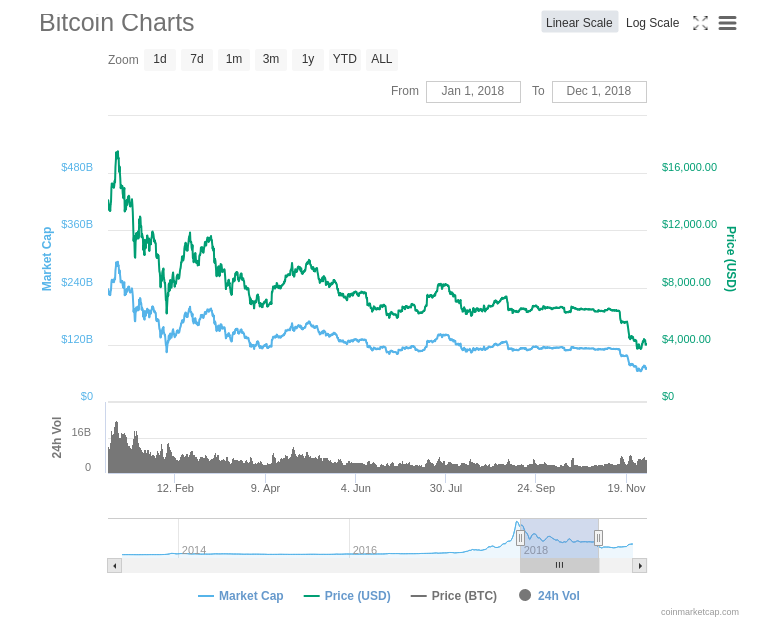 

## R Code


```R
library(Quandl)
library(quantmod)
library(timeSeries)
library(corrplot)
library(ggplot2)
library(urca)
library(PerformanceAnalytics)
library(tseries)
```

We will be using cryptocurrency data from Quandl. An API key is needed to retrieve data from Quandl. The analysis will be performed on 6 common pairs of cryptocurrencies that existed back in Jan 2018.


```R
Quandl.api_key('')
```


```R
pairs = c(
    "ETHBTC",
    "LTCBTC",
    "XRPBTC",
    "XMRBTC",
    "ZECBTC",
    "DSHBTC"
)
startDate = "2018-01-01"
endDate = "2018-12-01"
```


```R
# Create a list of data in the xts format
pairsDataListXts = list()

for(i in 1:length(pairs)){
    pair = pairs[i]
    bifinexPair = paste("BITFINEX/", pair, sep = "")
    pairData = Quandl(bifinexPair, start_date=startDate, end_date=endDate)
    assign(pair, pairData)
    pairDataXts = as.xts(pairData, order.by = pairData$Date, x=pairData$Last)
    pairsDataListXts[[i]] = pairDataXts
}
```

### Cointegration Test

Selecting two random cryptocurrencies, we will perform the Johansen test to observe the test statistics and critical value of the test. 


```R
# Creating a xts object with both time series data of ZEC and DSH
ZECBTCXTS = pairsDataListXts[[5]]
DSHBTCXTS = pairsDataListXts[[6]]
PAIRXTS = merge(ZECBTCXTS, DSHBTCXTS, join = "left")
names(PAIRXTS) = c("ZECBTC", "DSHBTC")
```


```R
# Perform Johansen test on the pair
jotest=ca.jo(PAIRXTS, type="trace", K=2, ecdet="none", spec="longrun")
summary(jotest)
```


    
    ###################### 
    # Johansen-Procedure # 
    ###################### 
    
    Test type: trace statistic , with linear trend 
    
    Eigenvalues (lambda):
    [1] 0.040592920 0.009793911
    
    Values of teststatistic and critical values of test:
    
              test 10pct  5pct  1pct
    r <= 1 |  3.20  6.50  8.18 11.65
    r = 0  | 16.67 15.66 17.95 23.52
    
    Eigenvectors, normalised to first column:
    (These are the cointegration relations)
    
               ZECBTC.l2 DSHBTC.l2
    ZECBTC.l2  1.0000000  1.000000
    DSHBTC.l2 -0.5861501  0.224751
    
    Weights W:
    (This is the loading matrix)
    
                ZECBTC.l2    DSHBTC.l2
    ZECBTC.d -0.063673166 -0.006547003
    DSHBTC.d  0.008594671 -0.012099956


From the test above, we can see that the critical value for (r=0) at 5 pct level is 17.95. We will use the critical value to short list some cryptocurrency pairs before selecting one pair to work with.


```R
# Print all pairs that has r = 0 above the critical value of 17.95
R0_CRITICAL = 17.95

# Iterate through the pairs to perform Johansen test on. Print the pairs if they passes the cointegration test.
for(i1 in 1:length(pairsDataListXts)){
    for(i2 in 1:length(pairsDataListXts)){
        if(i1 != i2){
            PAIRXTS = merge(pairsDataListXts[[i1]], pairsDataListXts[[i2]], join = "left")
            jotest=ca.jo(PAIRXTS, type="trace", K=2, ecdet="none", spec="longrun")
            if(jotest@teststat[2] >= R0_CRITICAL){
                print(paste(pairs[i1], pairs[i2]))
                print(jotest@teststat)
            }
        }
    }
}
```

    [1] "ETHBTC XRPBTC"
    [1]  2.615824 32.276714
    [1] "ETHBTC DSHBTC"
    [1]  1.711873 25.922373
    [1] "XRPBTC ETHBTC"
    [1]  2.615824 32.276714
    [1] "XRPBTC ZECBTC"
    [1]  4.433185 19.632115
    [1] "ZECBTC XRPBTC"
    [1]  4.433185 19.632115
    [1] "DSHBTC ETHBTC"
    [1]  1.711873 25.922373


From the test above we can see a few viable cryptocurrency pairs:

- ETH/XRP
- ETH/DSH
- XRP/ZEC

XRP/ZEC will be selected to build the model on.

We will plot the price movement of these two cryptocurrencies to observe the data we will be dealing with.


```R
# Plot the nomalised price movement for both XRP and ZEC
XRPBTCXTS = pairsDataListXts[[3]]/pairsDataListXts[[3]][[1]]
ZECBTCXTS = pairsDataListXts[[5]]/pairsDataListXts[[5]][[1]]
PAIRXTS = merge(XRPBTCXTS, ZECBTCXTS, join = "left")
names(PAIRXTS) = c("XRPBTC", "ZECBTC")
plot(PAIRXTS)
```


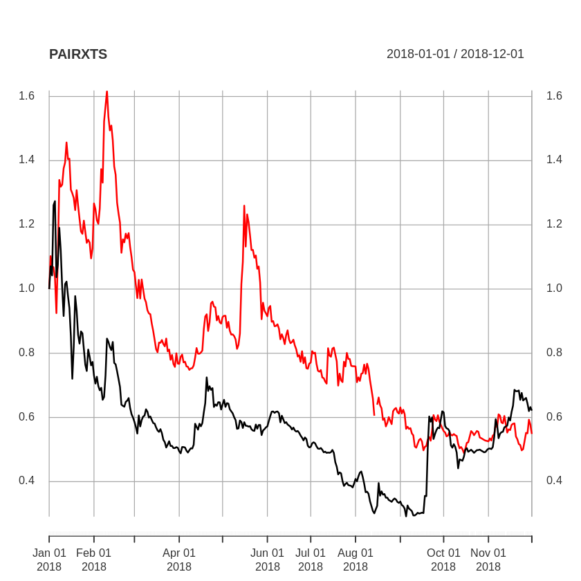


As we can see above, the pairs do not seem to have high degree of correlation. We will attempt to validate our hypthesis that the daily returns of the pair follows a stationary trend.

The spread for the daily return on the two cryptocurrencies will be plotted first.


```R
# Plotting the spread of XRP/ZEC
XRPXTS_DR = dailyReturn(pairsDataListXts[[3]])
ZECBTS_DR = dailyReturn(pairsDataListXts[[5]])
SPREAD = XRPXTS_DR - ZECBTS_DR
plot(SPREAD)
```


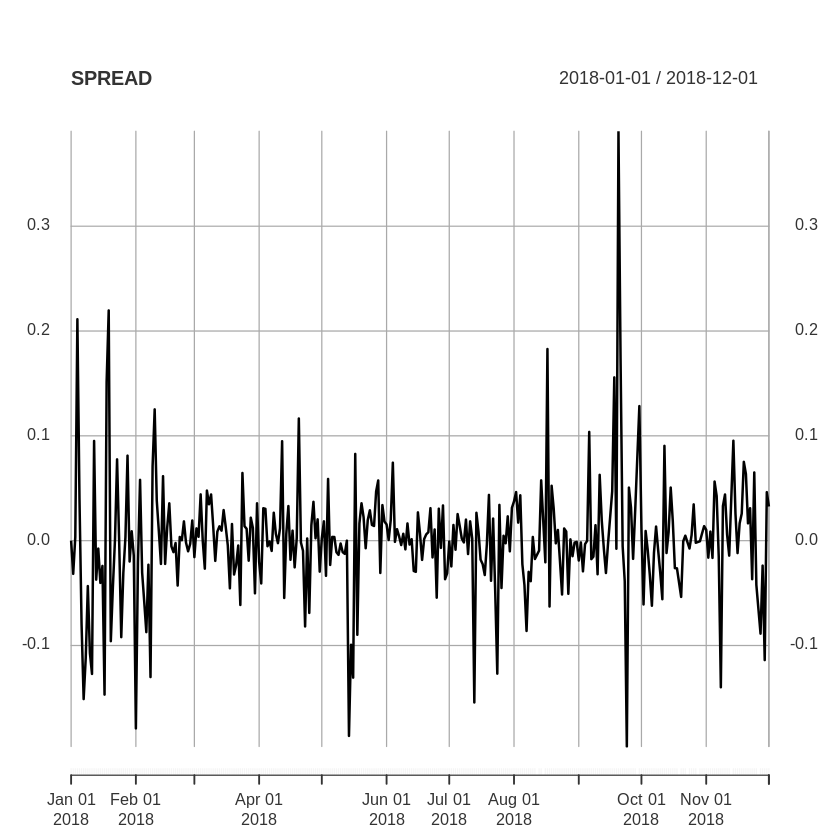


As seen from above, the process for the spread of returns seemed to be stationary, we will confirm this with ADF test. 


```R
adf.test(SPREAD)
```

    Warning message in adf.test(SPREAD):
    “p-value smaller than printed p-value”


    
    	Augmented Dickey-Fuller Test
    
    data:  SPREAD
    Dickey-Fuller = -7.0876, Lag order = 6, p-value = 0.01
    alternative hypothesis: stationary


The hypothesis that the spread follows a stationary process can be confirmed with the ADF test. This could mean that the trading strategy could work with this cryptocurrency pair.

We will now run the trading strategy with the cryptocurrency pair.


```R
# Function to calculate spead based on z-score
Z_SPREAD = function(x){
    return (x * sd(SPREAD) + mean(SPREAD))
}
```


```R
# Function to generate signal based on xts dataframe and the critical value to enter and exit the positions
GENERATE_SIGNAL = function(x, enter, exit){
    # 0 = neutral, 1 = long, -1 = short
    signal = list()
    signal[1] = 0
    for(i in 2:nrow(x)){
        prevPosition = signal[i-1]
        ret = x[[i]]

        if(ret <= (-enter)){
            # Enter long if return <= -ENTER_RET
            signal[i] = 1
        }else if(ret >= enter){
            # Enter short if return >= ENTER_RET
            signal[i] = -1
        }else if(prevPosition == 1 && ret >= exit){
            # Exit long if return >= EXIT_RET
            signal[i] = 0
        }else if(prevPosition == -1 && ret <= (-exit)){
            # Exit short if return <= EXIT_RET
            signal[i] = 0
        }else{
            signal[i] = prevPosition
        }
    }
    signal
}
```


```R
# Enter when current return spread is 3 standard deviation away
# and exit when it's 1 standard deviation away

ENTER_RET = Z_SPREAD(3)
EXIT_RET = Z_SPREAD(1)

# Generate signal for long/short position
signal = GENERATE_SIGNAL(SPREAD, ENTER_RET, EXIT_RET)

# Merge signal with the spread in daily returns
RES = merge(SPREAD, signal)

# Calculate the t+1 daily returns based on signal at t 
RES$tradeReturn = RES$daily.returns * lag(RES$signal)

# Display results
head(RES)
```


               daily.returns signal tradeReturn
    2018-01-01   0.000000000      0          NA
    2018-01-02  -0.031663573      0  0.00000000
    2018-01-03   0.003453594      0  0.00000000
    2018-01-04   0.211254927     -1  0.00000000
    2018-01-05   0.040585192     -1 -0.04058519
    2018-01-06  -0.079457605      0  0.07945761


```R
# Show performance of the algorithm
charts.PerformanceSummary(na.approx(RES$tradeReturn))
```


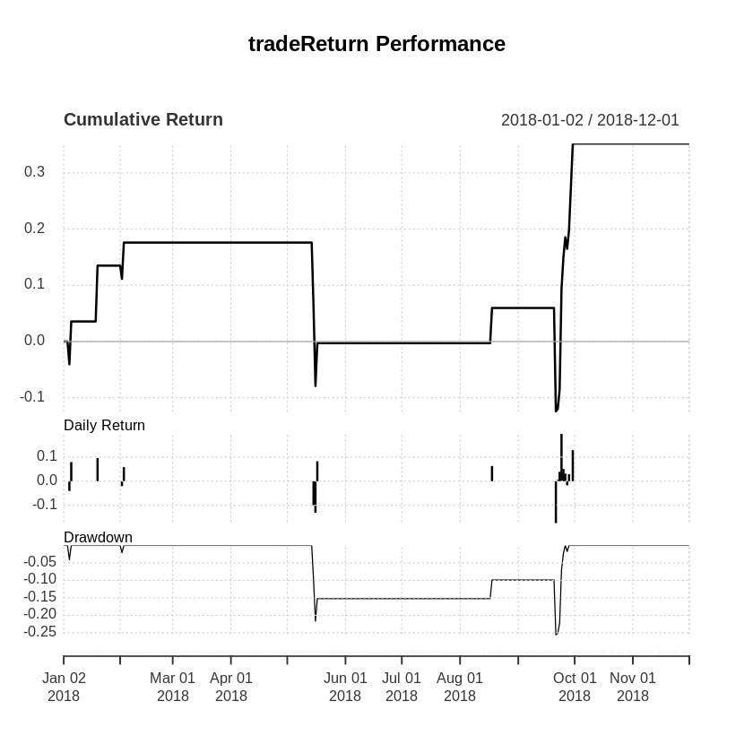


From the performace summary above we can observe that the the cumulative return at the end of the year is > 30%. We can also see that the returns are based on few trades across the year. It can also be observed that the strategy is very risky from the huge drop in the returns in the few bad trades as well as the high maximum drawdown of >25%. 

To further quantify the strategy, we will calculate the:

- Cumulative return
- Annualised return
- Sharpe ratio
- Annualised Sharpe ratio


```R
Return.cumulative(RES$tradeReturn)
Return.annualized(RES$tradeReturn)
maxDrawdown(RES$tradeReturn)
SharpeRatio(RES$tradeReturn, Rf = 0, p=0.95, FUN = "StdDev")
SharpeRatio.annualized(RES$tradeReturn, Rf = 0)
```


<table>
<thead><tr><th></th><th scope=col>tradeReturn</th></tr></thead>
<tbody>
	<tr><th scope=row>Cumulative Return</th><td>0.352222</td></tr>
</tbody>
</table>


<table>
<thead><tr><th></th><th scope=col>tradeReturn</th></tr></thead>
<tbody>
	<tr><th scope=row>Annualized Return</th><td>0.2627021</td></tr>
</tbody>
</table>


0.255531129087392


<table>
<thead><tr><th></th><th scope=col>tradeReturn</th></tr></thead>
<tbody>
	<tr><th scope=row>StdDev Sharpe (Rf=0%, p=95%):</th><td>0.05379146</td></tr>
</tbody>
</table>


<table>
<thead><tr><th></th><th scope=col>tradeReturn</th></tr></thead>
<tbody>
	<tr><th scope=row>Annualized Sharpe Ratio (Rf=0%)</th><td>0.7710583</td></tr>
</tbody>
</table>


From the values above, we can see that the model is viable but risky. To have a better understanding of the performance of the model in relation to other models, we will compare it with a benchmark of buy-and-hold strategy which holds both assets in equal weights in the same timeframe. 


```R
# Create benchmark portfolio
BENCHMARK = (XRPXTS_DR + ZECBTS_DR) / 2

# Plot daily returns of benchmark
plot(BENCHMARK)

# Plot performance of benchmark
charts.PerformanceSummary(na.approx(BENCHMARK))
```


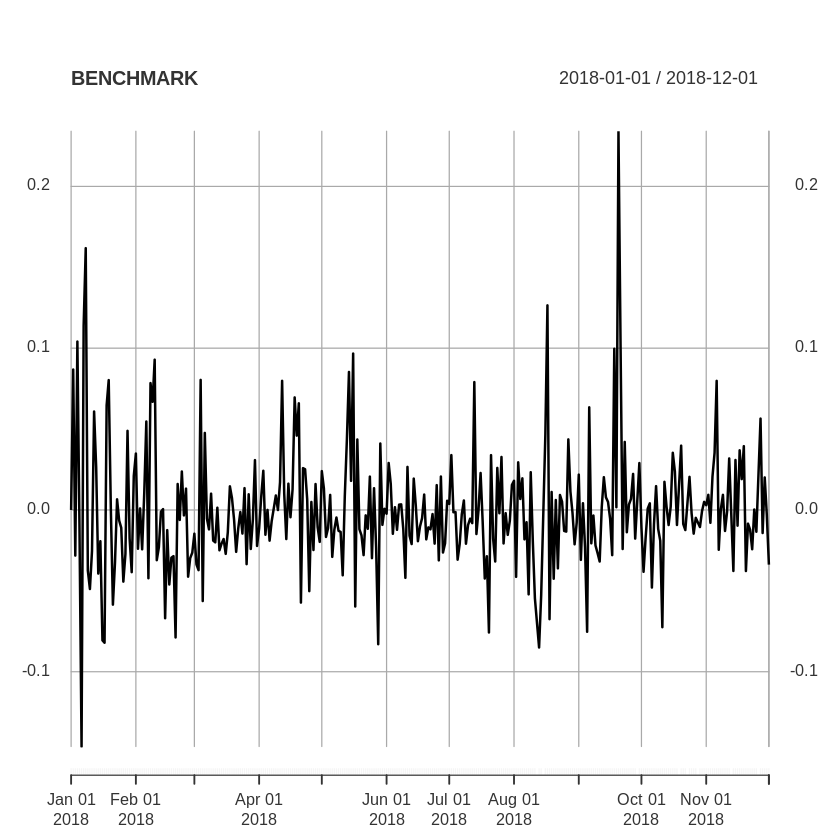


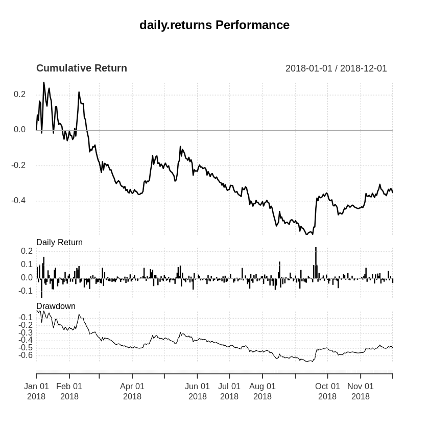


```R
Return.cumulative(BENCHMARK)
Return.annualized(BENCHMARK)
maxDrawdown(BENCHMARK)
SharpeRatio(BENCHMARK, Rf = 0, p=0.95, FUN = "StdDev")
SharpeRatio.annualized(BENCHMARK, Rf = 0)
```


<table>
<thead><tr><th></th><th scope=col>daily.returns</th></tr></thead>
<tbody>
	<tr><th scope=row>Cumulative Return</th><td>-0.3542302</td></tr>
</tbody>
</table>


<table>
<thead><tr><th></th><th scope=col>daily.returns</th></tr></thead>
<tbody>
	<tr><th scope=row>Annualized Return</th><td>-0.2860992</td></tr>
</tbody>
</table>


0.677199512468512


<table>
<thead><tr><th></th><th scope=col>daily.returns</th></tr></thead>
<tbody>
	<tr><th scope=row>StdDev Sharpe (Rf=0%, p=95%):</th><td>-0.01609935</td></tr>
</tbody>
</table>


<table>
<thead><tr><th></th><th scope=col>daily.returns</th></tr></thead>
<tbody>
	<tr><th scope=row>Annualized Sharpe Ratio (Rf=0%)</th><td>-0.4688807</td></tr>
</tbody>
</table>


As we can see, the statstical arbitrage model outperforms the buy and hold strategy greatly in the period of market downturn. 

### Forecast

We will attempt to apply the same model in a different timeframe, up to Apr 2019. The price movement of the market is largly characterised by the sideway movement of the cryptocurrencies as shown by bitcoin's price:

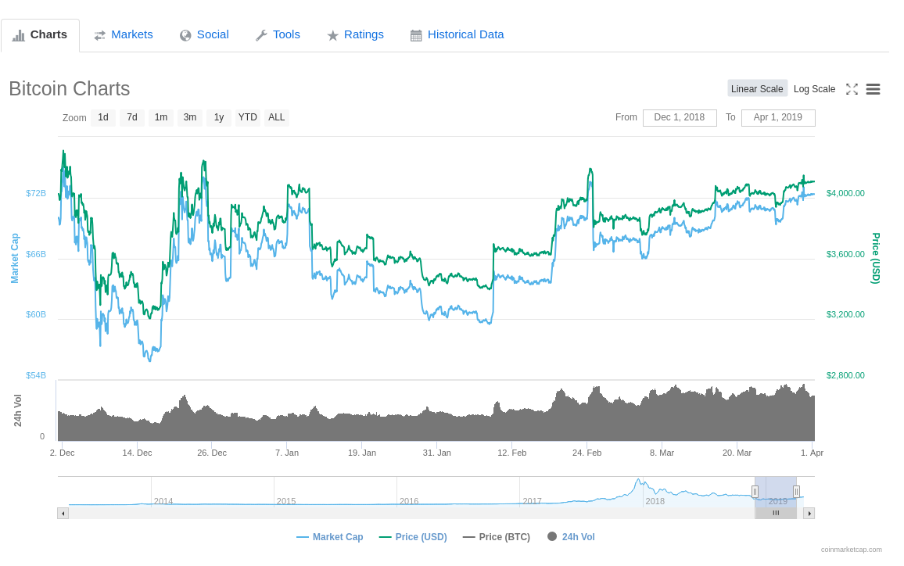 


```R
# Applying to out-of-sample data
pairs = c(
    "XRPBTC",
    "ZECBTC"
)
startDate = "2018-12-01"
endDate = "2019-04-01"
pairsDataListXts = list()

# Fetch price data
for(i in 1:length(pairs)){
    pair = pairs[i]
    bifinexPair = paste("BITFINEX/", pair, sep = "")
    pairData = Quandl(bifinexPair, start_date=startDate, end_date=endDate)
    assign(pair, pairData)
    pairDataXts = as.xts(pairData, order.by = pairData$Date, x=pairData$Last)
    pairsDataListXts[[i]] = pairDataXts
}

# Create time series of the spread
XRPXTS_DR = dailyReturn(pairsDataListXts[[1]])
ZECBTS_DR = dailyReturn(pairsDataListXts[[2]])
SPREAD = XRPXTS_DR - ZECBTS_DR
plot(SPREAD)
```


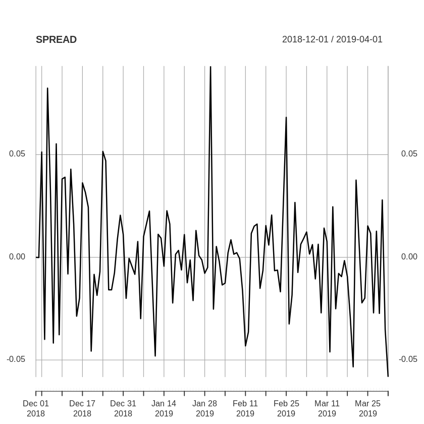


```R
# Enter when current return spread is 3 standard deviation away
# and exit when it's 1 standard deviation away
ENTER_RET = Z_SPREAD(3)
EXIT_RET = Z_SPREAD(1)

signal = GENERATE_SIGNAL(SPREAD, ENTER_RET, EXIT_RET)
RES = merge(SPREAD, signal)
RES$tradeReturn = RES$daily.returns * lag(RES$signal)

# Saving results to be used later
FORECASTED = RES

head(RES)
```


               daily.returns signal tradeReturn
    2018-12-01  0.0000000000      0          NA
    2018-12-02 -0.0001131245      0  0.00000000
    2018-12-03  0.0512798584      0  0.00000000
    2018-12-04 -0.0399565325      0  0.00000000
    2018-12-05  0.0823836816     -1  0.00000000
    2018-12-06  0.0324139120     -1 -0.03241391


```R
charts.PerformanceSummary(na.approx(RES$tradeReturn))
```


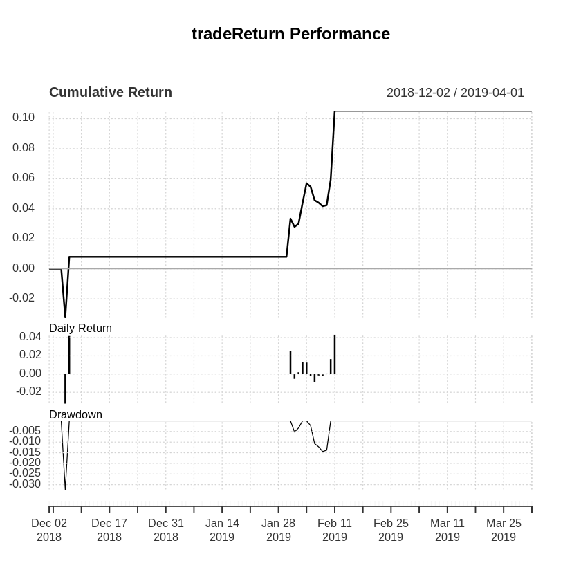


```R
Return.cumulative(RES$tradeReturn)
Return.annualized(RES$tradeReturn)
maxDrawdown(RES$tradeReturn)
SharpeRatio(RES$tradeReturn, Rf = 0, p=0.95, FUN = "StdDev")
SharpeRatio.annualized(RES$tradeReturn, Rf = 0)
```


<table>
<thead><tr><th></th><th scope=col>tradeReturn</th></tr></thead>
<tbody>
	<tr><th scope=row>Cumulative Return</th><td>0.1052364</td></tr>
</tbody>
</table>


<table>
<thead><tr><th></th><th scope=col>tradeReturn</th></tr></thead>
<tbody>
	<tr><th scope=row>Annualized Return</th><td>0.2404972</td></tr>
</tbody>
</table>


0.0324139119521271


<table>
<thead><tr><th></th><th scope=col>tradeReturn</th></tr></thead>
<tbody>
	<tr><th scope=row>StdDev Sharpe (Rf=0%, p=95%):</th><td>0.1232066</td></tr>
</tbody>
</table>


<table>
<thead><tr><th></th><th scope=col>tradeReturn</th></tr></thead>
<tbody>
	<tr><th scope=row>Annualized Sharpe Ratio (Rf=0%)</th><td>2.119837</td></tr>
</tbody>
</table>


From the charts above, we can see that the trading strategy is also applicable in a market with sideway movements. However, we can see that the maximum drawdown is still huge, at >30%.

We can compare the performance with that of a buy-and-hold strategy.


```R
# Comparing to benchmarks
BENCHMARK = (XRPXTS_DR + ZECBTS_DR) / 2
plot(BENCHMARK)
charts.PerformanceSummary(na.approx(BENCHMARK))
```


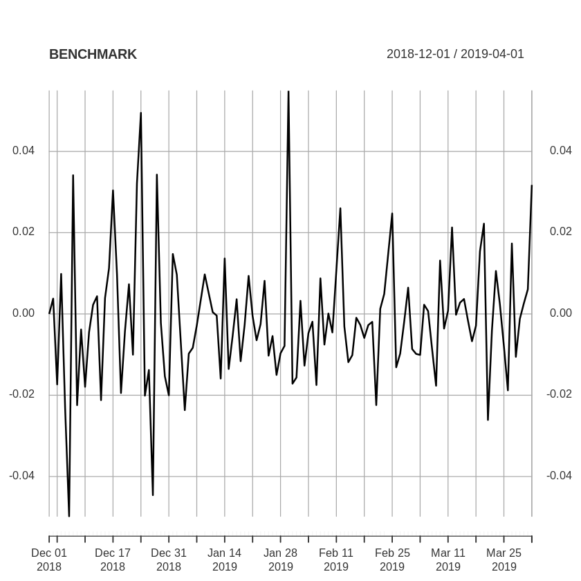


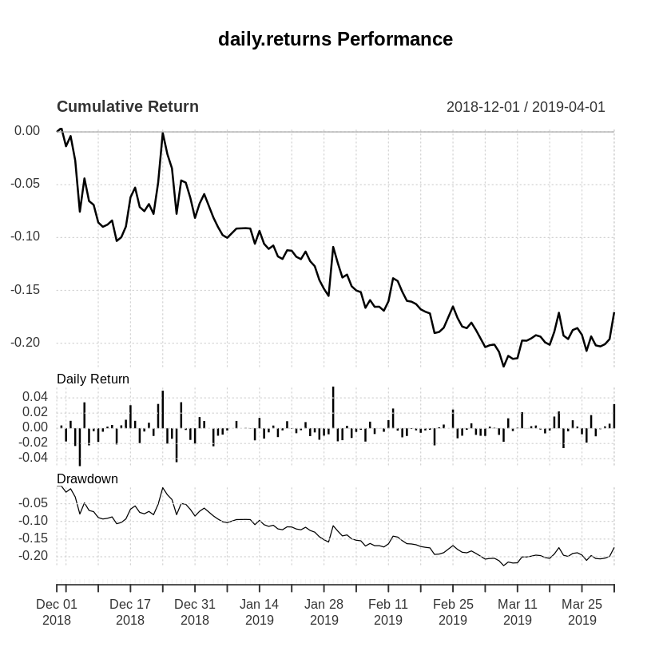


Comparing the performance, we can see that a buy-and-hold strategy greatly underperform compared to the statistical arbitrage model. However, it can also be seen that the maximum drawdown is only at 20%, compared to 30% on the statstical arbitrage model. 

## Implementation Limitations 

In order to facilitate our investigation of the potential feasibility of trading strategies, we have applied simplifying assumptions. Firstly, we only examine closing data. At day t, we apply the algorithm to generate trading signal for day t. The return for day t + 1 will then be based on closing prices at day t and day t + 1. In reality, we would not be able to execute the trading decision at day t (i.e. note that we first wait to get the closing price for day t). Rather, we would execute the trade at day t + 1 at the opening price or an intraday price. Due to market movements, there may be slippage costs as well. That is, we may not be able to execute our intended trades at exactly the intended price.

Secondly, we ignore fees. Our algorithm may do well in this regard because it trades infrequently. Still, the effects of fees could still be substantial. Trading fees can range from 0.10% to 0.85%2, in addition to withdrawal fees. 

Finally, further examining our results, most of our returns are accounted for by a few large downward movements. If we compare our strategy to a “short and hold” strategy, it beats our algorithm. In the testing period from Jan 2019 to Apr 2019, the cumulative returns are compared below.

<table>
<thead><tr><th></th><th scope=col>Cummulative Return</th></tr></thead>
<tbody>
	<tr><th scope=row><p align="left">Short XRP</p></th><td><p align="center">14.96%</p></td></tr>
	<tr><th scope=row><p align="left">Short ZEC</p></th><td><p align="center">20.76%</p></td></tr>
	<tr><th scope=row><p align="left">Short both (50-50)</p></th><td><p align="center">17.86%</p></td></tr>
	<tr><th scope=row><p align="left">Our Algorithm</p></th><td><p align="center">10.52%</p></td></tr>
</tbody>
</table>


## Recommendations for further investigation

Statistical arbitrage has been explored in cryptocurrencies and was found to be promising2. However, academic papers tend to apply simplifying assumptions as we have discussed previously. 

Also, algorithmic trading strategies may decrease in effectiveness in efficient markets. The paper by Fischer and Co., Statistical Arbitrage in Cryptocurrency Markets, examined data in 2018. Since the cryptocurrency markets is relatively new and less developed than other financial markets, some of their positive results may disappear as the cryptocurrency markets become more efficient.

Another area to explore is when statistical arbitrage work best. In periods wherein there is a strong trend, momentum strategies might be better suited. Recall that the underlying belief in momentum strategies is the opposite of mean-reversion techniques.  

Finally, we may enrich our trading strategy by using data other than price. The paper “Algorithmic Trading of Cryptocurrency Based on Twitter Sentiment Analysis” by Colliani and Co.4 demonstrated some success in predicting cryptocurrency market movement using supervised learning algorithms.


## Summary

In conclusion, statistical arbitrage on the XRP/ZEC pair is a viable model for automated trading, and outperforms the benchmark. However, we can see that the strategy is very risky, with large drawdowns, but also with high returns. 

To determine if the additional rewards is worth the additional risk, we can re-evaluate the model with the Sharpe ratio with a risk-free asset with 2% returns. 


```R
SharpeRatio(FORECASTED$tradeReturn, Rf = 0.02, p=0.95, FUN = "StdDev")
SharpeRatio.annualized(FORECASTED$tradeReturn, Rf = 0.02)
```


<table>
<thead><tr><th></th><th scope=col>tradeReturn</th></tr></thead>
<tbody>
	<tr><th scope=row>StdDev Sharpe (Rf=2%, p=95%):</th><td>-2.675277</td></tr>
</tbody>
</table>


<table>
<thead><tr><th></th><th scope=col>tradeReturn</th></tr></thead>
<tbody>
	<tr><th scope=row>Annualized Sharpe Ratio (Rf=504%)</th><td>-8.746845</td></tr>
</tbody>
</table>


As seen from the sharpe ratio, the additional returns does not justify the risk as a standalone asset. However, it does not mean that the statistical arbitrage on the pair is not viable to be included in a portfolio. More work can be done to evaluate how this model can be integrated with traditional portfolio to add diversity.

## References
[1] https://towardsdatascience.com/pairs-trading-with-cryptocurrencies-e79b4a00b015
[2] https://www.btcmarkets.net/fees
[3] Fischer, T.G.; Krauss, C.; Deinert, A. Statistical Arbitrage in Cryptocurrency Markets. J. Risk Financial Manag. 2019, 12, 31.
[4] Colianni, Stuart G. et al. “Algorithmic Trading of Cryptocurrency Based on Twitter Sentiment Analysis.” (2015).


## Additional Bibliography

- https://analyticsprofile.com/algo-trading/pair-trading-part-1-code-distance-based-pair-trading-strategy-in-r/
- https://timtrice.github.io/backtesting-strategies/index.html
- https://www.econometrics-with-r.org/index.html
